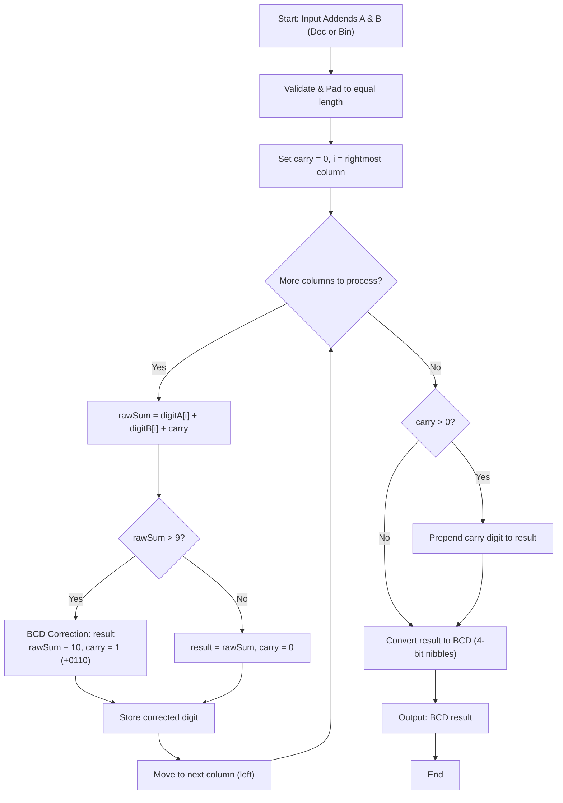
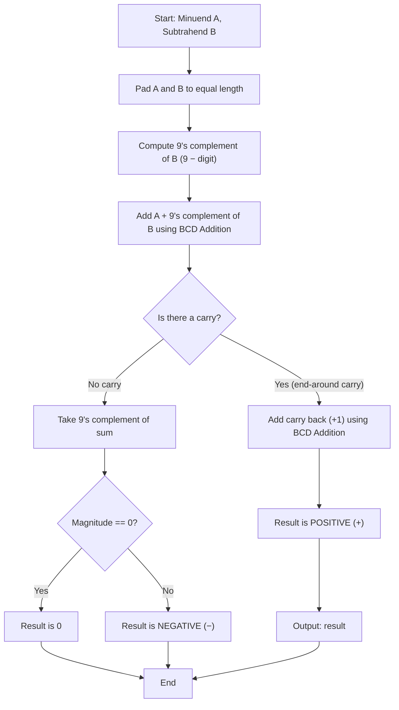
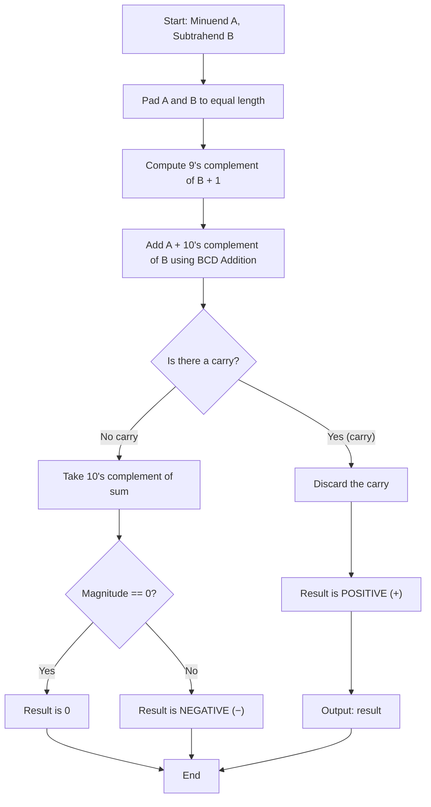

# BCD Addition & Subtraction — System Documentation

**Project:** BCD Addition & Subtraction  
**Course Context:** Computer Architecture (Activity 3 – BCD Arithmetic)  
**System Type:** Client-Side Web Application (Multi-Page)  
**Document Version:** 1.2.0  

---

## Table of Contents
1. [System Requirements](#1-system-requirements)
   - [1.1 Project Overview & Purpose](#11-project-overview--purpose)
   - [1.2 Functional Requirements (FR)](#12-functional-requirements-fr)
   - [1.3 Non-Functional Requirements (NFR)](#13-non-functional-requirements-nfr)
   - [1.4 System & Hardware Constraints](#14-system--hardware-constraints)
2. [Algorithms & Pseudocode](#2-algorithms--pseudocode)
   - [2.1 Operand Validation & Dual-Base Decoding](#21-operand-validation--dual-base-decoding)
   - [2.2 Decimal-to-BCD Conversion](#22-decimal-to-bcd-conversion)
   - [2.3 BCD Addition with +6 Correction](#23-bcd-addition-with-6-correction)
   - [2.4 9's Complement Computation](#24-9s-complement-computation)
   - [2.5 10's Complement Computation](#25-10s-complement-computation)
   - [2.6 BCD Subtraction Using 9's Complement](#26-bcd-subtraction-using-9s-complement)
   - [2.7 BCD Subtraction Using 10's Complement](#27-bcd-subtraction-using-10s-complement)
3. [Flowcharts](#3-flowcharts)
   - [3.1 BCD Addition Flow](#31-bcd-addition-flow)
   - [3.2 BCD Subtraction Using 9's Complement Flow](#32-bcd-subtraction-using-9s-complement-flow)
   - [3.3 BCD Subtraction Using 10's Complement Flow](#33-bcd-subtraction-using-10s-complement-flow)
   - [3.4 draw.io File Integration](#34-drawio-file-integration)
4. [Program Implementation](#4-program-implementation)
   - [4.1 Architecture & File Organization](#41-architecture--file-organization)
   - [4.2 Source Code](#42-source-code)
     - [4.2.1 bcd-arithmetic/index.html](#421-bcd-arithmeticindexhtml)
     - [4.2.2 bcd-arithmetic/bcd.css](#422-bcd-arithmeticbcdcss)
     - [4.2.3 bcd-arithmetic/bcd.js](#423-bcd-arithmeticbcdjs)
     - [4.2.4 bcd-arithmetic/bcd-ui.js](#424-bcd-arithmeticbcd-uijs)
5. [Test Cases & Sample Output](#5-test-cases--sample-output)
   - [5.1 BCD Addition Test Cases](#51-bcd-addition-test-cases)
   - [5.2 BCD Subtraction Test Cases](#52-bcd-subtraction-test-cases)
   - [5.3 Dual-Base Input Test Cases](#53-dual-base-input-test-cases)
   - [5.4 Sample Output Runs](#54-sample-output-runs)

---

## 1. System Requirements

### 1.1 Project Overview & Purpose

The **BCD Addition & Subtraction** module extends the existing Number System Converter with Binary-Coded Decimal (BCD) arithmetic capabilities. BCD represents each decimal digit (0–9) as a fixed 4-bit binary value (8421 code), and is widely used in digital systems where exact decimal representation is essential (e.g., financial calculations, digital clocks, calculators).

The system allows users to:
1. Input **multiple operands** (2 to 10 operands labeled alphabetically as `Operand A`, `Operand B`, ... and arranged cleanly **4 per row** in a responsive card grid).
2. Choose between **Decimal (Base 10)** and **Binary (Base 2 / BCD 8421 nibbles)** for each individual operand card with real-time conversion and validation.
3. Construct their own **custom flow of operands** via the dedicated **Arithmetic Expression** builder, selecting operand variables (`A`, `B`, `C`, ...) and using **only addition (`+`) and subtraction (`−`)** operators with parentheses (`(`, `)`).
4. View **live variable preview badges** in the expression toolbar displaying real-time values for each letter (`[ A: 45 ]`, `[ B: 23 ]`).
5. Perform **BCD addition** with automatic column-by-column +6 correction when a nibble sum exceeds 9.
6. Perform **BCD subtraction using the 9's complement** method (with end-around carry and complement-of-sum negative detection).
7. Perform **BCD subtraction using the 10's complement** method (with carry discard and complement-of-sum negative detection).
8. View **real-time BCD previews** of each input operand with automatic decimal-binary synchronization.
9. Press the **Perform BCD Operation (=) button** to compute and smoothly scroll to the result container with a highlight pulse animation.
10. View **step-by-step solutions** for every evaluated operation in the custom expression with collapsible toggle.

### BCD Theory in Computer Architecture

**Binary-Coded Decimal (BCD)** is a class of binary encodings where each decimal digit is represented by a fixed number of binary digits (bits). In the standard 8421 BCD encoding:

| Decimal | BCD (4-bit) |
|:--------|:------------|
| 0       | 0000        |
| 1       | 0001        |
| 2       | 0010        |
| 3       | 0011        |
| 4       | 0100        |
| 5       | 0101        |
| 6       | 0110        |
| 7       | 0111        |
| 8       | 1000        |
| 9       | 1001        |

**Key BCD Arithmetic Rules:**

1. **BCD Addition:** Add corresponding 4-bit groups. If any nibble sum exceeds 9 (1001_2), add 6 (0110_2) to correct it and propagate a carry to the next nibble. This correction is necessary because 4 bits can represent 16 values (0–15), but BCD only permits 0–9.

2. **9's Complement:** Subtract each digit from 9. This is analogous to the (r−1)'s complement in decimal.
   - Example: 9's complement of 347 = 652 (9−3=6, 9−4=5, 9−7=2)

3. **10's Complement:** Add 1 to the 9's complement. This is analogous to the r's complement in decimal.
   - Example: 10's complement of 347 = 653 (652 + 1)

4. **BCD Subtraction via 9's Complement:**
   - Compute the 9's complement of the subtrahend.
   - Add it to the minuend using BCD addition.
   - If there is a carry, add it back (end-around carry) → result is positive.
   - If no carry, take the 9's complement of the sum → result is negative (magnitude 0 yields 0).

5. **BCD Subtraction via 10's Complement:**
   - Compute the 10's complement of the subtrahend.
   - Add it to the minuend using BCD addition.
   - If there is a carry, discard it → result is positive.
   - If no carry, take the 10's complement of the sum → result is negative (magnitude 0 yields 0).

---

### 1.2 Functional Requirements (FR)

| ID | Requirement | Priority |
|:---|:---|:---|
| FR-01 | User can specify number of operands (2–10) | High |
| FR-02 | Operands are presented as compact cards in a 4-by-row grid (desktop) | High |
| FR-03 | User can choose between Decimal (10) and Binary (2) for each operand | High |
| FR-04 | User sees real-time BCD preview and decimal equivalents for each operand | Medium |
| FR-05 | User can construct custom operand flow via Arithmetic Expression builder with variables (A, B, C, ...) and only addition (+) and subtraction (−) operators | High |
| FR-06 | Expression toolbar includes real-time variable badges with live value previews and token insertion helpers | Medium |
| FR-07 | System validates inputs (digits 0–9 for decimal; bits 0–1 with BCD nibbles for binary) | High |
| FR-08 | Equal button computes the complete BCD arithmetic chain | High |
| FR-09 | Equal button scrolls/navigates smoothly to the result container with pulse animation | High |
| FR-10 | For addition: display BCD addition with +6 correction step details | High |
| FR-11 | For subtraction: display results using both 9's and 10's complement methods | High |
| FR-12 | Step-by-step solution with toggle (show/hide) | High |
| FR-13 | Display individual operation cards for each step in the chain | Medium |
| FR-14 | Display final answer in both Decimal and BCD format | High |

### 1.3 Non-Functional Requirements (NFR)

| ID | Requirement | Priority |
|:---|:---|:---|
| NFR-01 | Consistent visual design with the main Number System Converter palette | High |
| NFR-02 | Smooth scroll animation to result container with highlight pulse | Medium |
| NFR-03 | Responsive layout: 4 cards per row on desktop, 2 on tablet, 1 on mobile | Medium |
| NFR-04 | All computations run client-side (no server required) | High |

### 1.4 System & Hardware Constraints

* **Platform:** Client-side web browser (desktop, tablet, or mobile).
* **Browser Compatibility:** Google Chrome 80+, Mozilla Firefox 75+, Microsoft Edge 80+, Apple Safari 14+ (requires ES Module support).
* **Host Server:** Standard static web server (e.g., VS Code Live Server, Python http.server, or GitHub Pages).

---

## 2. Algorithms & Pseudocode

### 2.1 Operand Validation & Dual-Base Decoding (validateOperandInput)

Validates user input according to the chosen base (Base 10 or Base 2):

```text
Algorithm: validateOperandInput(value, base)
Input: value (String), base (10 for Decimal, 2 for Binary)
Output: Object { valid, digits, bcdString, isNegative, message }

1.  Trim input string
2.  If string is empty: Return { valid: false, message: "Input cannot be empty." }
3.  Check optional leading sign ('+' or '−')
4.  If base == 10:
5.      Verify all remaining characters are '0'..'9'
6.      Strip leading zeros (preserve at least one '0')
7.      Set bcdString = decimalToBCD(digits)
8.      Return { valid: true, digits, bcdString, isNegative, message: "Valid decimal input." }
9.  Else if base == 2:
10.     Remove spaces from bit string
11.     Verify all characters are '0' or '1'
12.     If bit string is spaced into 4-bit nibbles or aligned to 4 bits:
13.         For each 4-bit nibble:
14.             val = parseInt(nibble, 2)
15.             If val > 9: break (not valid BCD nibble)
16.         If all nibbles <= 9:
17.             decimalDigits = concatenate decoded nibble values
18.             bcdString = decimalToBCD(decimalDigits)
19.             Return { valid: true, digits: decimalDigits, bcdString, isNegative, type: "BCD nibbles" }
20.     If not BCD nibbles, treat as standard Binary (Base 2):
21.         decimalDigits = BigInt("0b" + cleanBits).toString()
22.         bcdString = decimalToBCD(decimalDigits)
23.         Return { valid: true, digits: decimalDigits, bcdString, isNegative, type: "Base 2" }
```

---

### 2.2 Decimal-to-BCD Conversion

Converts each decimal digit to its 4-bit BCD representation.

```text
Algorithm: decimalToBCD(decimalStr)
Input: decimalStr (String of decimal digits '0'-'9')
Output: BCD string with 4-bit groups separated by spaces

1.  Set result = ""
2.  For each digit in decimalStr:
3.      Set bcd = toBinary(digit, 4 bits)  // e.g., 5 → "0101"
4.      Append bcd + " " to result
5.  Return Trim(result)
```

---

### 2.3 BCD Addition with +6 Correction

```text
Algorithm: addBCD(aStr, bStr)
Input: aStr, bStr (Decimal number strings)
Output: Object { decimalResult, bcdResult, steps }

1.  Set maxLen = Max(Length(aStr), Length(bStr))
2.  Set aPadded = PadLeft(aStr, maxLen, '0')
3.  Set bPadded = PadLeft(bStr, maxLen, '0')
4.  Set carry = 0
5.  Set resultDigits = []
6.  For i from maxLen - 1 down to 0:
7.      Set rawSum = digit(aPadded[i]) + digit(bPadded[i]) + carry
8.      If rawSum > 9:
9.          Set corrected = rawSum - 10
10.         Set carry = 1
11.         Prepend corrected to resultDigits
12.     Else:
13.         Set carry = 0
14.         Prepend rawSum to resultDigits
15. If carry > 0:
16.     Prepend carry to resultDigits
17. Return { decimalResult: Join(resultDigits), bcdResult: decimalToBCD(result) }
```

---

### 2.4 9's Complement Computation

```text
Algorithm: ninesComplement(decimalStr)
Input: decimalStr (String of decimal digits)
Output: String 9's complement

1.  Set result = ""
2.  For each digit in decimalStr:
3.      Set complement = 9 - digit
4.      Append complement to result
5.  Return result
```

---

### 2.5 10's Complement Computation

```text
Algorithm: tensComplement(decimalStr)
Input: decimalStr (String of decimal digits)
Output: String 10's complement

1.  Set nines = ninesComplement(decimalStr)
2.  Set result = addBCD(nines, "0...01")  // Add 1 using BCD addition
3.  Return result (truncated to original length if overflow)
```

---

### 2.6 BCD Subtraction Using 9's Complement

```text
Algorithm: subtractBCDUsing9sComplement(aStr, bStr)
Input: aStr (Minuend A), bStr (Subtrahend B) — both decimal strings
Output: Object { decimalResult, bcdResult, isNegative, solution }

1.  Pad A and B to equal length
2.  Set ninesB = ninesComplement(B)
3.  Set addResult = addBCD(A, ninesB)
4.  If addResult.carry > 0:
        // End-around carry → result is POSITIVE
5.      Set sum = addResult.result (without carry)
6.      Set finalResult = addBCD(sum, "0...01")  // Add carry back
7.      Return { result: finalResult, isNegative: false }
8.  Else:
        // No carry → result is NEGATIVE (or 0)
9.      Set magnitude = ninesComplement(addResult.result)
10.     Set isNegative = (magnitude != "0")
11.     Return { result: isNegative ? ("−" + magnitude) : magnitude, isNegative }
```

---

### 2.7 BCD Subtraction Using 10's Complement

```text
Algorithm: subtractBCDUsing10sComplement(aStr, bStr)
Input: aStr (Minuend A), bStr (Subtrahend B) — both decimal strings
Output: Object { decimalResult, bcdResult, isNegative, solution }

1.  Pad A and B to equal length
2.  Set tensB = tensComplement(B)
3.  Set addResult = addBCD(A, tensB)
4.  If addResult.carry > 0:
        // Carry detected → DISCARD carry → result is POSITIVE
5.      Set finalResult = addResult.result (without carry)
6.      Return { result: finalResult, isNegative: false }
7.  Else:
        // No carry → result is NEGATIVE (or 0)
8.      Set magnitude = tensComplement(addResult.result)
9.      Set isNegative = (magnitude != "0")
10.     Return { result: isNegative ? ("−" + magnitude) : magnitude, isNegative }
```

---

### 2.8 Arithmetic Expression Parsing & BCD Evaluation (evaluateBCDExpression)

The system allows users to define custom operand flows containing variable tokens (`A`, `B`, `C`, ...), addition (`+`), subtraction (`−`), and parentheses (`(`, `)`):

```text
Grammar:
  Expression  ::= Term { ('+' | '−') Term }
  Term        ::= [ '+' | '−' ] Factor
  Factor      ::= '(' Expression ')' | VARIABLE | NUMBER

Algorithm: evaluateBCDExpression(exprStr, varValues)
Input: exprStr (String expression), varValues (Object mapping letter -> decimal string)
Output: Object { finalDecimal, finalBCD, isNegative, operationResults, fullSolution }

1. Tokenize exprStr into tokens: LPAREN, RPAREN, OP (+, −), VAR (A–J), NUMBER.
2. Initialize parser pointer index = 0.
3. Parse Expression using Recursive Descent:
   a. parseTerm(): Handles optional unary sign (+ or −) before Factor.
   b. parseFactor(): Consumes NUMBER, VARIABLE lookup from varValues, or parenthesized Expression.
   c. parseExpr(): Evaluates binary operations left-to-right respecting operator precedence.
4. For each evaluated operation:
   a. If op == '+':
      Invoke BCD addition algorithm (+6 correction for nibble sums > 9).
   b. If op == '−':
      Invoke 9's complement and 10's complement subtraction algorithms.
   c. Record step number, operands, BCD binary representation, decimal magnitude, and solution text.
5. Return final decimal result, final BCD nibbles, and comprehensive solution log.
```

---

## 3. Flowcharts

### 3.1 BCD Addition Flow



### 3.2 BCD Subtraction Using 9's Complement Flow



### 3.3 BCD Subtraction Using 10's Complement Flow



### 3.4 draw.io File Integration

The complete vector diagrams for the BCD Arithmetic module are isolated in the activity's dedicated diagram file:
- **File:** `bcd-arithmetic/flowcharts.drawio`
- **Tab 1:** *1. BCD App Lifecycle & Expression Flow* — Complete reactive event loop for operand cards, dual-base conversion, expression builder, and evaluation.
- **Tab 2:** *2. BCD Addition (+6 Correction)* — Complete decision pipeline with BCD correction branch (+0110).
- **Tab 3:** *3. BCD Subtraction (Complements)* — Dual branch architecture comparing 9's and 10's complement flows side by side.

---

## 4. Program Implementation

### 4.1 Architecture & File Organization

```text
number-system-converter/
├── index.html                       (Modified: added BCD Arithmetic nav link)
├── style.css                        (Modified: added .header-nav-links style)
├── flowcharts.drawio                (Main converter flowcharts: Lifecycle, Conversion, Parser)
├── complement/                      (Existing: Complements activity)
│   ├── index.html                   (Modified: added cross-nav link)
│   ├── complement.css               (Modified: added .header-nav-links)
│   ├── complement.js                (No changes)
│   └── complement-ui.js             (No changes)
├── bcd-arithmetic/                  (BCD Activity Module)
│   ├── flowcharts.drawio            (Dedicated BCD flowcharts: Lifecycle, Addition, Subtraction)
│   ├── index.html                   (4-by-row layout, expression builder, dual nav)
│   ├── bcd.css                      (Grid styles, expression toolbar, complement result boxes)
│   ├── bcd.js                       (BCD core logic, 9's/10's complement, recursive descent parser)
│   └── bcd-ui.js                    (Card generator, live BCD previews, expression engine)
└── BCD_ARITHMETIC_DOCUMENTATION.md  (Complete activity documentation)
```

**Module Roles:**

| File | Role |
|:---|:---|
| `bcd-arithmetic/bcd.js` | Pure math module: dual-base validation (`validateOperandInput`), BCD addition with +6 correction, 9's & 10's complement subtraction, chained evaluation, zero-normalization, step-by-step solution text. |
| `bcd-arithmetic/bcd-ui.js` | UI orchestration: 4-by-row card rendering, base selection toggles (`10 Dec` / `2 Bin`) with live synchronization, operator toggles (+/−), live expression bar, equal button calculation and smooth scrolling. |
| `bcd-arithmetic/bcd.css` | Visual styling adhering to the official color palette (`#355872`, `#7AAACE`, `#9CD5FF`, `#F7F8F0`, `#DCE3EB`), 4-column responsive grid, compact card layout, pulse animations. |
| `bcd-arithmetic/index.html` | Page markup with header nav links, operand count controls, live expression preview bar, 4-by-row operands grid, equal button, and result section. |

---

### 4.2 Source Code

#### 4.2.1 `bcd-arithmetic/index.html`

```html
<!DOCTYPE html>
<html lang="en">
<head>
    <meta charset="UTF-8">
    <meta name="viewport" content="width=device-width, initial-scale=1.0">

    <title>BCD Addition & Subtraction</title>

    <link rel="stylesheet" href="./bcd.css">
</head>
<body>

    <main class="app-container">

        <header class="header-container">
            <h1>BCD Addition & Subtraction</h1>
            <p>Perform BCD arithmetic using 9's and 10's complement methods.</p>
            <div class="header-nav-links">
                <a href="../index.html" class="header-nav-link">
                    <span class="nav-arrow">←</span> Back to Number System Converter
                </a>
                <a href="../complement/index.html" class="header-nav-link">
                    <span class="nav-arrow">←</span> Back to Complements
                </a>
            </div>
        </header>

        <!-- ═══════════════════════════════════════════════════ -->
        <!-- CONTROLS -->
        <!-- ═══════════════════════════════════════════════════ -->

        <section class="controls-container">
            <div class="control-group">
                <label for="bcdInputCount">
                    Number of input operands:
                </label>
                <input
                    type="number"
                    id="bcdInputCount"
                    min="2"
                    max="10"
                    value="4"
                >
            </div>

            <button id="bcdSetInputsButton" type="button">
                Set Inputs
            </button>
        </section>

        <!-- ═══════════════════════════════════════════════════ -->
        <!-- ARITHMETIC EXPRESSION BUILDER -->
        <!-- ═══════════════════════════════════════════════════ -->

        <section class="expression-container" id="bcdExpressionContainer">
            <div class="expression-header">
                <h2>Arithmetic Expression</h2>
                <p>Build expressions with variables, operators, and parentheses: e.g. (A + B - C) + D</p>
            </div>

            <div class="expression-toolbar">
                <div class="toolbar-group">
                    <span class="toolbar-label">Variables:</span>
                    <div id="bcdVariableButtons" class="btn-group"></div>
                </div>

                <div class="toolbar-group">
                    <span class="toolbar-label">Operators:</span>
                    <div class="btn-group">
                        <button type="button" class="btn-expr" data-insert="+">+</button>
                        <button type="button" class="btn-expr" data-insert="-">−</button>
                        <button type="button" class="btn-expr" data-insert="(">(</button>
                        <button type="button" class="btn-expr" data-insert=")">)</button>
                        <button type="button" class="btn-expr btn-clear" id="bcdClearExpressionButton">Clear</button>
                    </div>
                </div>
            </div>

            <div class="expression-input-row">
                <label for="bcdExpressionInput">Enter Expression:</label>
                <input
                    type="text"
                    id="bcdExpressionInput"
                    placeholder="e.g. (A + B - C) + D"
                    autocomplete="off"
                    spellcheck="false"
                >
            </div>

            <div class="expression-action-row">
                <button id="bcdPerformArithmeticButton" type="button" class="btn-perform-op">
                    <span class="equal-icon">=</span>
                    <span>Perform BCD Operation</span>
                </button>
            </div>
        </section>

        <!-- ═══════════════════════════════════════════════════ -->
        <!-- OPERANDS INPUT GRID (4 PER ROW) -->
        <!-- ═══════════════════════════════════════════════════ -->

        <section
            id="bcdOperandsContainer"
            class="bcd-operands-grid">
        </section>

        <!-- ═══════════════════════════════════════════════════ -->
        <!-- RESULT CONTAINER -->
        <!-- ═══════════════════════════════════════════════════ -->

        <section
            id="bcdResultContainer"
            class="bcd-result-container"
            hidden>
        </section>

    </main>

    <script type="module" src="./bcd-ui.js"></script>
</body>
</html>
```

#### 4.2.2 `bcd-arithmetic/bcd.css`

```css
/* ═══════════════════════════════════════════════════════
   BCD ARITHMETIC PAGE STYLES
   Consistent with the Number System Converter palette
   Color palette:
     - Dark:    #355872
     - Mid:     #7AAACE
     - Light:   #9CD5FF
     - Surface: #F7F8F0
     - BG:      #DCE3EB
   ═══════════════════════════════════════════════════════ */

html {
    scroll-behavior: smooth;
}

* {
    box-sizing: border-box;
}

body {
    margin: 0;
    min-height: 100vh;
    background-color: #DCE3EB;
    background-image:
        linear-gradient(to right, rgba(53, 88, 114, 0.12) 1px, transparent 1px),
        linear-gradient(to bottom, rgba(53, 88, 114, 0.12) 1px, transparent 1px),
        linear-gradient(to right, rgba(53, 88, 114, 0.05) 1px, transparent 1px),
        linear-gradient(to bottom, rgba(53, 88, 114, 0.05) 1px, transparent 1px);
    background-size: 80px 80px, 80px 80px, 20px 20px, 20px 20px;
    color: #355872;
    font-family: Arial, sans-serif;
}

.app-container {
    width: min(1360px, 94%);
    margin: 32px auto;
}

/* ── Header ── */
.header-container {
    padding: 28px;
    margin-bottom: 24px;
    background-color: #355872;
    color: #F7F8F0;
    border-radius: 14px;
    text-align: center;
}

.header-container h1 {
    margin: 0 0 8px;
}

.header-container p {
    margin: 0 0 14px;
}

.header-nav-link {
    display: inline-flex;
    align-items: center;
    gap: 6px;
    padding: 10px 20px;
    background-color: #9CD5FF;
    color: #355872;
    font-weight: bold;
    font-size: 0.95rem;
    border: 2px solid #9CD5FF;
    border-radius: 8px;
    text-decoration: none;
    transition: background-color 0.2s ease, transform 0.15s ease;
}

.header-nav-link:hover {
    background-color: #F7F8F0;
    transform: translateY(-1px);
}

.header-nav-link .nav-arrow {
    font-size: 1.15rem;
    font-weight: 800;
}

.header-nav-links {
    display: flex;
    justify-content: center;
    gap: 12px;
    flex-wrap: wrap;
}

/* ── Controls Container ── */
.controls-container {
    display: flex;
    justify-content: center;
    align-items: flex-end;
    gap: 16px;
    padding: 20px;
    margin-bottom: 20px;
    background-color: #7AAACE;
    border-radius: 14px;
}

.control-group {
    display: flex;
    flex-direction: column;
    gap: 6px;
}

label {
    font-weight: bold;
}

input,
select {
    width: 100%;
    padding: 10px;
    border: 2px solid #355872;
    border-radius: 6px;
    background-color: #F7F8F0;
    color: #355872;
    font-size: 1rem;
}

#bcdInputCount {
    width: 150px;
}

button {
    padding: 11px 16px;
    border: 2px solid #355872;
    border-radius: 6px;
    background-color: #9CD5FF;
    color: #355872;
    font-weight: bold;
    font-size: 1rem;
    cursor: pointer;
    transition: all 0.15s ease;
}

button:hover {
    background-color: #F7F8F0;
    transform: translateY(-1px);
}

button:active {
    transform: translateY(0);
}

/* ── Arithmetic Expression Container ── */
.expression-container {
    padding: 20px 24px;
    margin-bottom: 24px;
    background-color: #7AAACE;
    border: 2px solid #355872;
    border-radius: 14px;
    box-shadow: 0 3px 10px rgba(53, 88, 114, 0.15);
}

.expression-header {
    margin-bottom: 14px;
}

.expression-header h2 {
    margin: 0 0 4px;
    font-size: 1.35rem;
    color: #355872;
}

.expression-header p {
    margin: 0;
    font-size: 0.95rem;
    color: #355872;
    opacity: 0.9;
}

.expression-toolbar {
    display: flex;
    flex-wrap: wrap;
    align-items: center;
    gap: 16px;
    margin-bottom: 14px;
    padding: 10px 14px;
    background-color: rgba(247, 248, 240, 0.6);
    border: 1.5px solid #355872;
    border-radius: 10px;
}

.toolbar-group {
    display: flex;
    align-items: center;
    flex-wrap: wrap;
    gap: 8px;
}

.toolbar-label {
    font-weight: bold;
    font-size: 0.9rem;
    color: #355872;
}

.btn-group {
    display: flex;
    flex-wrap: wrap;
    gap: 6px;
}

.btn-expr {
    padding: 6px 12px;
    min-width: 38px;
    font-size: 1rem;
    font-weight: bold;
    background-color: #9CD5FF;
    color: #355872;
    border: 2px solid #355872;
    border-radius: 6px;
    cursor: pointer;
    transition: background-color 0.15s ease, transform 0.1s ease;
}

.btn-expr:hover {
    background-color: #F7F8F0;
    transform: translateY(-1px);
}

.btn-expr:active {
    transform: translateY(0);
}

.btn-expr.btn-var {
    display: inline-flex;
    align-items: center;
    gap: 6px;
    background-color: #F7F8F0;
    color: #355872;
    padding: 5px 10px;
}

.btn-expr.btn-var .var-letter {
    font-weight: 800;
    font-size: 1.05rem;
}

.btn-expr.btn-var .var-preview {
    font-size: 0.75rem;
    font-weight: 700;
    padding: 2px 6px;
    background-color: rgba(53, 88, 114, 0.12);
    border-radius: 4px;
    max-width: 75px;
    overflow: hidden;
    text-overflow: ellipsis;
    white-space: nowrap;
}

.btn-expr.btn-var:hover {
    background-color: #9CD5FF;
}

.btn-expr.btn-var:hover .var-preview {
    background-color: rgba(53, 88, 114, 0.22);
}

.btn-expr.btn-clear {
    background-color: #FFD2D2;
    color: #D8000C;
    border-color: #D8000C;
}

.btn-expr.btn-clear:hover {
    background-color: #FFF0F0;
}

.expression-input-row {
    display: flex;
    flex-direction: column;
    gap: 6px;
    margin-bottom: 14px;
}

.expression-input-row label {
    font-weight: bold;
    font-size: 0.95rem;
    color: #355872;
}

#bcdExpressionInput {
    width: 100%;
    padding: 12px 16px;
    font-size: 1.15rem;
    font-weight: bold;
    font-family: monospace, Arial, sans-serif;
    letter-spacing: 0.5px;
    background-color: #F7F8F0;
    color: #355872;
    border: 2px solid #355872;
    border-radius: 6px;
}

.expression-action-row {
    display: flex;
    justify-content: flex-start;
    align-items: center;
    gap: 16px;
}

.btn-perform-op {
    display: inline-flex;
    align-items: center;
    gap: 10px;
    padding: 11px 22px;
    font-size: 1rem;
    font-weight: 800;
    background-color: #9CD5FF;
    color: #355872;
    border: 2px solid #355872;
    border-radius: 8px;
    cursor: pointer;
    transition: all 0.15s ease;
}

.btn-perform-op:hover {
    background-color: #F7F8F0;
    transform: translateY(-2px);
    box-shadow: 0 4px 12px rgba(53, 88, 114, 0.2);
}

.btn-perform-op:active {
    transform: translateY(0);
}

.btn-perform-op .equal-icon {
    display: inline-flex;
    align-items: center;
    justify-content: center;
    width: 26px;
    height: 26px;
    background-color: #355872;
    color: #F7F8F0;
    font-size: 1.1rem;
    font-weight: 800;
    border-radius: 5px;
}

/* ── Operands Grid (4 by row) ── */
.bcd-operands-grid {
    display: grid;
    grid-template-columns: repeat(4, minmax(0, 1fr));
    gap: 16px;
    width: 100%;
    margin: 0 auto 24px;
}

/* ── Operand Card ── */
.bcd-operand-card {
    display: flex;
    flex-direction: column;
    padding: 16px;
    background-color: #7AAACE;
    border: 2px solid #355872;
    border-radius: 14px;
    box-shadow: 0 2px 8px rgba(53, 88, 114, 0.12);
    transition: transform 0.15s ease, box-shadow 0.15s ease;
}

.bcd-operand-card:hover {
    transform: translateY(-2px);
    box-shadow: 0 4px 14px rgba(53, 88, 114, 0.2);
}

.card-header-row {
    display: flex;
    align-items: center;
    justify-content: space-between;
    gap: 8px;
    margin-bottom: 12px;
    padding-bottom: 8px;
    border-bottom: 1.5px solid rgba(53, 88, 114, 0.2);
}

.card-badge-group {
    display: flex;
    align-items: center;
    gap: 8px;
}

.operand-badge {
    display: inline-flex;
    align-items: center;
    justify-content: center;
    width: 32px;
    height: 32px;
    background-color: #355872;
    color: #F7F8F0;
    font-weight: 800;
    font-size: 1.05rem;
    border-radius: 8px;
    box-shadow: 0 2px 4px rgba(53, 88, 114, 0.2);
    flex-shrink: 0;
}

.operand-title {
    font-weight: 800;
    font-size: 0.95rem;
    color: #355872;
}

/* ── Base Selection Buttons (Dec vs Bin) ── */
.base-btn-group {
    display: grid;
    grid-template-columns: 1fr 1fr;
    gap: 6px;
    margin-bottom: 10px;
}

.btn-base {
    display: inline-flex;
    align-items: center;
    justify-content: center;
    gap: 6px;
    padding: 6px 8px;
    background-color: #F7F8F0;
    border: 2px solid #355872;
    border-radius: 8px;
    color: #355872;
    cursor: pointer;
    font-weight: bold;
    font-size: 0.88rem;
    transition: all 0.15s ease;
    user-select: none;
}

.btn-base .base-tag {
    font-size: 0.72rem;
    text-transform: uppercase;
    letter-spacing: 0.5px;
    opacity: 0.85;
}

.btn-base:hover {
    background-color: #9CD5FF;
}

.btn-base.active {
    background-color: #355872;
    color: #F7F8F0;
    border-color: #355872;
    box-shadow: 0 2px 6px rgba(53, 88, 114, 0.35);
}

.btn-base.active .base-tag {
    color: #9CD5FF;
}

/* ── Card Input Section ── */
.operand-input-section {
    display: flex;
    flex-direction: column;
    gap: 4px;
    margin-bottom: 6px;
}

.operand-input-label {
    font-size: 0.82rem;
    font-weight: bold;
    color: #355872;
}

.operand-input {
    width: 100%;
    padding: 8px 10px;
    font-size: 0.98rem;
    font-family: 'Consolas', 'Courier New', monospace;
    letter-spacing: 0.5px;
}

.operand-bcd-preview {
    font-size: 0.8rem;
    font-family: 'Consolas', 'Courier New', monospace;
    color: #1a374d;
    min-height: 24px;
    padding: 4px 6px;
    background-color: rgba(247, 248, 240, 0.65);
    border: 1px dashed rgba(53, 88, 114, 0.4);
    border-radius: 6px;
    letter-spacing: 0.5px;
    word-break: break-all;
    margin-bottom: 4px;
}

.validation-message {
    min-height: 18px;
    margin: 0;
    font-weight: bold;
    font-size: 0.78rem;
    line-height: 1.2;
}

.validation-message.valid {
    color: #1b5e20;
}

.validation-message.invalid {
    color: #9e2020;
}

/* Responsive 4-by-row rules */
@media (max-width: 1100px) {
    .bcd-operands-grid {
        grid-template-columns: repeat(2, minmax(0, 1fr));
    }
}

@media (max-width: 600px) {
    .bcd-operands-grid {
        grid-template-columns: 1fr;
    }
}


/* ── Equal Button Container ── */
.equal-button-container {
    display: flex;
    justify-content: center;
    margin-bottom: 24px;
}

.equal-btn {
    display: flex;
    align-items: center;
    gap: 12px;
    padding: 18px 40px;
    font-size: 1.25rem;
    font-weight: 800;
    background-color: #355872;
    color: #F7F8F0;
    border: 3px solid #355872;
    border-radius: 14px;
    cursor: pointer;
    transition: all 0.2s ease;
    box-shadow: 0 4px 14px rgba(53, 88, 114, 0.3);
}

.equal-btn:hover {
    background-color: #7AAACE;
    color: #355872;
    transform: translateY(-3px);
    box-shadow: 0 8px 24px rgba(53, 88, 114, 0.25);
}

.equal-btn:active {
    transform: translateY(0);
    box-shadow: 0 2px 8px rgba(53, 88, 114, 0.3);
}

.equal-icon {
    display: inline-flex;
    align-items: center;
    justify-content: center;
    width: 40px;
    height: 40px;
    background-color: #9CD5FF;
    color: #355872;
    font-size: 1.5rem;
    font-weight: 800;
    border-radius: 8px;
}

/* ── Result Container ── */
.bcd-result-container {
    padding: 24px;
    margin-bottom: 24px;
    background-color: #355872;
    color: #F7F8F0;
    border-radius: 14px;
    border: 2px solid #355872;
    box-shadow: 0 4px 14px rgba(53, 88, 114, 0.2);
    scroll-margin-top: 20px;
    transition: transform 0.25s ease, box-shadow 0.25s ease;
}

@keyframes resultPulse {
    0% {
        box-shadow: 0 0 0 0 rgba(156, 213, 255, 0.8);
        transform: scale(0.995);
    }
    50% {
        box-shadow: 0 0 0 12px rgba(156, 213, 255, 0);
        transform: scale(1.005);
    }
    100% {
        box-shadow: 0 4px 14px rgba(53, 88, 114, 0.2);
        transform: scale(1);
    }
}

.bcd-result-container.highlight-pulse {
    animation: resultPulse 0.6s ease-out;
}

.bcd-result-header {
    display: flex;
    justify-content: space-between;
    align-items: center;
    flex-wrap: wrap;
    gap: 12px;
    margin-bottom: 16px;
}

.bcd-result-header h2 {
    margin: 0;
    font-size: 1.5rem;
    color: #F7F8F0;
}

.bcd-result-badge {
    padding: 6px 14px;
    background-color: #7AAACE;
    color: #F7F8F0;
    border-radius: 20px;
    font-size: 0.9rem;
    font-weight: bold;
}

.bcd-expression-row {
    font-size: 1.05rem;
    margin-bottom: 16px;
    padding: 12px 16px;
    background-color: rgba(247, 248, 240, 0.12);
    border-radius: 8px;
    word-break: break-word;
    line-height: 1.5;
    font-family: 'Consolas', 'Courier New', monospace;
}

.bcd-final-result-box {
    display: flex;
    flex-direction: column;
    gap: 8px;
    padding: 20px;
    background-color: #F7F8F0;
    border: 3px solid #9CD5FF;
    border-radius: 12px;
    color: #355872;
    margin-bottom: 16px;
}

.bcd-final-result-label {
    font-size: 0.95rem;
    font-weight: bold;
    color: #7AAACE;
    text-transform: uppercase;
    letter-spacing: 1px;
}

.bcd-final-result-value {
    font-size: 2rem;
    font-weight: 800;
    font-family: 'Consolas', 'Courier New', monospace;
    letter-spacing: 2px;
    color: #355872;
    overflow-wrap: anywhere;
}

.bcd-final-result-decimal {
    font-size: 1.1rem;
    color: #7AAACE;
    font-weight: bold;
}

/* ── Operation Step Cards ── */
.bcd-operation-card {
    padding: 16px;
    margin-bottom: 12px;
    background-color: rgba(247, 248, 240, 0.08);
    border-radius: 10px;
    border-left: 4px solid #9CD5FF;
}

.bcd-operation-card-header {
    display: flex;
    align-items: center;
    gap: 10px;
    margin-bottom: 10px;
}

.bcd-op-step-badge {
    display: inline-flex;
    align-items: center;
    justify-content: center;
    min-width: 30px;
    height: 30px;
    padding: 0 8px;
    background-color: #9CD5FF;
    color: #355872;
    font-weight: 800;
    font-size: 0.85rem;
    border-radius: 6px;
}

.bcd-op-title {
    font-weight: bold;
    font-size: 1rem;
}

.bcd-method-label {
    display: inline-block;
    font-size: 0.8rem;
    font-weight: 700;
    padding: 3px 10px;
    background-color: #9CD5FF;
    color: #355872;
    border-radius: 12px;
    margin-bottom: 6px;
}

.bcd-op-result-box {
    display: flex;
    flex-direction: column;
    gap: 4px;
    padding: 14px;
    background-color: #F7F8F0;
    border: 2px solid #355872;
    border-radius: 8px;
    color: #355872;
    margin-bottom: 8px;
}

.bcd-op-result-label {
    font-size: 0.9rem;
    font-weight: bold;
    color: #7AAACE;
}

.bcd-op-result-value {
    font-size: 1.4rem;
    font-weight: bold;
    font-family: 'Consolas', 'Courier New', monospace;
    letter-spacing: 1px;
    color: #355872;
    overflow-wrap: anywhere;
}

/* ── Solution Toggle & Container ── */
.solution-toggle {
    display: flex;
    justify-content: space-between;
    align-items: center;
    width: 100%;
    margin-top: 14px;
    background-color: #7AAACE;
    color: #355872;
    border-color: #7AAACE;
}

.solution-toggle:hover {
    background-color: #F7F8F0;
}

.solution-chevron {
    font-size: 1.3rem;
    line-height: 1;
}

.solution-container {
    min-height: 70px;
    margin-top: 12px;
    padding: 14px;
    background-color: rgba(247, 248, 240, 0.95);
    border: 2px solid rgba(247, 248, 240, 0.3);
    border-radius: 8px;
    color: #355872;
    white-space: pre-line;
    line-height: 1.6;
    font-family: monospace, Arial, sans-serif;
    font-size: 0.92rem;
}

/* ── Responsive ── */
@media (max-width: 600px) {
    .controls-container {
        align-items: stretch;
        flex-direction: column;
    }

    #bcdInputCount {
        width: 100%;
    }

    .bcd-operand-row {
        flex-direction: column;
        align-items: stretch;
    }

    .operand-badge {
        width: 100%;
        height: auto;
        padding: 6px;
        border-radius: 8px;
    }

    .operator-btn {
        width: 44px;
        height: 44px;
        font-size: 1.3rem;
    }

    .equal-btn {
        width: 100%;
        justify-content: center;
    }
}
```

#### 4.2.3 `bcd-arithmetic/bcd.js`

```javascript
/**
 * ═══════════════════════════════════════════════════════
 *  BCD ARITHMETIC MODULE
 *  Core logic for BCD addition, subtraction using
 *  9's complement and 10's complement methods.
 * ═══════════════════════════════════════════════════════
 */

// ═══════════════════════════════════════════════════════
// Validation
// ═══════════════════════════════════════════════════════

/**
 * Validates that the input is a valid decimal number (digits 0-9 only).
 * Accepts optional leading '+' or '-'.
 */
export function validateBCDInput(value) {
    return validateOperandInput(value, 10);
}

/**
 * Validates operand input based on selected base (10 for Decimal, 2 for Binary).
 * For base 10: accepts digits 0-9 with optional leading '+' or '-'.
 * For base 2: accepts binary bits (0 and 1, spaces allowed) with optional sign.
 *   - Parses BCD nibbles (if 4-bit aligned or spaced, where each nibble <= 9)
 *   - Or parses standard binary integer and converts to decimal & BCD.
 * Returns normalized decimal digits, BCD string, and display preview info.
 */
export function validateOperandInput(value, base = 10) {
    const trimmed = value.trim();

    if (trimmed === "") {
        return {
            valid: false,
            message: "Input cannot be empty."
        };
    }

    let sign = "+";
    let body = trimmed;

    if (trimmed.startsWith("-") || trimmed.startsWith("+")) {
        sign = trimmed[0];
        body = trimmed.slice(1).trim();
    }

    if (body === "") {
        return {
            valid: false,
            message: "Please enter digits after the sign."
        };
    }

    if (base === 10) {
        // Remove leading zeros but keep at least one digit
        const stripped = body.replace(/^0+/, "") || "0";

        for (const ch of stripped) {
            if (ch < "0" || ch > "9") {
                return {
                    valid: false,
                    message: `Invalid character '${ch}'. Decimal accepts digits 0-9 only.`
                };
            }
        }

        const bcd = decimalToBCD(stripped);
        return {
            valid: true,
            sign,
            isNegative: sign === "-",
            digits: stripped,
            normalizedValue: `${sign === "-" ? "-" : ""}${stripped}`,
            bcdString: bcd.bcdString,
            displayInfo: `BCD: ${bcd.bcdString}`,
            message: "Valid decimal input."
        };
    } else if (base === 2) {
        // Binary mode: can be BCD nibbles (e.g. 0100 0101) or pure binary (e.g. 101101)
        const cleanBits = body.replace(/\s+/g, "");

        for (const ch of cleanBits) {
            if (ch !== "0" && ch !== "1") {
                return {
                    valid: false,
                    message: `Invalid character '${ch}' for Binary. Bits must be 0 or 1.`
                };
            }
        }

        if (cleanBits === "") {
            return {
                valid: false,
                message: "Please enter binary digits."
            };
        }

        const hasSpaces = body.includes(" ");
        let decimalDigits = "";
        let bcdString = "";
        let isBCDNibbles = false;

        // Try BCD nibble decoding if spaced or length is multiple of 4
        if (hasSpaces || cleanBits.length % 4 === 0) {
            const rem = cleanBits.length % 4;
            const padded = rem === 0 ? cleanBits : "0".repeat(4 - rem) + cleanBits;
            let validNibbles = true;
            let tempDec = "";

            for (let i = 0; i < padded.length; i += 4) {
                const nibble = padded.slice(i, i + 4);
                const val = parseInt(nibble, 2);
                if (val > 9) {
                    validNibbles = false;
                    break;
                }
                tempDec += val.toString();
            }

            if (validNibbles) {
                decimalDigits = tempDec.replace(/^0+/, "") || "0";
                bcdString = decimalToBCD(decimalDigits).bcdString;
                isBCDNibbles = true;
            }
        }

        if (!isBCDNibbles) {
            // Standard binary integer: parse to BigInt decimal then to BCD
            try {
                const bigVal = BigInt("0b" + cleanBits);
                decimalDigits = bigVal.toString();
                bcdString = decimalToBCD(decimalDigits).bcdString;
            } catch (e) {
                return {
                    valid: false,
                    message: "Invalid binary number."
                };
            }
        }

        return {
            valid: true,
            sign,
            isNegative: sign === "-",
            digits: decimalDigits,
            normalizedValue: `${sign === "-" ? "-" : ""}${decimalDigits}`,
            bcdString: bcdString,
            displayInfo: `Dec: ${sign === "-" ? "-" : ""}${decimalDigits} | BCD: ${bcdString}`,
            message: `Valid binary (${isBCDNibbles ? "BCD nibbles" : "Base 2"}).`
        };
    }

    return {
        valid: false,
        message: `Unsupported base ${base}.`
    };
}


// ═══════════════════════════════════════════════════════
// BCD Conversion Utilities
// ═══════════════════════════════════════════════════════

/**
 * Converts a single decimal digit (0-9) to its 4-bit BCD representation.
 */
export function digitToBCD(digit) {
    return digit.toString(2).padStart(4, "0");
}

/**
 * Converts a decimal number string to its BCD representation.
 * Each digit becomes a 4-bit group.
 * Returns an array of { digit, bcd } objects and the full BCD string.
 */
export function decimalToBCD(decimalStr) {
    const groups = [];
    for (const ch of decimalStr) {
        const d = Number(ch);
        groups.push({
            digit: d,
            bcd: digitToBCD(d)
        });
    }
    return {
        groups,
        bcdString: groups.map(g => g.bcd).join(" ")
    };
}

/**
 * Converts a BCD string (groups of 4 bits) back to decimal.
 * Returns null if any nibble > 9.
 */
export function bcdToDecimal(bcdGroups) {
    let result = "";
    for (const group of bcdGroups) {
        const val = parseInt(group, 2);
        if (val > 9) return null; // Invalid BCD
        result += val.toString();
    }
    // Remove leading zeros
    return result.replace(/^0+/, "") || "0";
}

/**
 * Splits a binary string into 4-bit nibbles from right to left.
 */
export function splitIntoNibbles(binaryStr) {
    // Pad to multiple of 4
    const rem = binaryStr.length % 4;
    const padded = rem === 0 ? binaryStr : "0".repeat(4 - rem) + binaryStr;
    const nibbles = [];
    for (let i = 0; i < padded.length; i += 4) {
        nibbles.push(padded.slice(i, i + 4));
    }
    return nibbles;
}

/**
 * Formats a BCD string with spaces between nibbles.
 */
export function formatBCD(bcdStr) {
    const clean = bcdStr.replace(/\s/g, "");
    return splitIntoNibbles(clean).join(" ");
}

// ═══════════════════════════════════════════════════════
// BCD Addition (single pair of digits)
// ═══════════════════════════════════════════════════════

/**
 * Adds two BCD-encoded decimal numbers digit by digit.
 * Applies +6 correction when a nibble sum exceeds 9.
 *
 * @param {string} aStr - First decimal number string
 * @param {string} bStr - Second decimal number string
 * @returns {object} - { result, bcdResult, steps, decimalResult }
 */
export function addBCD(aStr, bStr) {
    // Pad to equal length
    const maxLen = Math.max(aStr.length, bStr.length);
    const aPadded = aStr.padStart(maxLen, "0");
    const bPadded = bStr.padStart(maxLen, "0");

    const steps = [];
    const resultDigits = [];
    let carry = 0;

    // Process from right to left
    for (let i = maxLen - 1; i >= 0; i--) {
        const dA = Number(aPadded[i]);
        const dB = Number(bPadded[i]);
        const rawSum = dA + dB + carry;

        const step = {
            position: maxLen - 1 - i,
            digitA: dA,
            digitB: dB,
            carryIn: carry,
            rawSum: rawSum,
            bcdA: digitToBCD(dA),
            bcdB: digitToBCD(dB)
        };

        if (rawSum > 9) {
            // Correction needed: add 6 (0110)
            const corrected = rawSum - 10;
            step.needsCorrection = true;
            step.correctedDigit = corrected;
            step.correctedBCD = digitToBCD(corrected);
            carry = 1;
            resultDigits.unshift(corrected);
        } else {
            step.needsCorrection = false;
            step.correctedDigit = rawSum;
            step.correctedBCD = digitToBCD(rawSum);
            carry = 0;
            resultDigits.unshift(rawSum);
        }

        step.carryOut = carry;
        steps.push(step);
    }

    if (carry > 0) {
        resultDigits.unshift(carry);
    }

    const decimalResult = resultDigits.join("");
    const bcdResult = decimalToBCD(decimalResult);

    return {
        decimalResult,
        bcdResult: bcdResult.bcdString,
        carry,
        steps: steps.reverse() // Left to right for display
    };
}

/**
 * Subtracts two decimal digit strings using 9's complement method.
 * Returns step-by-step solution.
 */
export function subtractBCDUsing9sComplement(aStr, bStr) {
    // Pad to equal length
    const maxLen = Math.max(aStr.length, bStr.length);
    const aPadded = aStr.padStart(maxLen, "0");
    const bPadded = bStr.padStart(maxLen, "0");

    // Step 1: Find 9's complement of B
    const ninesComp = [];
    for (const ch of bPadded) {
        ninesComp.push(9 - Number(ch));
    }
    const ninesCompStr = ninesComp.join("");

    // Step 2: Add A + 9's complement of B
    const addResult = addBCD(aPadded, ninesCompStr);

    const lines = [];
    lines.push("══════════════════════════════════════════════════════════");
    lines.push("   BCD SUBTRACTION USING 9's COMPLEMENT                 ");
    lines.push("══════════════════════════════════════════════════════════");
    lines.push("");
    lines.push(`Minuend (A):    ${aPadded} (Decimal) = ${decimalToBCD(aPadded).bcdString} (BCD)`);
    lines.push(`Subtrahend (B): ${bPadded} (Decimal) = ${decimalToBCD(bPadded).bcdString} (BCD)`);
    lines.push(`Number of BCD digits: ${maxLen}`);
    lines.push("");

    // Step 1: 9's complement
    lines.push("── STEP 1: Find the 9's Complement of B ──");
    lines.push("  Method: Subtract each digit of B from 9.");
    lines.push("");
    for (let i = 0; i < maxLen; i++) {
        lines.push(`  Digit ${i + 1}: 9 − ${bPadded[i]} = ${ninesComp[i]}`);
    }
    lines.push("");
    lines.push(`  9's complement of B = ${ninesCompStr}`);
    lines.push(`  In BCD: ${decimalToBCD(ninesCompStr).bcdString}`);
    lines.push("");

    // Step 2: Add
    lines.push("── STEP 2: Add A + 9's Complement of B (BCD Addition) ──");
    lines.push(`    ${aPadded}`);
    lines.push(`  + ${ninesCompStr}`);
    lines.push(`  ${"─".repeat(maxLen + 4)}`);

    let finalResult;
    let isNegative = false;

    if (addResult.carry > 0) {
        // End-around carry
        const sumWithoutCarry = addResult.decimalResult.length > maxLen
            ? addResult.decimalResult.slice(1)
            : addResult.decimalResult;

        lines.push(`  1 ${sumWithoutCarry.padStart(maxLen, "0")}   ← End-around carry of 1`);
        lines.push("");
        lines.push("── STEP 3: End-around carry detected → Result is POSITIVE (+) ──");
        lines.push("  Add the end-around carry (+1) back to the result:");
        lines.push("");

        // Add 1 back
        const endAroundResult = addBCD(sumWithoutCarry.padStart(maxLen, "0"), "1".padStart(maxLen, "0"));
        finalResult = endAroundResult.decimalResult;

        lines.push(`    ${sumWithoutCarry.padStart(maxLen, "0")}`);
        lines.push(`  + ${"1".padStart(maxLen, "0")}`);
        lines.push(`  ${"─".repeat(maxLen + 4)}`);
        lines.push(`    ${finalResult.padStart(maxLen, "0")}`);
        lines.push("");

        // Show BCD correction details for addition steps
        lines.push("  BCD Addition Details (with +6 correction if nibble > 9):");
        for (const step of addResult.steps) {
            if (step.needsCorrection) {
                lines.push(`    Position ${step.position}: ${step.digitA} + ${step.digitB} + ${step.carryIn} = ${step.rawSum} > 9 → ${step.rawSum} − 10 = ${step.correctedDigit}, carry 1 (Correction: +0110)`);
            } else {
                lines.push(`    Position ${step.position}: ${step.digitA} + ${step.digitB} + ${step.carryIn} = ${step.rawSum} ≤ 9 → No correction needed`);
            }
        }
        lines.push("");

        lines.push(`Final Answer: A − B = ${finalResult} (Decimal)`);
        lines.push(`  In BCD: ${decimalToBCD(finalResult).bcdString}`);
    } else {
        // No carry → negative
        const sumStr = addResult.decimalResult.padStart(maxLen, "0");
        lines.push(`    ${sumStr}   ← No carry detected`);
        lines.push("");
        lines.push("── STEP 3: No end-around carry → Result is NEGATIVE (−) ──");
        lines.push("  Take the 9's complement of the sum to find the magnitude:");
        lines.push("");

        const negComp = [];
        for (const ch of sumStr) {
            negComp.push(9 - Number(ch));
        }
        finalResult = negComp.join("").replace(/^0+/, "") || "0";
        isNegative = finalResult !== "0";

        for (let i = 0; i < maxLen; i++) {
            lines.push(`  Digit ${i + 1}: 9 − ${sumStr[i]} = ${negComp[i]}`);
        }
        lines.push("");
        lines.push(`  Magnitude = ${finalResult}`);
        lines.push("");
        lines.push(`Final Answer: A − B = ${isNegative ? "−" + finalResult : finalResult} (Decimal)`);
        lines.push(`  In BCD: ${decimalToBCD(finalResult).bcdString}`);
    }

    return {
        isNegative,
        decimalResult: isNegative ? `-${finalResult}` : finalResult,
        bcdResult: decimalToBCD(finalResult).bcdString,
        solution: lines.join("\n")
    };
}

/**
 * Subtracts two decimal digit strings using 10's complement method.
 * Returns step-by-step solution.
 */
export function subtractBCDUsing10sComplement(aStr, bStr) {
    // Pad to equal length
    const maxLen = Math.max(aStr.length, bStr.length);
    const aPadded = aStr.padStart(maxLen, "0");
    const bPadded = bStr.padStart(maxLen, "0");

    // Step 1: Find 10's complement of B = 9's complement + 1
    const ninesComp = [];
    for (const ch of bPadded) {
        ninesComp.push(9 - Number(ch));
    }
    const ninesCompStr = ninesComp.join("");

    // Add 1 to get 10's complement
    const tensCompResult = addBCD(ninesCompStr, "1".padStart(maxLen, "0"));
    const tensCompStr = tensCompResult.decimalResult.padStart(maxLen, "0");
    // If 10's complement overflows (e.g., B = 0 → 10's comp = 10^n), take last maxLen digits
    const tensCompDisplay = tensCompStr.length > maxLen ? tensCompStr.slice(tensCompStr.length - maxLen) : tensCompStr;

    // Step 2: Add A + 10's complement of B
    const addResult = addBCD(aPadded, tensCompDisplay);

    const lines = [];
    lines.push("══════════════════════════════════════════════════════════");
    lines.push("   BCD SUBTRACTION USING 10's COMPLEMENT                ");
    lines.push("══════════════════════════════════════════════════════════");
    lines.push("");
    lines.push(`Minuend (A):    ${aPadded} (Decimal) = ${decimalToBCD(aPadded).bcdString} (BCD)`);
    lines.push(`Subtrahend (B): ${bPadded} (Decimal) = ${decimalToBCD(bPadded).bcdString} (BCD)`);
    lines.push(`Number of BCD digits: ${maxLen}`);
    lines.push("");

    // Step 1: 10's complement
    lines.push("── STEP 1: Find the 10's Complement of B ──");
    lines.push("  Method: 9's complement + 1.");
    lines.push("");
    lines.push("  First, 9's complement (subtract each digit from 9):");
    for (let i = 0; i < maxLen; i++) {
        lines.push(`    Digit ${i + 1}: 9 − ${bPadded[i]} = ${ninesComp[i]}`);
    }
    lines.push(`  9's complement of B = ${ninesCompStr}`);
    lines.push("");
    lines.push("  Then add 1:");
    lines.push(`    ${ninesCompStr}`);
    lines.push(`  + ${"1".padStart(maxLen, "0")}`);
    lines.push(`  ${"─".repeat(maxLen + 4)}`);
    lines.push(`    ${tensCompDisplay}`);
    lines.push("");
    lines.push(`  10's complement of B = ${tensCompDisplay}`);
    lines.push(`  In BCD: ${decimalToBCD(tensCompDisplay).bcdString}`);
    lines.push("");

    // Step 2: Add
    lines.push("── STEP 2: Add A + 10's Complement of B (BCD Addition) ──");
    lines.push(`    ${aPadded}`);
    lines.push(`  + ${tensCompDisplay}`);
    lines.push(`  ${"─".repeat(maxLen + 4)}`);

    let finalResult;
    let isNegative = false;

    if (addResult.carry > 0) {
        // Carry detected → discard → positive
        const sumWithoutCarry = addResult.decimalResult.length > maxLen
            ? addResult.decimalResult.slice(1)
            : addResult.decimalResult;

        lines.push(`  1 ${sumWithoutCarry.padStart(maxLen, "0")}   ← Carry of 1 detected`);
        lines.push("");
        lines.push("── STEP 3: Carry detected → DISCARD the carry → Result is POSITIVE (+) ──");
        lines.push(`  Discarding the carry gives:`);

        finalResult = sumWithoutCarry.replace(/^0+/, "") || "0";

        lines.push(`  Result = ${finalResult}`);
        lines.push("");

        // Show BCD correction details
        lines.push("  BCD Addition Details (with +6 correction if nibble > 9):");
        for (const step of addResult.steps) {
            if (step.needsCorrection) {
                lines.push(`    Position ${step.position}: ${step.digitA} + ${step.digitB} + ${step.carryIn} = ${step.rawSum} > 9 → ${step.rawSum} − 10 = ${step.correctedDigit}, carry 1 (Correction: +0110)`);
            } else {
                lines.push(`    Position ${step.position}: ${step.digitA} + ${step.digitB} + ${step.carryIn} = ${step.rawSum} ≤ 9 → No correction needed`);
            }
        }
        lines.push("");

        lines.push(`Final Answer: A − B = ${finalResult} (Decimal)`);
        lines.push(`  In BCD: ${decimalToBCD(finalResult).bcdString}`);
    } else {
        // No carry → negative
        const sumStr = addResult.decimalResult.padStart(maxLen, "0");
        lines.push(`    ${sumStr}   ← No carry detected`);
        lines.push("");
        lines.push("── STEP 3: No carry → Result is NEGATIVE (−) ──");
        lines.push("  Take the 10's complement of the sum to find the magnitude:");
        lines.push("");

        // 10's complement of sum
        const negNines = [];
        for (const ch of sumStr) {
            negNines.push(9 - Number(ch));
        }
        const negNinesStr = negNines.join("");
        const negTensResult = addBCD(negNinesStr, "1".padStart(maxLen, "0"));
        const negTensStr = negTensResult.decimalResult.padStart(maxLen, "0");
        const negTensDisplay = negTensStr.length > maxLen ? negTensStr.slice(negTensStr.length - maxLen) : negTensStr;

        finalResult = negTensDisplay.replace(/^0+/, "") || "0";
        isNegative = finalResult !== "0";

        lines.push("  9's complement of sum:");
        for (let i = 0; i < maxLen; i++) {
            lines.push(`    Digit ${i + 1}: 9 − ${sumStr[i]} = ${negNines[i]}`);
        }
        lines.push(`  = ${negNinesStr}`);
        lines.push("");
        lines.push("  Add 1:");
        lines.push(`    ${negNinesStr}`);
        lines.push(`  + ${"1".padStart(maxLen, "0")}`);
        lines.push(`  ${"─".repeat(maxLen + 4)}`);
        lines.push(`    ${negTensDisplay}`);
        lines.push("");
        lines.push(`  Magnitude = ${finalResult}`);
        lines.push("");
        lines.push(`Final Answer: A − B = ${isNegative ? "−" + finalResult : finalResult} (Decimal)`);
        lines.push(`  In BCD: ${decimalToBCD(finalResult).bcdString}`);
    }

    return {
        isNegative,
        decimalResult: isNegative ? `-${finalResult}` : finalResult,
        bcdResult: decimalToBCD(finalResult).bcdString,
        solution: lines.join("\n")
    };
}

/**
 * Performs BCD addition with step-by-step solution.
 */
export function addBCDWithSolution(aStr, bStr) {
    const maxLen = Math.max(aStr.length, bStr.length);
    const aPadded = aStr.padStart(maxLen, "0");
    const bPadded = bStr.padStart(maxLen, "0");

    const result = addBCD(aPadded, bPadded);

    const lines = [];
    lines.push("══════════════════════════════════════════════════════════");
    lines.push("              BCD ADDITION                               ");
    lines.push("══════════════════════════════════════════════════════════");
    lines.push("");
    lines.push(`Addend (A):  ${aPadded} (Decimal) = ${decimalToBCD(aPadded).bcdString} (BCD)`);
    lines.push(`Addend (B):  ${bPadded} (Decimal) = ${decimalToBCD(bPadded).bcdString} (BCD)`);
    lines.push("");

    lines.push("── STEP 1: Convert each decimal digit to 4-bit BCD ──");
    lines.push(`  A: ${aPadded} → ${decimalToBCD(aPadded).bcdString}`);
    lines.push(`  B: ${bPadded} → ${decimalToBCD(bPadded).bcdString}`);
    lines.push("");

    lines.push("── STEP 2: Add BCD digits column by column (right to left) ──");
    lines.push("");

    for (const step of result.steps) {
        lines.push(`  Column ${step.position} (from right):`);
        lines.push(`    ${step.digitA} (${step.bcdA}) + ${step.digitB} (${step.bcdB}) + carry ${step.carryIn}`);
        lines.push(`    Raw sum = ${step.rawSum}`);

        if (step.needsCorrection) {
            lines.push(`    ${step.rawSum} > 9 → BCD CORRECTION needed!`);
            lines.push(`    Add 6 (0110): ${step.rawSum} + 6 = ${step.rawSum + 6} → digit = ${step.correctedDigit} (${step.correctedBCD}), carry = 1`);
        } else {
            lines.push(`    ${step.rawSum} ≤ 9 → No correction needed`);
            lines.push(`    Result digit = ${step.correctedDigit} (${step.correctedBCD}), carry = ${step.carryOut}`);
        }
        lines.push("");
    }

    if (result.carry > 0) {
        lines.push(`  Final carry: 1 → prepend to result`);
        lines.push("");
    }

    lines.push(`── RESULT ──`);
    lines.push(`  Decimal: ${result.decimalResult}`);
    lines.push(`  BCD:     ${decimalToBCD(result.decimalResult).bcdString}`);

    return {
        decimalResult: result.decimalResult,
        bcdResult: decimalToBCD(result.decimalResult).bcdString,
        steps: result.steps,
        solution: lines.join("\n")
    };
}

/**
 * Processes a chain of BCD operations (addition/subtraction) on multiple operands.
 * operators array: ["+", "-", "+", ...] with length = operands.length - 1
 *
 * For addition: direct BCD addition
 * For subtraction: uses both 9's and 10's complement methods
 *
 * Returns comprehensive step-by-step for each operation.
 */
export function processBCDChain(operands, operators) {
    if (operands.length === 0) {
        return { error: "No operands provided." };
    }

    if (operands.length === 1) {
        const bcd = decimalToBCD(operands[0]);
        return {
            finalDecimal: operands[0],
            finalBCD: bcd.bcdString,
            operationResults: [],
            fullSolution: `Single operand: ${operands[0]} = ${bcd.bcdString} (BCD)`
        };
    }

    const operationResults = [];
    let runningResult = operands[0];
    const allSolutionLines = [];

    allSolutionLines.push("══════════════════════════════════════════════════════════");
    allSolutionLines.push("           BCD ARITHMETIC — FULL COMPUTATION             ");
    allSolutionLines.push("══════════════════════════════════════════════════════════");
    allSolutionLines.push("");

    // Build expression string
    let expression = operands[0];
    for (let i = 0; i < operators.length; i++) {
        expression += ` ${operators[i] === "+" ? "+" : "−"} ${operands[i + 1]}`;
    }
    allSolutionLines.push(`Expression: ${expression}`);
    allSolutionLines.push("");

    for (let i = 0; i < operators.length; i++) {
        const op = operators[i];
        const nextOperand = operands[i + 1];

        allSolutionLines.push(`─────────────────────────────────────────`);
        allSolutionLines.push(`  Operation ${i + 1}: ${runningResult} ${op === "+" ? "+" : "−"} ${nextOperand}`);
        allSolutionLines.push(`─────────────────────────────────────────`);
        allSolutionLines.push("");

        if (op === "+") {
            const addSol = addBCDWithSolution(runningResult, nextOperand);
            operationResults.push({
                type: "addition",
                operandA: runningResult,
                operandB: nextOperand,
                result: addSol.decimalResult,
                bcdResult: addSol.bcdResult,
                solution: addSol.solution
            });
            runningResult = addSol.decimalResult;
            allSolutionLines.push(addSol.solution);
        } else {
            // Subtraction: show both complement methods
            // Determine if runningResult or nextOperand is negative (from previous negative results)
            let aStr = runningResult;
            let bStr = nextOperand;
            let effectiveSubtraction = true;

            // Handle negative running result
            let aIsNeg = false;
            let bIsNeg = false;

            if (aStr.startsWith("-")) {
                aIsNeg = true;
                aStr = aStr.slice(1);
            }
            if (bStr.startsWith("-")) {
                bIsNeg = true;
                bStr = bStr.slice(1);
            }

            // A - B:
            // If A positive, B positive: subtract normally
            // If A negative, B positive: -(|A| + |B|) → addition, negate
            // If A positive, B negative: |A| + |B| → addition
            // If A negative, B negative: -(|A| - |B|) or |B| - |A| depending

            if (!aIsNeg && !bIsNeg) {
                // Normal subtraction A - B
                const ninesSol = subtractBCDUsing9sComplement(aStr, bStr);
                const tensSol = subtractBCDUsing10sComplement(aStr, bStr);

                operationResults.push({
                    type: "subtraction",
                    operandA: runningResult,
                    operandB: nextOperand,
                    ninesResult: ninesSol,
                    tensResult: tensSol,
                    result: ninesSol.decimalResult,
                    bcdResult: ninesSol.bcdResult,
                    ninesSolution: ninesSol.solution,
                    tensSolution: tensSol.solution
                });

                runningResult = ninesSol.decimalResult;

                allSolutionLines.push("▸ Method 1: Using 9's Complement");
                allSolutionLines.push("");
                allSolutionLines.push(ninesSol.solution);
                allSolutionLines.push("");
                allSolutionLines.push("▸ Method 2: Using 10's Complement");
                allSolutionLines.push("");
                allSolutionLines.push(tensSol.solution);
            } else if (aIsNeg && !bIsNeg) {
                // -A - B = -(A + B)
                const addSol = addBCDWithSolution(aStr, bStr);
                const negResult = `-${addSol.decimalResult}`;

                operationResults.push({
                    type: "subtraction-via-addition",
                    operandA: runningResult,
                    operandB: nextOperand,
                    note: `−${aStr} − ${bStr} = −(${aStr} + ${bStr})`,
                    result: negResult,
                    bcdResult: decimalToBCD(addSol.decimalResult).bcdString,
                    solution: addSol.solution + `\n\nSince both signs are negative: result = −${addSol.decimalResult}`
                });

                runningResult = negResult;
                allSolutionLines.push(`Note: −${aStr} − ${bStr} = −(${aStr} + ${bStr})`);
                allSolutionLines.push(addSol.solution);
                allSolutionLines.push(`Result = −${addSol.decimalResult}`);
            } else if (!aIsNeg && bIsNeg) {
                // A - (-B) = A + B
                const addSol = addBCDWithSolution(aStr, bStr);

                operationResults.push({
                    type: "subtraction-becomes-addition",
                    operandA: runningResult,
                    operandB: nextOperand,
                    note: `${aStr} − (−${bStr}) = ${aStr} + ${bStr}`,
                    result: addSol.decimalResult,
                    bcdResult: addSol.bcdResult,
                    solution: addSol.solution
                });

                runningResult = addSol.decimalResult;
                allSolutionLines.push(`Note: ${aStr} − (−${bStr}) = ${aStr} + ${bStr}`);
                allSolutionLines.push(addSol.solution);
            } else {
                // -A - (-B) = B - A
                const ninesSol = subtractBCDUsing9sComplement(bStr, aStr);
                const tensSol = subtractBCDUsing10sComplement(bStr, aStr);

                operationResults.push({
                    type: "subtraction",
                    operandA: runningResult,
                    operandB: nextOperand,
                    note: `−${aStr} − (−${bStr}) = ${bStr} − ${aStr}`,
                    ninesResult: ninesSol,
                    tensResult: tensSol,
                    result: ninesSol.decimalResult,
                    bcdResult: ninesSol.bcdResult,
                    ninesSolution: ninesSol.solution,
                    tensSolution: tensSol.solution
                });

                runningResult = ninesSol.decimalResult;
                allSolutionLines.push(`Note: −${aStr} − (−${bStr}) = ${bStr} − ${aStr}`);
                allSolutionLines.push("");
                allSolutionLines.push("▸ Method 1: Using 9's Complement");
                allSolutionLines.push("");
                allSolutionLines.push(ninesSol.solution);
                allSolutionLines.push("");
                allSolutionLines.push("▸ Method 2: Using 10's Complement");
                allSolutionLines.push("");
                allSolutionLines.push(tensSol.solution);
            }
        }

        allSolutionLines.push("");
        allSolutionLines.push(`Running result after operation ${i + 1}: ${runningResult}`);
        allSolutionLines.push(`In BCD: ${decimalToBCD(runningResult.replace(/^-/, "")).bcdString}`);
        allSolutionLines.push("");
    }

    allSolutionLines.push("══════════════════════════════════════════════════════════");
    allSolutionLines.push(`FINAL ANSWER: ${runningResult} (Decimal)`);
    allSolutionLines.push(`In BCD: ${decimalToBCD(runningResult.replace(/^-/, "")).bcdString}`);
    allSolutionLines.push("══════════════════════════════════════════════════════════");

    return {
        finalDecimal: runningResult,
        finalBCD: decimalToBCD(runningResult.replace(/^-/, "")).bcdString,
        isNegative: runningResult.startsWith("-"),
        operationResults,
        fullSolution: allSolutionLines.join("\n")
    };
}

/**
 * Normalizes a decimal string to remove redundant leading zeros
 * while correctly preserving negative signs and zero ("0").
 */
export function cleanDecimal(str) {
    if (str.startsWith("-")) {
        const stripped = str.slice(1).replace(/^0+/, "") || "0";
        return stripped === "0" ? "0" : `-${stripped}`;
    }
    return str.replace(/^0+/, "") || "0";
}

/**
 * Executes a single BCD operation (addition or subtraction) on two decimal values,
 * applying appropriate sign rules and computing step-by-step solutions
 * (BCD addition with +6 correction, and subtraction using 9's & 10's complement).
 */
export function evaluateBCDOperation(aStr, op, bStr) {
    const aIsNeg = aStr.startsWith("-");
    const bIsNeg = bStr.startsWith("-");
    const aMag = aIsNeg ? aStr.slice(1) : aStr;
    const bMag = bIsNeg ? bStr.slice(1) : bStr;

    if (op === "+") {
        if (!aIsNeg && !bIsNeg) {
            // A + B
            const res = addBCDWithSolution(aMag, bMag);
            return {
                decimalResult: cleanDecimal(res.decimalResult),
                bcdResult: res.bcdResult,
                type: "addition",
                solution: res.solution
            };
        } else if (!aIsNeg && bIsNeg) {
            // A + (-B) = A - B
            const nines = subtractBCDUsing9sComplement(aMag, bMag);
            const tens = subtractBCDUsing10sComplement(aMag, bMag);
            return {
                decimalResult: cleanDecimal(nines.decimalResult),
                bcdResult: nines.bcdResult,
                type: "subtraction",
                ninesResult: nines,
                tensResult: tens,
                solution: nines.solution + "\n\n" + tens.solution
            };
        } else if (aIsNeg && !bIsNeg) {
            // -A + B = B - A
            const nines = subtractBCDUsing9sComplement(bMag, aMag);
            const tens = subtractBCDUsing10sComplement(bMag, aMag);
            return {
                decimalResult: cleanDecimal(nines.decimalResult),
                bcdResult: nines.bcdResult,
                type: "subtraction",
                ninesResult: nines,
                tensResult: tens,
                solution: nines.solution + "\n\n" + tens.solution
            };
        } else {
            // -A + (-B) = -(A + B)
            const res = addBCDWithSolution(aMag, bMag);
            const negDec = cleanDecimal(`-${res.decimalResult}`);
            return {
                decimalResult: negDec,
                bcdResult: res.bcdResult,
                type: "addition-negated",
                solution: `Note: −${aMag} + (−${bMag}) = −(${aMag} + ${bMag})\n\n` + res.solution
            };
        }
    } else {
        // op === '-'
        if (!aIsNeg && !bIsNeg) {
            // A - B
            const nines = subtractBCDUsing9sComplement(aMag, bMag);
            const tens = subtractBCDUsing10sComplement(aMag, bMag);
            return {
                decimalResult: cleanDecimal(nines.decimalResult),
                bcdResult: nines.bcdResult,
                type: "subtraction",
                ninesResult: nines,
                tensResult: tens,
                solution: nines.solution + "\n\n" + tens.solution
            };
        } else if (!aIsNeg && bIsNeg) {
            // A - (-B) = A + B
            const res = addBCDWithSolution(aMag, bMag);
            return {
                decimalResult: cleanDecimal(res.decimalResult),
                bcdResult: res.bcdResult,
                type: "addition",
                solution: `Note: ${aMag} − (−${bMag}) = ${aMag} + ${bMag}\n\n` + res.solution
            };
        } else if (aIsNeg && !bIsNeg) {
            // -A - B = -(A + B)
            const res = addBCDWithSolution(aMag, bMag);
            const negDec = cleanDecimal(`-${res.decimalResult}`);
            return {
                decimalResult: negDec,
                bcdResult: res.bcdResult,
                type: "addition-negated",
                solution: `Note: −${aMag} − ${bMag} = −(${aMag} + ${bMag})\n\n` + res.solution
            };
        } else {
            // -A - (-B) = B - A
            const nines = subtractBCDUsing9sComplement(bMag, aMag);
            const tens = subtractBCDUsing10sComplement(bMag, aMag);
            return {
                decimalResult: cleanDecimal(nines.decimalResult),
                bcdResult: nines.bcdResult,
                type: "subtraction",
                ninesResult: nines,
                tensResult: tens,
                solution: `Note: −${aMag} − (−${bMag}) = ${bMag} − ${aMag}\n\n` + nines.solution + "\n\n" + tens.solution
            };
        }
    }
}

/**
 * Tokenizes a custom BCD expression string.
 * Supports: Variables (A-Z), +, -, parentheses (), and raw numbers.
 */
export function tokenizeBCDExpression(input) {
    const tokens = [];
    let i = 0;
    const str = input.trim();

    while (i < str.length) {
        const ch = str[i];

        if (/\s/.test(ch)) {
            i++;
            continue;
        }

        if (ch === "+" || ch === "-" || ch === "−") {
            tokens.push({ type: "OP", value: ch === "−" ? "-" : ch, pos: i });
            i++;
        } else if (ch === "(") {
            tokens.push({ type: "LPAREN", value: "(", pos: i });
            i++;
        } else if (ch === ")") {
            tokens.push({ type: "RPAREN", value: ")", pos: i });
            i++;
        } else if (/[a-zA-Z]/.test(ch)) {
            tokens.push({ type: "VAR", value: ch.toUpperCase(), pos: i });
            i++;
        } else if (/[0-9]/.test(ch)) {
            let num = "";
            const p = i;
            while (i < str.length && /[0-9]/.test(str[i])) {
                num += str[i++];
            }
            tokens.push({ type: "NUMBER", value: num, pos: p });
        } else {
            return {
                error: `Invalid character '${ch}' at position ${i + 1}. Only variables (A-Z), operators (+, −), and parentheses are allowed in BCD expressions.`
            };
        }
    }

    if (tokens.length === 0) {
        return { error: "Expression is empty. Please enter an expression like (A + B) − C or A + B + C." };
    }

    return { tokens };
}

/**
 * Evaluates an arbitrary user-defined BCD arithmetic expression using a
 * recursive descent parser. Performs step-by-step BCD addition and subtraction
 * (using both 9's and 10's complement), and returns comprehensive step records.
 *
 * @param {string} exprStr - Custom expression string (e.g. "(A + B) - C + D")
 * @param {object} varValues - Map of variable letters to decimal digit strings { A: "25", B: "18", ... }
 */
export function evaluateBCDExpression(exprStr, varValues) {
    const tRes = tokenizeBCDExpression(exprStr);
    if (tRes.error) return tRes;

    const tokens = tRes.tokens;
    let index = 0;
    const opSteps = [];
    const allSolutionLines = [];

    allSolutionLines.push("══════════════════════════════════════════════════════════");
    allSolutionLines.push("       BCD ARITHMETIC EXPRESSION EVALUATION             ");
    allSolutionLines.push("══════════════════════════════════════════════════════════");
    allSolutionLines.push(`Expression: ${exprStr}`);
    allSolutionLines.push("");

    // Show variable values
    const usedVars = Array.from(new Set(tokens.filter(t => t.type === "VAR").map(t => t.value)));
    for (const v of usedVars) {
        if (v in varValues) {
            allSolutionLines.push(`  Variable ${v} = ${varValues[v]} (Decimal) = ${decimalToBCD(varValues[v].replace(/^-/, "")).bcdString} (BCD)`);
        }
    }
    allSolutionLines.push("");

    function parseExpr() {
        let leftRes = parseTerm();
        if (leftRes.error) return leftRes;

        while (index < tokens.length && tokens[index].type === "OP") {
            const opTok = tokens[index++];
            const rightRes = parseTerm();
            if (rightRes.error) return rightRes;

            const leftVal = leftRes.value;
            const rightVal = rightRes.value;
            const opRes = evaluateBCDOperation(leftVal, opTok.value, rightVal);

            const stepIndex = opSteps.length + 1;
            allSolutionLines.push(`──────────────────────────────────────────────────────────`);
            allSolutionLines.push(`  Step ${stepIndex}: ${leftVal} ${opTok.value === "+" ? "+" : "−"} ${rightVal} = ${opRes.decimalResult}`);
            allSolutionLines.push(`──────────────────────────────────────────────────────────`);
            allSolutionLines.push(opRes.solution);
            allSolutionLines.push("");

            opSteps.push({
                stepNumber: stepIndex,
                operandA: leftVal,
                op: opTok.value,
                operandB: rightVal,
                result: opRes.decimalResult,
                bcdResult: opRes.bcdResult,
                type: opRes.type,
                ninesResult: opRes.ninesResult,
                tensResult: opRes.tensResult,
                solution: opRes.solution
            });

            leftRes = { value: opRes.decimalResult };
        }
        return leftRes;
    }

    function parseTerm() {
        if (index < tokens.length && tokens[index].type === "OP" && tokens[index].value === "-") {
            index++;
            const fact = parseFactor();
            if (fact.error) return fact;
            const negated = fact.value.startsWith("-") ? fact.value.slice(1) : `-${fact.value}`;
            return { value: negated };
        }
        if (index < tokens.length && tokens[index].type === "OP" && tokens[index].value === "+") {
            index++;
        }
        return parseFactor();
    }

    function parseFactor() {
        const tok = tokens[index++];
        if (!tok) return { error: "Unexpected end of expression." };

        if (tok.type === "LPAREN") {
            const inner = parseExpr();
            if (inner.error) return inner;
            if (index >= tokens.length || tokens[index].type !== "RPAREN") {
                return { error: 'Missing closing parenthesis ")".' };
            }
            index++; // consume RPAREN
            return inner;
        }

        if (tok.type === "VAR") {
            if (!(tok.value in varValues)) {
                return {
                    error: `Undefined variable "${tok.value}" in expression. Available inputs: ${Object.keys(varValues).join(", ")}`
                };
            }
            return { value: varValues[tok.value] };
        }

        if (tok.type === "NUMBER") {
            return { value: tok.value };
        }

        return { error: `Unexpected token "${tok.value}" at position ${tok.pos + 1}.` };
    }

    const finalRes = parseExpr();
    if (finalRes.error) return finalRes;

    if (index < tokens.length) {
        return { error: `Unexpected extra token "${tokens[index].value}" at position ${tokens[index].pos + 1}.` };
    }

    const finalDecimal = finalRes.value;
    const finalBCD = decimalToBCD(finalDecimal.replace(/^-/, "")).bcdString;

    allSolutionLines.push("══════════════════════════════════════════════════════════");
    allSolutionLines.push(`FINAL ANSWER: ${finalDecimal} (Decimal)`);
    allSolutionLines.push(`In BCD: ${finalDecimal.startsWith("-") ? "−" : ""}${finalBCD}`);
    allSolutionLines.push("══════════════════════════════════════════════════════════");

    return {
        finalDecimal,
        finalBCD,
        isNegative: finalDecimal.startsWith("-"),
        operationResults: opSteps,
        fullSolution: allSolutionLines.join("\n")
    };
}
```

#### 4.2.4 `bcd-arithmetic/bcd-ui.js`

```javascript
import {
    validateOperandInput,
    validateBCDInput,
    decimalToBCD,
    evaluateBCDExpression,
    addBCDWithSolution,
    subtractBCDUsing9sComplement,
    subtractBCDUsing10sComplement
} from "./bcd.js";

// ═══════════════════════════════════════════════════════
// DOM References
// ═══════════════════════════════════════════════════════

const bcdInputCount = document.getElementById("bcdInputCount");
const bcdSetInputsButton = document.getElementById("bcdSetInputsButton");
const bcdVariableButtons = document.getElementById("bcdVariableButtons");
const bcdClearExpressionButton = document.getElementById("bcdClearExpressionButton");
const bcdExpressionInput = document.getElementById("bcdExpressionInput");
const bcdPerformArithmeticButton = document.getElementById("bcdPerformArithmeticButton");
const bcdOperandsContainer = document.getElementById("bcdOperandsContainer");
const bcdResultContainer = document.getElementById("bcdResultContainer");

// ═══════════════════════════════════════════════════════
// State
// ═══════════════════════════════════════════════════════

let operandCount = 4;

// ═══════════════════════════════════════════════════════
// Helper: Get input letter
// ═══════════════════════════════════════════════════════

function getInputLetter(index) {
    return String.fromCharCode(65 + index);
}

// ═══════════════════════════════════════════════════════
// Cursor Insertion Helper
// ═══════════════════════════════════════════════════════

function insertAtCursor(inputElement, textToInsert) {
    const start = inputElement.selectionStart ?? inputElement.value.length;
    const end = inputElement.selectionEnd ?? inputElement.value.length;
    const originalText = inputElement.value;

    const needsSpaces = /[+\-]/.test(textToInsert);
    const formattedInsert = needsSpaces ? ` ${textToInsert} ` : textToInsert;

    inputElement.value =
        originalText.substring(0, start) +
        formattedInsert +
        originalText.substring(end);

    const newCursorPos = start + formattedInsert.length;
    inputElement.focus();
    inputElement.setSelectionRange(newCursorPos, newCursorPos);
}

// ═══════════════════════════════════════════════════════
// Update Variable Buttons Toolbar
// ═══════════════════════════════════════════════════════

function updateVariableButtons(count) {
    if (!bcdVariableButtons) return;
    bcdVariableButtons.replaceChildren();

    for (let i = 0; i < count; i++) {
        const letter = getInputLetter(i);
        const btn = document.createElement("button");
        btn.type = "button";
        btn.className = "btn-expr btn-var";
        btn.setAttribute("data-var", letter);
        btn.setAttribute("data-insert", letter);
        btn.title = `Insert operand ${letter} into expression`;

        const letterSpan = document.createElement("span");
        letterSpan.className = "var-letter";
        letterSpan.textContent = letter;

        const previewSpan = document.createElement("span");
        previewSpan.className = "var-preview";
        previewSpan.id = `bcd-var-preview-${letter}`;
        previewSpan.textContent = "—";

        btn.append(letterSpan, previewSpan);

        btn.addEventListener("click", function () {
            insertAtCursor(bcdExpressionInput, letter);
        });

        bcdVariableButtons.appendChild(btn);
    }
}

// ═══════════════════════════════════════════════════════
// Update Variable Badges Previews
// ═══════════════════════════════════════════════════════

function updateVariablePreviews() {
    const cards = bcdOperandsContainer.querySelectorAll(".bcd-operand-card");
    cards.forEach((card, index) => {
        const letter = getInputLetter(index);
        const previewSpan = document.getElementById(`bcd-var-preview-${letter}`);
        if (!previewSpan) return;

        const input = card.querySelector(".operand-input");
        const base = Number(card.getAttribute("data-selected-base") || 10);
        const rawValue = input.value.trim();

        if (rawValue === "") {
            previewSpan.textContent = "—";
            previewSpan.title = `No valid value set for ${letter}`;
            return;
        }

        const validation = validateOperandInput(rawValue, base);
        if (validation.valid) {
            const display = `${validation.isNegative ? "-" : ""}${validation.digits}`;
            previewSpan.textContent = display;
            previewSpan.title = `Current value for ${letter}: ${display}`;
        } else {
            previewSpan.textContent = "?";
            previewSpan.title = `Invalid value for ${letter}`;
        }
    });
}

// ═══════════════════════════════════════════════════════
// Create Operand Cards (4 by row in CSS grid)
// ═══════════════════════════════════════════════════════

function createOperandCards(count) {
    bcdOperandsContainer.replaceChildren();
    bcdResultContainer.hidden = true;
    bcdResultContainer.replaceChildren();

    updateVariableButtons(count);

    // Set default initial expression: e.g. A + B - C + D
    const defaultTokens = [];
    for (let i = 0; i < count; i++) {
        const letter = getInputLetter(i);
        if (i === 0) {
            defaultTokens.push(letter);
        } else {
            // Alternate + and - for rich demonstration
            const op = i % 2 === 1 ? "+" : "−";
            defaultTokens.push(op, letter);
        }
    }
    bcdExpressionInput.value = defaultTokens.join(" ");

    for (let i = 0; i < count; i++) {
        const letter = getInputLetter(i);

        // ── Operand Card ──
        const card = document.createElement("div");
        card.className = "bcd-operand-card";
        card.setAttribute("data-operand-index", String(i));
        card.setAttribute("data-operand-letter", letter);
        card.setAttribute("data-selected-base", "10");

        // Header Row: Badge & Title
        const headerRow = document.createElement("div");
        headerRow.className = "card-header-row";

        const badgeGroup = document.createElement("div");
        badgeGroup.className = "card-badge-group";

        const badge = document.createElement("span");
        badge.className = "operand-badge";
        badge.textContent = letter;

        const title = document.createElement("span");
        title.className = "operand-title";
        title.textContent = `Operand ${letter}`;

        badgeGroup.append(badge, title);
        headerRow.appendChild(badgeGroup);
        card.appendChild(headerRow);

        // ── Base Selector (10 Dec vs 2 Bin) ──
        const baseGroup = document.createElement("div");
        baseGroup.className = "base-btn-group";
        baseGroup.setAttribute("role", "group");
        baseGroup.setAttribute("aria-label", `Operand ${letter} base`);

        const decBtn = document.createElement("button");
        decBtn.type = "button";
        decBtn.className = "btn-base active";
        decBtn.setAttribute("data-base", "10");
        decBtn.innerHTML = `10 <span class="base-tag">Dec</span>`;

        const binBtn = document.createElement("button");
        binBtn.type = "button";
        binBtn.className = "btn-base";
        binBtn.setAttribute("data-base", "2");
        binBtn.innerHTML = `2 <span class="base-tag">Bin</span>`;

        baseGroup.append(decBtn, binBtn);
        card.appendChild(baseGroup);

        // ── Input Section ──
        const inputSection = document.createElement("div");
        inputSection.className = "operand-input-section";

        const inputLabel = document.createElement("label");
        inputLabel.className = "operand-input-label";
        inputLabel.setAttribute("for", `bcd-operand-${letter}`);
        inputLabel.textContent = `Value (Decimal):`;

        const input = document.createElement("input");
        input.type = "text";
        input.id = `bcd-operand-${letter}`;
        input.className = "operand-input";
        input.placeholder = `Enter decimal number for ${letter}`;
        input.autocomplete = "off";
        input.spellcheck = false;

        inputSection.append(inputLabel, input);
        card.appendChild(inputSection);

        // ── Live BCD / Decimal Preview ──
        const bcdPreview = document.createElement("div");
        bcdPreview.className = "operand-bcd-preview";
        bcdPreview.textContent = "BCD: —";
        card.appendChild(bcdPreview);

        // ── Validation Message ──
        const validationMsg = document.createElement("p");
        validationMsg.className = "validation-message";
        card.appendChild(validationMsg);

        bcdOperandsContainer.appendChild(card);

        // ── Base Toggle Event Handler ──
        baseGroup.addEventListener("click", function (e) {
            const btn = e.target.closest(".btn-base");
            if (!btn || btn.classList.contains("active")) return;

            const oldBase = Number(card.getAttribute("data-selected-base") || 10);
            const newBase = Number(btn.getAttribute("data-base"));

            baseGroup.querySelectorAll(".btn-base").forEach(b => b.classList.remove("active"));
            btn.classList.add("active");
            card.setAttribute("data-selected-base", String(newBase));

            // Update label and placeholder
            if (newBase === 10) {
                inputLabel.textContent = `Value (Decimal):`;
                input.placeholder = `Enter decimal number for ${letter}`;

                const curVal = input.value.trim();
                if (curVal !== "") {
                    const validation = validateOperandInput(curVal, oldBase);
                    if (validation.valid) {
                        input.value = `${validation.isNegative ? "-" : ""}${validation.digits}`;
                    }
                }
            } else {
                inputLabel.textContent = `Value (Binary):`;
                input.placeholder = `e.g. 0100 0101 (BCD) or 101101`;

                const curVal = input.value.trim();
                if (curVal !== "") {
                    const validation = validateOperandInput(curVal, oldBase);
                    if (validation.valid) {
                        input.value = validation.bcdString;
                    }
                }
            }

            updateCardPreview(card);
            updateVariablePreviews();
        });

        // ── Real-time Input Validation & Preview ──
        input.addEventListener("input", function () {
            updateCardPreview(card);
            updateVariablePreviews();
        });
    }

    updateVariablePreviews();
}

// ═══════════════════════════════════════════════════════
// Update Preview for a Single Card
// ═══════════════════════════════════════════════════════

function updateCardPreview(card) {
    const input = card.querySelector(".operand-input");
    const preview = card.querySelector(".operand-bcd-preview");
    const validationMsg = card.querySelector(".validation-message");
    const base = Number(card.getAttribute("data-selected-base") || 10);

    const rawValue = input.value.trim();

    if (rawValue === "") {
        preview.textContent = "BCD: —";
        validationMsg.textContent = "";
        validationMsg.className = "validation-message";
        return;
    }

    const validation = validateOperandInput(rawValue, base);
    validationMsg.textContent = validation.message;
    validationMsg.className = validation.valid
        ? "validation-message valid"
        : "validation-message invalid";

    if (validation.valid) {
        preview.textContent = validation.displayInfo;
    } else {
        preview.textContent = "BCD: —";
    }
}

// ═══════════════════════════════════════════════════════
// Gather Variable Values
// ═══════════════════════════════════════════════════════

function gatherVariableValues() {
    const varValues = {};
    const cards = bcdOperandsContainer.querySelectorAll(".bcd-operand-card");

    for (let i = 0; i < cards.length; i++) {
        const card = cards[i];
        const letter = getInputLetter(i);
        const input = card.querySelector(".operand-input");
        const base = Number(card.getAttribute("data-selected-base") || 10);
        const rawValue = input.value.trim();
        const validation = validateOperandInput(rawValue, base);

        if (!validation.valid) {
            const validationMsg = card.querySelector(".validation-message");
            validationMsg.textContent = rawValue === "" ? "This field is required." : validation.message;
            validationMsg.className = "validation-message invalid";
            input.focus();
            return null;
        }

        varValues[letter] = `${validation.isNegative ? "-" : ""}${validation.digits}`;
    }

    return varValues;
}

// ═══════════════════════════════════════════════════════
// Perform BCD Calculation & Display Result
// ═══════════════════════════════════════════════════════

function performCalculation() {
    const exprText = bcdExpressionInput.value.trim();
    if (!exprText) {
        alert("Please enter or construct an arithmetic expression.");
        bcdExpressionInput.focus();
        return;
    }

    const varValues = gatherVariableValues();
    if (!varValues) return;

    const evalResult = evaluateBCDExpression(exprText, varValues);

    if (evalResult.error) {
        alert(`Expression Error: ${evalResult.error}`);
        bcdExpressionInput.focus();
        return;
    }

    bcdResultContainer.hidden = false;

    // Build result HTML
    let html = `
        <div class="bcd-result-header">
            <h2>BCD Arithmetic Result</h2>
            <span class="bcd-result-badge">BCD (8421 Code)</span>
        </div>

        <div class="bcd-expression-row">
            Expression: ${exprText} = ${evalResult.finalDecimal}
        </div>

        <div class="bcd-final-result-box">
            <span class="bcd-final-result-label">Final Answer</span>
            <span class="bcd-final-result-value">${evalResult.isNegative ? "−" : ""}${evalResult.finalBCD}</span>
            <span class="bcd-final-result-decimal">${evalResult.finalDecimal} (Decimal)</span>
        </div>
    `;

    // Individual operation cards
    for (let i = 0; i < evalResult.operationResults.length; i++) {
        const op = evalResult.operationResults[i];

        html += `
            <div class="bcd-operation-card">
                <div class="bcd-operation-card-header">
                    <span class="bcd-op-step-badge">Step ${op.stepNumber || i + 1}</span>
                    <span class="bcd-op-title">${op.operandA} ${op.op === "+" ? "+" : "−"} ${op.operandB}</span>
                </div>
        `;

        if (op.type === "addition") {
            html += `
                <span class="bcd-method-label">BCD Addition (+6 Correction)</span>
                <div class="bcd-op-result-box">
                    <span class="bcd-op-result-label">Result:</span>
                    <span class="bcd-op-result-value">${op.result} (Decimal) = ${op.bcdResult} (BCD)</span>
                </div>
            `;
        } else if (op.type === "subtraction") {
            const nines = op.ninesResult || op;
            const tens = op.tensResult || op;

            html += `
                <span class="bcd-method-label">Using 9's Complement</span>
                <div class="bcd-op-result-box">
                    <span class="bcd-op-result-label">A − B via 9's complement:</span>
                    <span class="bcd-op-result-value">${nines.decimalResult} (Decimal) = ${nines.isNegative ? "−" : ""}${nines.bcdResult} (BCD)</span>
                </div>

                <span class="bcd-method-label">Using 10's Complement</span>
                <div class="bcd-op-result-box">
                    <span class="bcd-op-result-label">A − B via 10's complement:</span>
                    <span class="bcd-op-result-value">${tens.decimalResult} (Decimal) = ${tens.isNegative ? "−" : ""}${tens.bcdResult} (BCD)</span>
                </div>
            `;
        } else {
            html += `
                <div class="bcd-op-result-box">
                    <span class="bcd-op-result-label">Result:</span>
                    <span class="bcd-op-result-value">${op.result} (Decimal) = ${op.bcdResult} (BCD)</span>
                </div>
            `;
        }

        html += `</div>`;
    }

    // Solution toggle
    html += `
        <button type="button" class="solution-toggle" aria-expanded="false" id="bcdSolutionToggle">
            <span>Show step-by-step solution</span>
            <span class="solution-chevron">⌄</span>
        </button>
        <div class="solution-container" id="bcdSolutionContainer" hidden></div>
    `;

    bcdResultContainer.innerHTML = html;

    // Solution text
    const solContainer = bcdResultContainer.querySelector("#bcdSolutionContainer");
    solContainer.textContent = evalResult.fullSolution;

    // Solution toggle listener
    const toggleBtn = bcdResultContainer.querySelector("#bcdSolutionToggle");
    toggleBtn.addEventListener("click", function () {
        const isOpening = solContainer.hidden;
        solContainer.hidden = !isOpening;
        toggleBtn.setAttribute("aria-expanded", String(isOpening));
        toggleBtn.querySelector("span:first-child").textContent = isOpening
            ? "Hide step-by-step solution"
            : "Show step-by-step solution";
        toggleBtn.querySelector(".solution-chevron").textContent = isOpening
            ? "⌃"
            : "⌄";
        if (isOpening) {
            setTimeout(() => {
                solContainer.scrollIntoView({ behavior: "smooth", block: "nearest" });
            }, 60);
        }
    });

    // Scroll smoothly to result
    scrollToResult();
}

/**
 * Smoothly scrolls the window to the result container
 * with a pulse animation for visual feedback.
 */
function scrollToResult() {
    if (!bcdResultContainer || bcdResultContainer.hidden) return;

    requestAnimationFrame(() => {
        setTimeout(() => {
            bcdResultContainer.scrollIntoView({
                behavior: "smooth",
                block: "start"
            });

            bcdResultContainer.classList.remove("highlight-pulse");
            void bcdResultContainer.offsetWidth;
            bcdResultContainer.classList.add("highlight-pulse");
        }, 50);
    });
}

// ═══════════════════════════════════════════════════════
// Event Listeners
// ═══════════════════════════════════════════════════════

bcdSetInputsButton.addEventListener("click", function () {
    const count = Number(bcdInputCount.value);
    if (!Number.isInteger(count) || count < 2 || count > 10) {
        alert("Please enter a valid number of operands (from 2 to 10).");
        return;
    }
    operandCount = count;
    createOperandCards(count);
});

// Expression operators toolbar buttons
document.querySelectorAll(".expression-toolbar .btn-expr[data-insert]").forEach(btn => {
    btn.addEventListener("click", function () {
        const insertText = btn.getAttribute("data-insert");
        insertAtCursor(bcdExpressionInput, insertText);
    });
});

if (bcdClearExpressionButton) {
    bcdClearExpressionButton.addEventListener("click", function () {
        bcdExpressionInput.value = "";
        bcdExpressionInput.focus();
    });
}

if (bcdPerformArithmeticButton) {
    bcdPerformArithmeticButton.addEventListener("click", function () {
        performCalculation();
    });
}

// Allow Enter key in expression input to trigger calculation
bcdExpressionInput.addEventListener("keydown", function (e) {
    if (e.key === "Enter") {
        e.preventDefault();
        performCalculation();
    }
});

// ═══════════════════════════════════════════════════════
// Initialization: Start with 4 operands (4 by row)
// ═══════════════════════════════════════════════════════

createOperandCards(4);
```

---

## 5. Test Cases & Sample Output

### 5.1 BCD Addition Test Cases

| Case | Operand A (Dec) | Operand B (Dec) | Expected Decimal | Expected BCD | BCD Correction (+6) |
|:---|:---|:---|:---|:---|:---|
| TC-A1 | 25 | 14 | 39 | 0011 1001 | None (raw sums 5+4=9, 2+1=3) |
| TC-A2 | 68 | 57 | 125 | 0001 0010 0101 | Yes on both columns (8+7=15 > 9; 6+5+1=12 > 9) |
| TC-A3 | 99 | 1 | 100 | 0001 0000 0000 | Yes on both columns (9+1=10 > 9; 9+1=10 > 9) |
| TC-A4 | 0 | 0 | 0 | 0000 | None |

### 5.2 BCD Subtraction Test Cases

| Case | Minuend A | Subtrahend B | Expected | 9's Complement Method | 10's Complement Method |
|:---|:---|:---|:---|:---|:---|
| TC-S1 | 75 | 32 | +43 | End-around carry of 1 detected → Add 1 to 42 → 43 | Carry of 1 detected → Discard carry → 43 |
| TC-S2 | 32 | 75 | −43 | No carry detected → Take 9's comp of 56 → −43 | No carry detected → Take 10's comp of 57 → −43 |
| TC-S3 | 50 | 50 | 0 | Sum = 99 (no carry) → 9's comp of 99 is 0 → Output 0 | Sum = 00 (carry discarded) → Output 0 |
| TC-S4 | 100 | 25 | +75 | End-around carry detected → 74 + 1 = 75 | Carry detected → Discard carry → 75 |

### 5.3 Dual-Base Input Test Cases

| Case | Selected Base | User Input String | Decoded Decimal | BCD Encoding | Mode Detected |
|:---|:---|:---|:---|:---|:---|
| TC-B1 | 10 (Dec) | 45 | 45 | 0100 0101 | Decimal |
| TC-B2 | 2 (Bin) | 0100 0101 | 45 | 0100 0101 | BCD Nibbles (spaced) |
| TC-B3 | 2 (Bin) | 00100101 | 25 | 0010 0101 | BCD Nibbles (4-bit aligned) |
| TC-B4 | 2 (Bin) | 11001 | 25 | 0010 0101 | Pure Binary (Base 2: 25) |

---

### 5.4 Sample Output Runs

#### Sample 1: 4-Operand Chain (25 + 18 − 10 + 5)
```
Expression: 25 + 18 − 10 + 5 = 38
Final Answer: 0011 1000 (BCD) = 38 (Decimal)

Op 1: 25 + 18 = 43 (BCD: 0100 0011)
Op 2: 43 − 10 = 33 (BCD: 0011 0011) [Via 9's & 10's complement]
Op 3: 33 + 5  = 38 (BCD: 0011 1000)
```

#### Sample 2: Negative Result (32 − 75)
```
Expression: 32 − 75 = −43
Final Answer: −0100 0011 (BCD) = −43 (Decimal)

Method 1 (9's Complement):
  9's complement of 75 = 24
  32 + 24 = 56 (No carry)
  Result is negative: 9's complement of 56 = 43
  Answer = −43

Method 2 (10's Complement):
  10's complement of 75 = 25
  32 + 25 = 57 (No carry)
  Result is negative: 10's complement of 57 = 43
  Answer = −43
```
