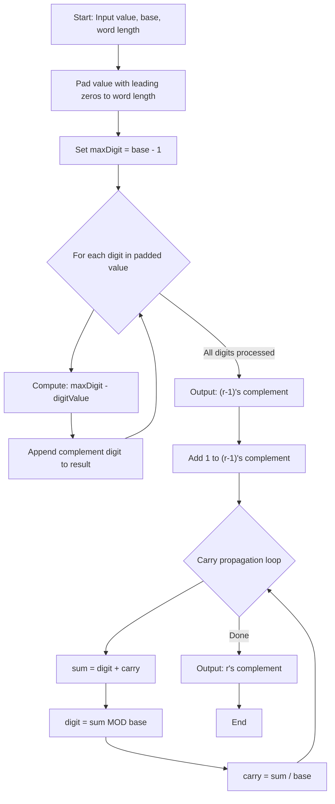
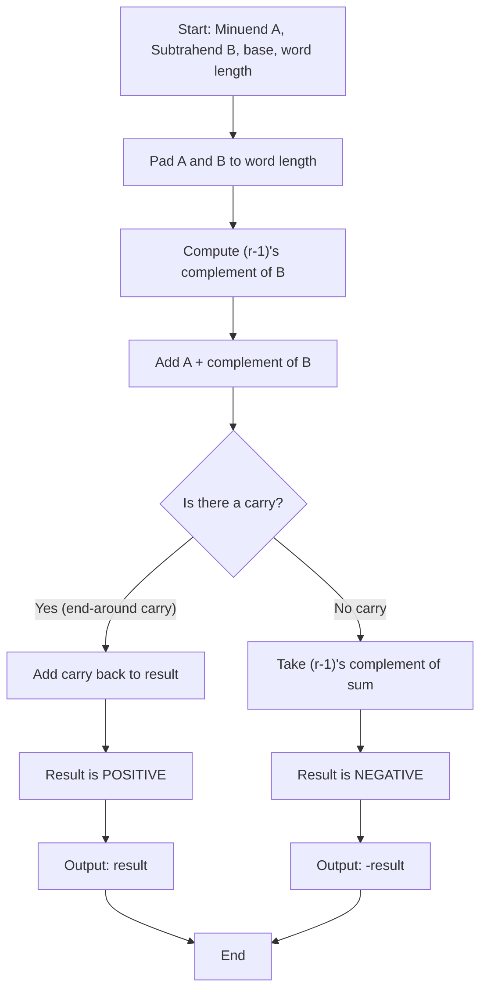
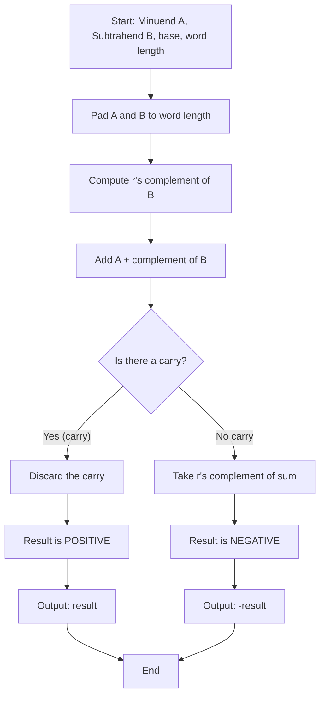

# 1's and 2's Complement for Number Systems — System Documentation

**Project:** 1's and 2's Complement for Number Systems  
**Course Context:** Computer Architecture (Activity 2 – Complements & Subtraction)  
**System Type:** Client-Side Web Application (Multi-Page)  
**Document Version:** 1.0.0  

---

## Table of Contents
1. [System Requirements](#1-system-requirements)
   - [1.1 Project Overview & Purpose](#11-project-overview--purpose)
   - [1.2 Functional Requirements (FR)](#12-functional-requirements-fr)
   - [1.3 Non-Functional Requirements (NFR)](#13-non-functional-requirements-nfr)
   - [1.4 System & Hardware Constraints](#14-system--hardware-constraints)
2. [Algorithms & Pseudocode](#2-algorithms--pseudocode)
   - [2.1 (r-1)'s Complement Computation](#21-r-1s-complement-computation-computerminus1complement)
   - [2.2 r's Complement Computation](#22-rs-complement-computation-computercomplement)
   - [2.3 Addition in Any Base](#23-addition-in-any-base-addinbase)
   - [2.4 Subtraction Using (r-1)'s Complement](#24-subtraction-using-r-1s-complement)
   - [2.5 Subtraction Using r's Complement](#25-subtraction-using-rs-complement)
3. [Flowcharts](#3-flowcharts)
   - [3.1 Complement Computation Flow](#31-complement-computation-flow)
   - [3.2 Subtraction Using (r-1)'s Complement Flow](#32-subtraction-using-r-1s-complement-flow)
   - [3.3 Subtraction Using r's Complement Flow](#33-subtraction-using-rs-complement-flow)
4. [Program Implementation](#4-program-implementation)
   - [4.1 Architecture & File Organization](#41-architecture--file-organization)
   - [4.2 Source Code](#42-source-code)
5. [Test Cases & Sample Output](#5-test-cases--sample-output)
   - [5.1 Complement Computation Test Cases](#51-complement-computation-test-cases)
   - [5.2 Subtraction Test Cases](#52-subtraction-test-cases)
   - [5.3 Sample Output](#53-sample-output)

---

## 1. System Requirements

### 1.1 Project Overview & Purpose

The **1's and 2's Complement for Number Systems** module extends the existing Number System Converter with binary complement computation and subtraction via complements across all four standard computing number systems:

- **Binary (Base 2)**
- **Octal (Base 8)**
- **Decimal (Base 10)**
- **Hexadecimal (Base 16)**

The system allows users to:
1. Input a number in **any of the four bases** (with optional `+` or `−` sign) and view its:
   - **True Binary Representation** (left-padded to the working bit length)
   - **(r-1)'s Complement (1's complement)** (bitwise inversion $0 \leftrightarrow 1$)
   - **r's Complement (2's complement)** (1's complement + 1)
   - **Signed Binary Representation** in both 1's and 2's complement notation
2. Perform **subtraction using the (r-1)'s complement (1's)** method with end-around carry.
3. Perform **subtraction using the r's complement (2's)** method with carry discard.
4. View **step-by-step solutions** detailing every bitwise operation and decimal conversions.
5. Configure a **working word length (bits)** (e.g., 4, 8, 16, 32 bits).

### Complement Theory in Computer Architecture

In digital computer systems, complements are fundamental binary representations used for signed integer arithmetic:

1. **True Binary Representation:** The magnitude of the number converted from the input base into binary and padded to the specified word length (e.g., 8-bit $+10_{10} = \text{0000 1010}_2$).
2. **1's Complement ((r-1)'s in Base 2):** Obtained by inverting every bit ($0 \rightarrow 1$ and $1 \rightarrow 0$).
   - For $\text{0000 1010}_2 \rightarrow \text{1111 0101}_2$.
3. **2's Complement (r's in Base 2):** Obtained by adding 1 to the 1's complement ($2^n - N$).
   - For $\text{1111 0101}_2 + 1 \rightarrow \text{1111 0110}_2$.
4. **Signed Number Representation:**
   - **Positive Numbers ($+N$):** In signed binary systems, positive values are represented identically to unsigned binary with the Most Significant Bit (MSB, sign bit) equal to `0` (e.g., $+10_{10} = \text{0000 1010}_2$ in both 1's and 2's complement).
   - **Negative Numbers ($-N$):** The negative value is formed by taking the 1's or 2's complement of the positive magnitude with MSB = `1` (e.g., $-10_{10} = \text{1111 0101}_2$ in 1's complement, and $\text{1111 0110}_2$ in 2's complement).

---

### 1.2 Functional Requirements (FR)

| ID | Requirement Name | Description |
| :--- | :--- | :--- |
| **FR-01** | **Complement Computation** | The user can enter a number in any of the four bases (2, 8, 10, 16) and see both the (r-1)'s and r's complements computed instantly. |
| **FR-02** | **Working Word Length** | The user can specify the working word length (digit width). Input values shorter than this width are left-padded with zeros. |
| **FR-03** | **Multiple Input Boxes** | The user can configure between 1 and 10 input boxes (Tab 1), each independently computing complements. |
| **FR-04** | **Subtraction via (r-1)'s Complement** | The user can subtract two numbers using the (r-1)'s complement method, with automatic end-around carry handling for positive results and re-complementing for negative results. |
| **FR-05** | **Subtraction via r's Complement** | The user can subtract two numbers using the r's complement method, with automatic carry discard for positive results and re-complementing for negative results. |
| **FR-06** | **Step-by-Step Solutions** | Every complement computation and subtraction displays a detailed, collapsible step-by-step solution. |
| **FR-07** | **Labeled Operands** | The Minuend (A) and Subtrahend (B) are clearly labeled in both the input and result display. |
| **FR-08** | **Smooth Navigation** | When the subtraction button is clicked, the page smoothly scrolls to the result container with a pulse animation. |
| **FR-09** | **Input Validation** | All inputs are validated against the selected base before processing, with inline error messages. |
| **FR-10** | **Tab Navigation** | Two tabs separate complement computation (Tab 1) from subtraction (Tab 2). |

---

### 1.3 Non-Functional Requirements (NFR)

* **NFR-01: Performance & Responsiveness:** All computations execute synchronously in < 16 ms.
* **NFR-02: Zero External Dependencies:** Pure Vanilla HTML5, CSS3, and ES6+ JavaScript modules.
* **NFR-03: Visual Consistency:** Uses the same color palette, typography, and component patterns as the main Number System Converter.
* **NFR-04: Robustness:** Comprehensive input validation with no uncaught JavaScript runtime exceptions.
* **NFR-05: Modularity:** Clean separation between math logic (`complement.js`) and UI orchestration (`complement-ui.js`).

---

### 1.4 System & Hardware Constraints

* **Platform:** Client-side web browser (desktop, tablet, or mobile).
* **Browser Compatibility:** Google Chrome 80+, Mozilla Firefox 75+, Microsoft Edge 80+, Apple Safari 14+ (requires ES Module support).
* **Host Server:** Standard static web server (e.g., VS Code Live Server, Python `http.server`, or GitHub Pages).

---

## 2. Algorithms & Pseudocode

### 2.1 1's Complement Computation (`compute1sComplement`)

Inverts each bit of the binary representation ($0 \leftrightarrow 1$).

```text
Algorithm: compute1sComplement(binaryStr)
Input: binaryStr (String of '0's and '1's)
Output: String 1's complement

1.  Set result = ""
2.  For each bit in binaryStr:
3.      If bit == '0':
4.          Set result = result + '1'
5.      Else:
6.          Set result = result + '0'
7.  Return result
```

**Example (8-bit binary):**
- Input: `00001010` ($10_{10}$)
- Inverted: `11110101` (1's complement)

---

### 2.2 2's Complement Computation (`compute2sComplement`)

Computes the 1's complement, then adds 1 with ripple carry.

```text
Algorithm: compute2sComplement(binaryStr)
Input: binaryStr (String of '0's and '1's)
Output: String 2's complement

1.  Set ones = compute1sComplement(binaryStr)
2.  Set digits = Array of integer bit values from ones
3.  Set carry = 1
4.  For i from Length(digits) - 1 down to 0:
5.      If carry == 0: Break
6.      Set sum = digits[i] + carry
7.      Set digits[i] = sum MOD 2
8.      Set carry = Floor(sum / 2)
9.  Return Join(digits as string)
```

**Example (8-bit binary):**
- Input: `00001010` ($10_{10}$)
- 1's complement: `11110101`
- Add 1: `11110101 + 1 = 11110110` (2's complement)

---

### 2.3 Binary Addition (`addBinary`)

Adds two binary strings bit-by-bit from right to left with carry propagation.

```text
Algorithm: addBinary(aBin, bBin)
Input: aBin, bBin (Binary strings)
Output: Object { result: String, carry: Integer }

1.  Set len = Max(Length(aBin), Length(bBin))
2.  Set aPadded = PadLeadingZeros(aBin, len)
3.  Set bPadded = PadLeadingZeros(bBin, len)
4.  Set digits = []
5.  Set carry = 0
6.  For i from len - 1 down to 0:
7.      Set sum = ToInt(aPadded[i]) + ToInt(bPadded[i]) + carry
8.      Prepend (sum MOD 2) to digits
9.      Set carry = Floor(sum / 2)
10. Return { result: Join(digits), carry: carry }
```

---

### 2.4 Subtraction Using 1's Complement

```text
Algorithm: subtractUsing1sComplement(minuendStr, subtrahendStr, base, numBits)
Input: minuendStr (A), subtrahendStr (B), base, numBits
Output: Object { result: String, isNegative: Boolean, decimalValue: String, solution: String }

1.  Convert A and B to binary strings binA and binB padded to numBits
2.  Set onesB = compute1sComplement(binB)
3.  Set addResult = addBinary(binA, onesB)
4.  If addResult.carry > 0:
        // End-around carry: result is POSITIVE
5.      Set carryStr = PadLeadingZeros("1", numBits)
6.      Set finalResult = addBinary(addResult.result, carryStr)
7.      Return { result: finalResult.result, isNegative: false }
8.  Else:
        // No carry: result is NEGATIVE
9.      Set negResult = compute1sComplement(addResult.result)
10.     Return { result: negResult, isNegative: true }
```

---

### 2.5 Subtraction Using 2's Complement

```text
Algorithm: subtractUsing2sComplement(minuendStr, subtrahendStr, base, numBits)
Input: minuendStr (A), subtrahendStr (B), base, numBits
Output: Object { result: String, isNegative: Boolean, decimalValue: String, solution: String }

1.  Convert A and B to binary strings binA and binB padded to numBits
2.  Set twosB = compute2sComplement(binB)
3.  Set addResult = addBinary(binA, twosB)
4.  If addResult.carry > 0:
        // Carry detected: discard carry, result is POSITIVE
5.      Return { result: addResult.result, isNegative: false }
6.  Else:
        // No carry: result is NEGATIVE
7.      Set negResult = compute2sComplement(addResult.result)
8.      Return { result: negResult, isNegative: true }
```

---

## 3. Flowcharts

### 3.1 Complement Computation Flow



### 3.2 Subtraction Using (r-1)'s Complement Flow



### 3.3 Subtraction Using r's Complement Flow



---

## 4. Program Implementation

### 4.1 Architecture & File Organization

```text
number-system-converter/
├── index.html                   (Modified: added header navigation button)
├── style.css                    (Modified: added .header-nav-link styles)
├── complement/                  (NEW folder)
│   ├── index.html               (NEW: two-tab complement page)
│   ├── complement.js            (NEW: core complement math module)
│   ├── complement-ui.js         (NEW: UI orchestration module)
│   └── complement.css           (NEW: page styling)
├── conversions/                 (Existing, no changes)
│   ├── validation.js            (Reused by complement.js)
│   └── ...
└── COMPLEMENT_DOCUMENTATION.md  (NEW: this document)
```

**Module Roles:**

| File | Role |
|:---|:---|
| `complement/complement.js` | Pure math module: complement computation, base addition, subtraction via complements, step-by-step solution generation. Imports `getDigitValue` and `validateInput` from `../conversions/validation.js`. |
| `complement/complement-ui.js` | UI orchestration: tab switching, dynamic input box creation, event listeners, real-time complement updates, subtraction execution, smooth scroll animations. |
| `complement/complement.css` | Visual styling consistent with the main app's color palette (`#355872`, `#7AAACE`, `#9CD5FF`, `#F7F8F0`, `#DCE3EB`). |
| `complement/index.html` | Two-tab page structure: Tab 1 for complement computation, Tab 2 for subtraction via complements. |

---

### 4.2 Source Code

#### 4.2.1 `complement/index.html`

```html
<!DOCTYPE html>
<html lang="en">
<head>
    <meta charset="UTF-8">
    <meta name="viewport" content="width=device-width, initial-scale=1.0">

    <title>1's and 2's Complement for Number Systems</title>

    <link rel="stylesheet" href="./complement.css">
</head>
<body>

    <main class="app-container">

        <header class="header-container">
            <h1>1's and 2's Complement for Number Systems</h1>
            <p>Compute complements and perform subtraction using complement methods.</p>
            <a href="../index.html" class="header-nav-link">
                <span class="nav-arrow">←</span> Back to Number System Converter
            </a>
        </header>

        <nav class="tab-bar" id="tabBar">
            <button type="button" class="tab-btn active" data-tab="complements">
                Complements
            </button>
            <button type="button" class="tab-btn" data-tab="subtraction">
                Subtraction via Complements
            </button>
        </nav>

        <!-- ═══════════════════════════════════════════════════ -->
        <!-- TAB 1: COMPLEMENTS -->
        <!-- ═══════════════════════════════════════════════════ -->
        <div class="tab-panel active" id="panel-complements">

            <section class="controls-container">
                <div class="control-group">
                    <label for="complementInputCount">
                        Number of input boxes:
                    </label>
                    <input
                        type="number"
                        id="complementInputCount"
                        min="1"
                        max="10"
                        value="3"
                    >
                </div>

                <button id="complementSetInputsButton" type="button">
                    Set Input Boxes
                </button>
            </section>

            <section
                id="complementInputsContainer"
                class="inputs-container">
            </section>

        </div>

        <!-- ═══════════════════════════════════════════════════ -->
        <!-- TAB 2: SUBTRACTION VIA COMPLEMENTS -->
        <!-- ═══════════════════════════════════════════════════ -->
        <div class="tab-panel" id="panel-subtraction">

            <section class="controls-container subtraction-controls">
                <div class="control-group">
                    <label>Number system:</label>
                    <div class="base-btn-group" id="subBaseButtonGroup" role="group" aria-label="Subtraction number system">
                        <button type="button" class="btn-base" data-base="10">10 <span class="base-tag">Dec</span></button>
                        <button type="button" class="btn-base active" data-base="2">2 <span class="base-tag">Bin</span></button>
                        <button type="button" class="btn-base" data-base="8">8 <span class="base-tag">Oct</span></button>
                        <button type="button" class="btn-base" data-base="16">16 <span class="base-tag">Hex</span></button>
                    </div>
                </div>

                <div class="control-group">
                    <label for="subDigitWidth">Working word length (bits):</label>
                    <input
                        type="number"
                        id="subDigitWidth"
                        min="1"
                        max="32"
                        value="8"
                    >
                </div>
            </section>

            <section class="subtraction-input-section">
                <div class="subtraction-field">
                    <label for="subMinuend" class="subtraction-label">
                        <span class="sub-label-badge">A</span>
                        Minuend (the number being subtracted from):
                    </label>
                    <input
                        type="text"
                        id="subMinuend"
                        class="number-input"
                        placeholder="Enter Minuend A (Base 2)"
                        autocomplete="off"
                        spellcheck="false"
                    >
                    <p class="validation-message" id="subMinuendValidation"></p>
                </div>

                <div class="subtraction-operator">−</div>

                <div class="subtraction-field">
                    <label for="subSubtrahend" class="subtraction-label">
                        <span class="sub-label-badge">B</span>
                        Subtrahend (the number being subtracted):
                    </label>
                    <input
                        type="text"
                        id="subSubtrahend"
                        class="number-input"
                        placeholder="Enter Subtrahend B (Base 2)"
                        autocomplete="off"
                        spellcheck="false"
                    >
                    <p class="validation-message" id="subSubtrahendValidation"></p>
                </div>

                <button id="performSubtractionButton" type="button">
                    Perform Subtraction
                </button>
            </section>

            <section
                id="subtractionResultContainer"
                class="subtraction-result-container"
                hidden>
            </section>

        </div>

    </main>

    <script type="module" src="./complement-ui.js"></script>
</body>
</html>
```

---

#### 4.2.2 `complement/complement.js`

```javascript
import {
    getDigitValue
} from "../conversions/validation.js";

/**
 * Validates signed or unsigned input for a given base.
 * Accepts optional leading '+' or '-'.
 */
export function validateSignedInput(value, base) {
    const trimmed = value.trim().toUpperCase();

    if (trimmed === "") {
        return {
            valid: false,
            message: "Input cannot be empty."
        };
    }

    let sign = "+";
    let digits = trimmed;

    if (trimmed.startsWith("-") || trimmed.startsWith("+")) {
        sign = trimmed[0];
        digits = trimmed.slice(1);
    }

    if (digits === "") {
        return {
            valid: false,
            message: "Please enter digits after the sign."
        };
    }

    for (const character of digits) {
        const digitValue = getDigitValue(character);
        if (digitValue < 0 || digitValue >= base) {
            return {
                valid: false,
                message: `Invalid character '${character}' for Base ${base}.`
            };
        }
    }

    return {
        valid: true,
        sign,
        isNegative: sign === "-",
        digits,
        normalizedValue: `${sign === "-" ? "-" : ""}${digits}`,
        message: "Valid input."
    };
}

/**
 * Converts a digit string in any supported base (2, 8, 10, 16) to a BigInt.
 */
export function baseToBigInt(digits, base) {
    let result = 0n;
    const b = BigInt(base);
    for (const ch of digits.toUpperCase()) {
        const d = BigInt(getDigitValue(ch));
        result = result * b + d;
    }
    return result;
}

/**
 * Returns complement names for display.
 */
export function getComplementNames() {
    return {
        rMinus1: "1's",
        r: "2's",
        rMinus1Full: "(r-1)'s complement (1's)",
        rFull: "r's complement (2's)"
    };
}

/**
 * Formats a binary string with spaces separating 4-bit nibbles from right to left.
 * Example: "00001010" → "0000 1010"
 */
export function formatBinaryWithSpaces(binaryStr) {
    if (!binaryStr) return "";
    const isNeg = binaryStr.startsWith("-");
    const raw = isNeg ? binaryStr.slice(1) : binaryStr;

    // Pad to multiple of 4 for clean grouping
    const rem = raw.length % 4;
    const padded = rem === 0 ? raw : "0".repeat(4 - rem) + raw;

    const parts = [];
    for (let i = 0; i < padded.length; i += 4) {
        parts.push(padded.slice(i, i + 4));
    }
    return (isNeg ? "−" : "") + parts.join(" ");
}

/**
 * Pads a binary string with leading zeros to reach target length.
 */
export function padBinary(binaryStr, numBits) {
    if (binaryStr.length >= numBits) {
        return binaryStr;
    }
    return "0".repeat(numBits - binaryStr.length) + binaryStr;
}

/**
 * Computes the 1's complement of a binary string by inverting every bit (0 ↔ 1).
 */
export function compute1sComplement(binaryStr) {
    let result = "";
    for (const bit of binaryStr) {
        result += bit === "0" ? "1" : "0";
    }
    return result;
}

/**
 * Computes the 2's complement of a binary string: 1's complement + 1.
 */
export function compute2sComplement(binaryStr) {
    const ones = compute1sComplement(binaryStr);
    const digits = ones.split("").map(Number);
    let carry = 1;

    for (let i = digits.length - 1; i >= 0 && carry > 0; i--) {
        const sum = digits[i] + carry;
        digits[i] = sum % 2;
        carry = Math.floor(sum / 2);
    }

    return digits.join("");
}

/**
 * Adds two binary strings of equal length.
 * Returns { result: string, carry: number }
 */
export function addBinary(aBin, bBin) {
    const len = Math.max(aBin.length, bBin.length);
    const aPadded = padBinary(aBin, len);
    const bPadded = padBinary(bBin, len);
    const digits = [];
    let carry = 0;

    for (let i = len - 1; i >= 0; i--) {
        const sum = Number(aPadded[i]) + Number(bPadded[i]) + carry;
        digits.unshift(sum % 2);
        carry = Math.floor(sum / 2);
    }

    return {
        result: digits.join(""),
        carry
    };
}

/**
 * Computes all complement representations for an input value.
 */
export function computeComplements(valueStr, base, userNumBits = 8) {
    const validation = validateSignedInput(valueStr, base);
    if (!validation.valid) {
        return null;
    }

    const { isNegative, digits, normalizedValue } = validation;
    const decimalBigInt = baseToBigInt(digits, base);
    const rawBinary = decimalBigInt.toString(2);

    // Determine working bit length:
    // User requested bits, but expand if raw binary needs more bits
    let effectiveBits = Math.max(Number(userNumBits) || 8, rawBinary.length);

    // Round up to nearest multiple of 4 for clean nibble alignment
    if (effectiveBits % 4 !== 0) {
        effectiveBits += 4 - (effectiveBits % 4);
    }

    const trueBinary = padBinary(rawBinary, effectiveBits);
    const onesComp = compute1sComplement(trueBinary);
    const twosComp = compute2sComplement(trueBinary);

    // Signed binary representations
    // For positive: identical to unsigned binary (MSB = 0)
    // For negative: 1's comp and 2's comp of magnitude (MSB = 1)
    const signed1sComp = isNegative ? onesComp : trueBinary;
    const signed2sComp = isNegative ? twosComp : trueBinary;

    return {
        isNegative,
        normalizedValue,
        decimalValue: decimalBigInt.toString(10),
        rawBinary,
        effectiveBits,
        trueBinary,
        onesComplement: onesComp,
        twosComplement: twosComp,
        signed1sComplement: signed1sComp,
        signed2sComplement: signed2sComp,
        formattedTrueBinary: formatBinaryWithSpaces(trueBinary),
        formatted1sComplement: formatBinaryWithSpaces(onesComp),
        formatted2sComplement: formatBinaryWithSpaces(twosComp),
        formattedSigned1s: formatBinaryWithSpaces(signed1sComp),
        formattedSigned2s: formatBinaryWithSpaces(signed2sComp)
    };
}

/**
 * Generates an educational step-by-step solution for 1's and 2's complement computation.
 */
export function createComplementSolution(valueStr, base, userNumBits = 8) {
    const comp = computeComplements(valueStr, base, userNumBits);
    if (!comp) {
        return "Please enter a valid input to view the step-by-step solution.";
    }

    const {
        isNegative,
        normalizedValue,
        decimalValue,
        effectiveBits,
        trueBinary,
        onesComplement,
        twosComplement,
        formattedTrueBinary,
        formatted1sComplement,
        formatted2sComplement,
        formattedSigned1s,
        formattedSigned2s
    } = comp;

    const lines = [];
    lines.push("══════════════════════════════════════════════════════════");
    lines.push("      1's AND 2's COMPLEMENT COMPUTATION (BINARY)        ");
    lines.push("══════════════════════════════════════════════════════════");
    lines.push("");
    lines.push(`Input: ${normalizedValue} (Base ${base})`);
    lines.push(`Decimal Value: ${isNegative ? "-" : ""}${decimalValue}`);
    lines.push(`Working word length: ${effectiveBits} bit(s)`);
    lines.push("");

    // Step 1: Conversion to Binary
    lines.push("── STEP 1: Convert Input to Binary ──");
    if (base === 2) {
        lines.push(`  Value is already in Base 2: ${trueBinary}`);
    } else if (base === 10) {
        lines.push(`  Decimal ${decimalValue} converted to ${effectiveBits}-bit binary:`);
        lines.push(`  True Binary = ${formattedTrueBinary}`);
    } else {
        lines.push(`  Convert ${normalizedValue} (Base ${base}) → Decimal ${decimalValue} → ${effectiveBits}-bit binary:`);
        lines.push(`  True Binary = ${formattedTrueBinary}`);
    }
    lines.push("");

    // Step 2: 1's Complement
    lines.push("── STEP 2: Compute 1's Complement (r-1)'s ──");
    lines.push("  Method: Invert every bit of the binary representation (0 ↔ 1).");
    lines.push("");
    lines.push(`  True Binary:    ${formattedTrueBinary}`);
    lines.push(`  Inverted (1's): ${formatted1sComplement}`);
    lines.push("");
    lines.push(`  (r-1)'s complement (1's) = ${formatted1sComplement}`);
    lines.push("");

    // Step 3: 2's Complement
    lines.push("── STEP 3: Compute 2's Complement (r's) ──");
    lines.push("  Method: Add 1 to the 1's complement.");
    lines.push("");
    lines.push(`    ${formatted1sComplement}   (1's Complement)`);
    lines.push(`  + ${formatBinaryWithSpaces(padBinary("1", effectiveBits))}   (+ 1)`);
    lines.push(`  ${"─".repeat(formatted1sComplement.length + 4)}`);
    lines.push(`    ${formatted2sComplement}   (2's Complement)`);
    lines.push("");
    lines.push(`  r's complement (2's) = ${formatted2sComplement}`);
    lines.push("");

    // Step 4: Signed Representation
    lines.push("── STEP 4: Signed Binary Representation Analysis ──");
    if (!isNegative) {
        lines.push(`  For positive numbers (+${decimalValue}):`);
        lines.push(`  • In signed systems, positive values keep sign bit MSB = 0:`);
        lines.push(`    Signed 1's Complement = ${formattedSigned1s}`);
        lines.push(`    Signed 2's Complement = ${formattedSigned2s}`);
        lines.push(`  • The bitwise complements represent the negation (−${decimalValue}):`);
        lines.push(`    Negative value (−${decimalValue}) in 1's Comp = ${formatted1sComplement}`);
        lines.push(`    Negative value (−${decimalValue}) in 2's Comp = ${formatted2sComplement}`);
    } else {
        lines.push(`  For negative numbers (−${decimalValue}):`);
        lines.push(`  • Magnitude in binary: ${formattedTrueBinary}`);
        lines.push(`  • Signed 1's Complement (−${decimalValue}): ${formattedSigned1s} (MSB = 1)`);
        lines.push(`  • Signed 2's Complement (−${decimalValue}): ${formattedSigned2s} (MSB = 1)`);
    }

    return lines.join("\n");
}

/**
 * Performs binary subtraction A − B using the 1's complement method.
 */
export function subtractUsing1sComplement(minuendStr, subtrahendStr, base, userNumBits = 8) {
    const valA = validateSignedInput(minuendStr, base);
    const valB = validateSignedInput(subtrahendStr, base);

    if (!valA.valid || !valB.valid) {
        return { error: "Invalid inputs." };
    }

    const decA = baseToBigInt(valA.digits, base) * (valA.isNegative ? -1n : 1n);
    const decB = baseToBigInt(valB.digits, base) * (valB.isNegative ? -1n : 1n);

    const binRawA = (decA < 0n ? -decA : decA).toString(2);
    const binRawB = (decB < 0n ? -decB : decB).toString(2);

    let effectiveBits = Math.max(Number(userNumBits) || 8, binRawA.length, binRawB.length);
    if (effectiveBits % 4 !== 0) {
        effectiveBits += 4 - (effectiveBits % 4);
    }

    const binA = padBinary(binRawA, effectiveBits);
    const binB = padBinary(binRawB, effectiveBits);

    // 1's complement of subtrahend B
    const onesB = compute1sComplement(binB);

    // Add A + 1's comp of B
    const addResult = addBinary(binA, onesB);

    const lines = [];
    lines.push("══════════════════════════════════════════════════════════");
    lines.push("     SUBTRACTION USING (r-1)'s COMPLEMENT (1's)          ");
    lines.push("══════════════════════════════════════════════════════════");
    lines.push("");
    lines.push(`Minuend (A):    ${valA.normalizedValue} (Base ${base}) = ${formatBinaryWithSpaces(binA)}₂ (${decA})`);
    lines.push(`Subtrahend (B): ${valB.normalizedValue} (Base ${base}) = ${formatBinaryWithSpaces(binB)}₂ (${decB})`);
    lines.push(`Working word length: ${effectiveBits} bit(s)`);
    lines.push("");

    // Step 1
    lines.push(`Step 1: Find the 1's complement of Subtrahend B (${formatBinaryWithSpaces(binB)})`);
    lines.push(`  Invert each bit: ${formatBinaryWithSpaces(binB)} → ${formatBinaryWithSpaces(onesB)}`);
    lines.push(`  1's complement of B = ${formatBinaryWithSpaces(onesB)}`);
    lines.push("");

    // Step 2
    lines.push("Step 2: Add Minuend A + 1's complement of Subtrahend B");
    lines.push(`    ${formatBinaryWithSpaces(binA)}   (Minuend A)`);
    lines.push(`  + ${formatBinaryWithSpaces(onesB)}   (1's complement of B)`);
    lines.push(`  ${"─".repeat(formatBinaryWithSpaces(binA).length + 4)}`);

    let finalBinary;
    let isNegative = false;
    let finalDec;

    if (addResult.carry > 0) {
        // Step 3a: End-around carry
        lines.push(`  1 ${formatBinaryWithSpaces(addResult.result)}   ← End-around carry of 1`);
        lines.push("");
        lines.push("Step 3: End-around carry detected → Result is POSITIVE (+)");
        lines.push("  Add the end-around carry (+1) back to the result:");

        const carryResult = addBinary(addResult.result, padBinary("1", effectiveBits));
        finalBinary = carryResult.result;
        finalDec = BigInt("0b" + finalBinary);

        lines.push(`    ${formatBinaryWithSpaces(addResult.result)}`);
        lines.push(`  + ${formatBinaryWithSpaces(padBinary("1", effectiveBits))}`);
        lines.push(`  ${"─".repeat(formatBinaryWithSpaces(finalBinary).length + 4)}`);
        lines.push(`    ${formatBinaryWithSpaces(finalBinary)}`);
        lines.push("");
        lines.push(`Final Answer: A − B = ${formatBinaryWithSpaces(finalBinary)}₂ (+${finalDec.toString(10)} in Base 10)`);
    } else {
        // Step 3b: No carry → negative result
        lines.push(`    ${formatBinaryWithSpaces(addResult.result)}   ← No carry detected (0)`);
        lines.push("");
        lines.push("Step 3: No end-around carry → Result is NEGATIVE (−)");
        lines.push("  Take the 1's complement of the sum to find the magnitude, then negate:");

        const invertedSum = compute1sComplement(addResult.result);
        finalBinary = invertedSum;
        isNegative = true;
        finalDec = BigInt("0b" + finalBinary);

        lines.push(`  Invert sum: ${formatBinaryWithSpaces(addResult.result)} → ${formatBinaryWithSpaces(invertedSum)}`);
        lines.push("");
        lines.push(`Final Answer: A − B = −${formatBinaryWithSpaces(finalBinary)}₂ (−${finalDec.toString(10)} in Base 10)`);
    }

    return {
        isNegative,
        rawBinary: finalBinary,
        formattedBinary: formatBinaryWithSpaces(finalBinary),
        decimalValue: (isNegative ? -finalDec : finalDec).toString(10),
        decimalString: (isNegative ? "-" : "+") + finalDec.toString(10),
        solution: lines.join("\n")
    };
}

/**
 * Performs binary subtraction A − B using the 2's complement method.
 */
export function subtractUsing2sComplement(minuendStr, subtrahendStr, base, userNumBits = 8) {
    const valA = validateSignedInput(minuendStr, base);
    const valB = validateSignedInput(subtrahendStr, base);

    if (!valA.valid || !valB.valid) {
        return { error: "Invalid inputs." };
    }

    const decA = baseToBigInt(valA.digits, base) * (valA.isNegative ? -1n : 1n);
    const decB = baseToBigInt(valB.digits, base) * (valB.isNegative ? -1n : 1n);

    const binRawA = (decA < 0n ? -decA : decA).toString(2);
    const binRawB = (decB < 0n ? -decB : decB).toString(2);

    let effectiveBits = Math.max(Number(userNumBits) || 8, binRawA.length, binRawB.length);
    if (effectiveBits % 4 !== 0) {
        effectiveBits += 4 - (effectiveBits % 4);
    }

    const binA = padBinary(binRawA, effectiveBits);
    const binB = padBinary(binRawB, effectiveBits);

    // 2's complement of subtrahend B
    const onesB = compute1sComplement(binB);
    const twosB = compute2sComplement(binB);

    // Add A + 2's comp of B
    const addResult = addBinary(binA, twosB);

    const lines = [];
    lines.push("══════════════════════════════════════════════════════════");
    lines.push("       SUBTRACTION USING r's COMPLEMENT (2's)             ");
    lines.push("══════════════════════════════════════════════════════════");
    lines.push("");
    lines.push(`Minuend (A):    ${valA.normalizedValue} (Base ${base}) = ${formatBinaryWithSpaces(binA)}₂ (${decA})`);
    lines.push(`Subtrahend (B): ${valB.normalizedValue} (Base ${base}) = ${formatBinaryWithSpaces(binB)}₂ (${decB})`);
    lines.push(`Working word length: ${effectiveBits} bit(s)`);
    lines.push("");

    // Step 1
    lines.push(`Step 1: Find the 2's complement of Subtrahend B (${formatBinaryWithSpaces(binB)})`);
    lines.push(`  1's complement of B: ${formatBinaryWithSpaces(onesB)}`);
    lines.push(`  Add 1:              ${formatBinaryWithSpaces(twosB)}`);
    lines.push(`  2's complement of B = ${formatBinaryWithSpaces(twosB)}`);
    lines.push("");

    // Step 2
    lines.push("Step 2: Add Minuend A + 2's complement of Subtrahend B");
    lines.push(`    ${formatBinaryWithSpaces(binA)}   (Minuend A)`);
    lines.push(`  + ${formatBinaryWithSpaces(twosB)}   (2's complement of B)`);
    lines.push(`  ${"─".repeat(formatBinaryWithSpaces(binA).length + 4)}`);

    let finalBinary;
    let isNegative = false;
    let finalDec;

    if (addResult.carry > 0) {
        // Step 3a: Carry detected → discard
        lines.push(`  1 ${formatBinaryWithSpaces(addResult.result)}   ← Carry of 1 detected`);
        lines.push("");
        lines.push("Step 3: Carry detected → DISCARD the carry → Result is POSITIVE (+)");
        lines.push("  Discarding the overflow carry gives:");

        finalBinary = addResult.result;
        finalDec = BigInt("0b" + finalBinary);

        lines.push(`  Result = ${formatBinaryWithSpaces(finalBinary)}`);
        lines.push("");
        lines.push(`Final Answer: A − B = ${formatBinaryWithSpaces(finalBinary)}₂ (+${finalDec.toString(10)} in Base 10)`);
    } else {
        // Step 3b: No carry → negative result
        lines.push(`    ${formatBinaryWithSpaces(addResult.result)}   ← No carry detected (0)`);
        lines.push("");
        lines.push("Step 3: No carry detected → Result is NEGATIVE (−)");
        lines.push("  Take the 2's complement of the sum to find the magnitude, then negate:");

        const twosSum = compute2sComplement(addResult.result);
        finalBinary = twosSum;
        isNegative = true;
        finalDec = BigInt("0b" + finalBinary);

        lines.push(`  1's comp of sum: ${formatBinaryWithSpaces(compute1sComplement(addResult.result))}`);
        lines.push(`  Add 1:           ${formatBinaryWithSpaces(twosSum)}`);
        lines.push("");
        lines.push(`Final Answer: A − B = −${formatBinaryWithSpaces(finalBinary)}₂ (−${finalDec.toString(10)} in Base 10)`);
    }

    return {
        isNegative,
        rawBinary: finalBinary,
        formattedBinary: formatBinaryWithSpaces(finalBinary),
        decimalValue: (isNegative ? -finalDec : finalDec).toString(10),
        decimalString: (isNegative ? "-" : "+") + finalDec.toString(10),
        solution: lines.join("\n")
    };
}

// Aliases for compatibility
export const computeRMinus1Complement = compute1sComplement;
export const computeRComplement = compute2sComplement;
export const subtractUsingRMinus1Complement = subtractUsing1sComplement;
export const subtractUsingRComplement = subtractUsing2sComplement;
export const padValue = padBinary;
```

---

#### 4.2.3 `complement/complement-ui.js`

```javascript
import {
    validateSignedInput,
    computeComplements,
    createComplementSolution,
    subtractUsing1sComplement,
    subtractUsing2sComplement,
    getComplementNames,
    formatBinaryWithSpaces
} from "./complement.js";

// ═══════════════════════════════════════════════════════
// Number Systems
// ═══════════════════════════════════════════════════════

const numberSystems = [
    { name: "Decimal",     base: 10, short: "Dec" },
    { name: "Binary",      base: 2,  short: "Bin" },
    { name: "Octal",       base: 8,  short: "Oct" },
    { name: "Hexadecimal", base: 16, short: "Hex" }
];

// ═══════════════════════════════════════════════════════
// DOM References
// ═══════════════════════════════════════════════════════

const tabBar = document.getElementById("tabBar");
const panelComplements = document.getElementById("panel-complements");
const panelSubtraction = document.getElementById("panel-subtraction");

// Tab 1
const complementInputCount = document.getElementById("complementInputCount");
const complementSetInputsButton = document.getElementById("complementSetInputsButton");
const complementInputsContainer = document.getElementById("complementInputsContainer");

// Tab 2
const subBaseButtonGroup = document.getElementById("subBaseButtonGroup");
const subDigitWidth = document.getElementById("subDigitWidth");
const subMinuend = document.getElementById("subMinuend");
const subSubtrahend = document.getElementById("subSubtrahend");
const subMinuendValidation = document.getElementById("subMinuendValidation");
const subSubtrahendValidation = document.getElementById("subSubtrahendValidation");
const performSubtractionButton = document.getElementById("performSubtractionButton");
const subtractionResultContainer = document.getElementById("subtractionResultContainer");

// ═══════════════════════════════════════════════════════
// Tab Switching
// ═══════════════════════════════════════════════════════

tabBar.addEventListener("click", function (e) {
    const btn = e.target.closest(".tab-btn");
    if (!btn) return;

    const tabName = btn.getAttribute("data-tab");

    tabBar.querySelectorAll(".tab-btn").forEach(b => b.classList.remove("active"));
    btn.classList.add("active");

    document.querySelectorAll(".tab-panel").forEach(p => p.classList.remove("active"));
    const targetPanel = document.getElementById(`panel-${tabName}`);
    if (targetPanel) {
        targetPanel.classList.add("active");
    }
});

// ═══════════════════════════════════════════════════════
// Helper: Get input letter
// ═══════════════════════════════════════════════════════

function getInputLetter(index) {
    return String.fromCharCode(65 + (index - 1));
}

// ═══════════════════════════════════════════════════════
// Helper: Create base button group
// ═══════════════════════════════════════════════════════

function createBaseButtonGroup(groupName, initialBase, onSelectChange) {
    const group = document.createElement("div");
    group.className = `base-btn-group ${groupName}-group`;
    group.setAttribute("role", "group");
    group.setAttribute("data-selected-base", String(initialBase));

    numberSystems.forEach(function (ns) {
        const btn = document.createElement("button");
        btn.type = "button";
        btn.className = `btn-base ${ns.base === initialBase ? "active" : ""}`;
        btn.setAttribute("data-base", String(ns.base));

        const numSpan = document.createElement("span");
        numSpan.className = "base-num";
        numSpan.textContent = ns.base;

        const tagSpan = document.createElement("span");
        tagSpan.className = "base-tag";
        tagSpan.textContent = ns.short;

        btn.append(numSpan, tagSpan);

        btn.addEventListener("click", function () {
            if (btn.classList.contains("active")) return;

            group.querySelectorAll(".btn-base").forEach(b => b.classList.remove("active"));
            btn.classList.add("active");
            group.setAttribute("data-selected-base", String(ns.base));

            if (typeof onSelectChange === "function") {
                onSelectChange(ns.base);
            }
        });

        group.appendChild(btn);
    });

    return group;
}

// ═══════════════════════════════════════════════════════
// TAB 1: Create Input Boxes
// ═══════════════════════════════════════════════════════

function createComplementInputBoxes(count) {
    complementInputsContainer.replaceChildren();

    for (let i = 1; i <= count; i++) {
        const letter = getInputLetter(i);

        const inputContainer = document.createElement("article");
        inputContainer.className = "input-container";
        inputContainer.setAttribute("data-variable", letter);

        // Header
        const header = document.createElement("div");
        header.className = "box-header";

        const badge = document.createElement("span");
        badge.className = "box-badge";
        badge.textContent = letter;

        const title = document.createElement("h2");
        title.textContent = `Input Box ${letter}`;

        header.append(badge, title);

        // Input section
        const inputSection = document.createElement("div");
        inputSection.className = "input-section";

        const inputSystemLabel = document.createElement("label");
        inputSystemLabel.textContent = "Input number system:";

        const inputBaseGroup = createBaseButtonGroup("input-base", 2, function () {
            processComplementInput(inputContainer);
        });

        const digitWidthLabel = document.createElement("label");
        digitWidthLabel.setAttribute("for", `digit-width-${letter}`);
        digitWidthLabel.textContent = "Working word length (bits):";

        const digitWidthInput = document.createElement("input");
        digitWidthInput.type = "number";
        digitWidthInput.id = `digit-width-${letter}`;
        digitWidthInput.className = "digit-width-input";
        digitWidthInput.min = "1";
        digitWidthInput.max = "64";
        digitWidthInput.value = "8";

        digitWidthInput.addEventListener("input", function () {
            processComplementInput(inputContainer);
        });

        const numberLabel = document.createElement("label");
        numberLabel.setAttribute("for", `number-input-${letter}`);
        numberLabel.textContent = "Enter value:";

        const numberInput = document.createElement("input");
        numberInput.type = "text";
        numberInput.id = `number-input-${letter}`;
        numberInput.className = "number-input";
        numberInput.placeholder = `Enter value for ${letter} (Base 2)`;
        numberInput.autocomplete = "off";
        numberInput.spellcheck = false;

        const validationMessage = document.createElement("p");
        validationMessage.className = "validation-message";

        inputSection.append(
            inputSystemLabel,
            inputBaseGroup,
            digitWidthLabel,
            digitWidthInput,
            numberLabel,
            numberInput,
            validationMessage
        );

        // Complement result card
        const complementResult = document.createElement("div");
        complementResult.className = "complement-result";
        complementResult.hidden = true;

        const complementTitle = document.createElement("h3");
        complementTitle.className = "complement-result-title";
        complementTitle.textContent = "Complements (Binary)";

        // True binary row
        const trueBinaryRow = document.createElement("div");
        trueBinaryRow.className = "complement-row";
        const trueBinaryLabel = document.createElement("span");
        trueBinaryLabel.className = "complement-label";
        trueBinaryLabel.textContent = "True Binary:";
        const trueBinaryValue = document.createElement("span");
        trueBinaryValue.className = "complement-value true-binary-value";
        trueBinaryValue.textContent = "—";
        trueBinaryRow.append(trueBinaryLabel, trueBinaryValue);

        // 1's complement row
        const rMinus1Row = document.createElement("div");
        rMinus1Row.className = "complement-row";
        const rMinus1Label = document.createElement("span");
        rMinus1Label.className = "complement-label r-minus-1-label";
        rMinus1Label.textContent = "(r-1)'s complement (1's):";
        const rMinus1Value = document.createElement("span");
        rMinus1Value.className = "complement-value r-minus-1-value";
        rMinus1Value.textContent = "—";
        rMinus1Row.append(rMinus1Label, rMinus1Value);

        // 2's complement row
        const rRow = document.createElement("div");
        rRow.className = "complement-row";
        const rLabel = document.createElement("span");
        rLabel.className = "complement-label r-label";
        rLabel.textContent = "r's complement (2's):";
        const rValue = document.createElement("span");
        rValue.className = "complement-value r-value";
        rValue.textContent = "—";
        rRow.append(rLabel, rValue);

        // Signed 1's rep row
        const signed1sRow = document.createElement("div");
        signed1sRow.className = "complement-row signed-row";
        const signed1sLabel = document.createElement("span");
        signed1sLabel.className = "complement-label signed-1s-label";
        signed1sLabel.textContent = "Signed 1's Comp:";
        const signed1sValue = document.createElement("span");
        signed1sValue.className = "complement-value signed-1s-value";
        signed1sValue.textContent = "—";
        signed1sRow.append(signed1sLabel, signed1sValue);

        // Signed 2's rep row
        const signed2sRow = document.createElement("div");
        signed2sRow.className = "complement-row signed-row";
        const signed2sLabel = document.createElement("span");
        signed2sLabel.className = "complement-label signed-2s-label";
        signed2sLabel.textContent = "Signed 2's Comp:";
        const signed2sValue = document.createElement("span");
        signed2sValue.className = "complement-value signed-2s-value";
        signed2sValue.textContent = "—";
        signed2sRow.append(signed2sLabel, signed2sValue);

        complementResult.append(
            complementTitle,
            trueBinaryRow,
            rMinus1Row,
            rRow,
            signed1sRow,
            signed2sRow
        );

        // Solution toggle
        const solutionButton = document.createElement("button");
        solutionButton.type = "button";
        solutionButton.className = "solution-toggle";
        solutionButton.setAttribute("aria-expanded", "false");

        const solutionButtonText = document.createElement("span");
        solutionButtonText.textContent = "Show solution";
        const solutionChevron = document.createElement("span");
        solutionChevron.className = "solution-chevron";
        solutionChevron.textContent = "⌄";
        solutionButton.append(solutionButtonText, solutionChevron);

        const solutionContainer = document.createElement("div");
        solutionContainer.className = "solution-container";
        solutionContainer.textContent = "Solution will appear here after you enter a valid value.";
        solutionContainer.hidden = true;

        solutionButton.addEventListener("click", function () {
            const isOpening = solutionContainer.hidden;
            solutionContainer.hidden = !isOpening;
            solutionButton.setAttribute("aria-expanded", String(isOpening));
            solutionButtonText.textContent = isOpening ? "Hide solution" : "Show solution";
            solutionChevron.textContent = isOpening ? "⌃" : "⌄";
        });

        inputContainer.append(
            header,
            inputSection,
            complementResult,
            solutionButton,
            solutionContainer
        );

        complementInputsContainer.appendChild(inputContainer);

        // Real-time processing
        numberInput.addEventListener("input", function () {
            processComplementInput(inputContainer);
        });
    }
}

// ═══════════════════════════════════════════════════════
// TAB 1: Process complement input for a single box
// ═══════════════════════════════════════════════════════

function processComplementInput(inputContainer) {
    const numberInput = inputContainer.querySelector(".number-input");
    const inputBaseGroup = inputContainer.querySelector(".input-base-group");
    const validationMessage = inputContainer.querySelector(".validation-message");
    const complementResult = inputContainer.querySelector(".complement-result");
    const trueBinaryValue = complementResult.querySelector(".true-binary-value");
    const rMinus1Value = complementResult.querySelector(".r-minus-1-value");
    const rValue = complementResult.querySelector(".r-value");
    const signed1sLabel = complementResult.querySelector(".signed-1s-label");
    const signed1sValue = complementResult.querySelector(".signed-1s-value");
    const signed2sLabel = complementResult.querySelector(".signed-2s-label");
    const signed2sValue = complementResult.querySelector(".signed-2s-value");
    const solutionContainer = inputContainer.querySelector(".solution-container");
    const digitWidthInput = inputContainer.querySelector(".digit-width-input");
    const letter = inputContainer.getAttribute("data-variable");

    const base = Number(inputBaseGroup.getAttribute("data-selected-base") || 2);
    const numBits = Number(digitWidthInput.value || 8);

    numberInput.placeholder = `Enter value for ${letter} (Base ${base})`;

    const rawValue = numberInput.value.trim();
    if (rawValue === "") {
        validationMessage.textContent = "";
        validationMessage.className = "validation-message";
        complementResult.hidden = true;
        trueBinaryValue.textContent = "—";
        rMinus1Value.textContent = "—";
        rValue.textContent = "—";
        signed1sValue.textContent = "—";
        signed2sValue.textContent = "—";
        solutionContainer.textContent = "Solution will appear here after you enter a valid value.";
        return;
    }

    const validation = validateSignedInput(rawValue, base);
    validationMessage.textContent = validation.message;
    validationMessage.className = validation.valid
        ? "validation-message valid"
        : "validation-message invalid";

    if (!validation.valid) {
        complementResult.hidden = true;
        trueBinaryValue.textContent = "—";
        rMinus1Value.textContent = "—";
        rValue.textContent = "—";
        signed1sValue.textContent = "—";
        signed2sValue.textContent = "—";
        solutionContainer.textContent = `Enter a valid value for Base ${base} to see complements.`;
        return;
    }

    // Compute binary complements
    const comp = computeComplements(rawValue, base, numBits);
    if (!comp) {
        complementResult.hidden = true;
        return;
    }

    const signPrefix = comp.isNegative ? "−" : "+";

    trueBinaryValue.textContent = comp.formattedTrueBinary;
    rMinus1Value.textContent = comp.formatted1sComplement;
    rValue.textContent = comp.formatted2sComplement;

    signed1sLabel.textContent = `Signed 1's (${signPrefix}${comp.decimalValue}):`;
    signed1sValue.textContent = comp.formattedSigned1s;

    signed2sLabel.textContent = `Signed 2's (${signPrefix}${comp.decimalValue}):`;
    signed2sValue.textContent = comp.formattedSigned2s;

    complementResult.hidden = false;

    // Generate solution
    const solution = createComplementSolution(rawValue, base, numBits);
    solutionContainer.textContent = solution;
}

// ═══════════════════════════════════════════════════════
// TAB 1: Set Input Boxes button
// ═══════════════════════════════════════════════════════

complementSetInputsButton.addEventListener("click", function () {
    const count = Number(complementInputCount.value);
    if (!Number.isInteger(count) || count < 1 || count > 10) {
        alert("Please enter a valid number of input boxes (from 1 to 10).");
        return;
    }
    createComplementInputBoxes(count);
});

// ═══════════════════════════════════════════════════════
// TAB 2: Base selection and placeholders
// ═══════════════════════════════════════════════════════

function getSubBase() {
    const activeBtn = subBaseButtonGroup.querySelector(".btn-base.active");
    return activeBtn ? Number(activeBtn.getAttribute("data-base")) : 2;
}

function updateSubPlaceholders() {
    const base = getSubBase();
    subMinuend.placeholder = `Enter Minuend A (Base ${base})`;
    subSubtrahend.placeholder = `Enter Subtrahend B (Base ${base})`;
}

subBaseButtonGroup.addEventListener("click", function (e) {
    const btn = e.target.closest(".btn-base");
    if (!btn) return;

    subBaseButtonGroup.querySelectorAll(".btn-base").forEach(b => b.classList.remove("active"));
    btn.classList.add("active");

    updateSubPlaceholders();

    // Clear results on base change
    subtractionResultContainer.hidden = true;
    subtractionResultContainer.replaceChildren();
    subMinuendValidation.textContent = "";
    subSubtrahendValidation.textContent = "";
});

// ═══════════════════════════════════════════════════════
// TAB 2: Perform Subtraction
// ═══════════════════════════════════════════════════════

function performSubtraction() {
    const base = getSubBase();
    const numBits = Number(subDigitWidth.value || 8);
    const baseName = numberSystems.find(ns => ns.base === base)?.name || `Base ${base}`;

    // Validate minuend
    const aRaw = subMinuend.value.trim();
    if (aRaw === "") {
        subMinuendValidation.textContent = "Minuend (A) cannot be empty.";
        subMinuendValidation.className = "validation-message invalid";
        subMinuend.focus();
        return;
    }
    const aVal = validateSignedInput(aRaw, base);
    subMinuendValidation.textContent = aVal.message;
    subMinuendValidation.className = aVal.valid
        ? "validation-message valid"
        : "validation-message invalid";
    if (!aVal.valid) {
        subMinuend.focus();
        return;
    }

    // Validate subtrahend
    const bRaw = subSubtrahend.value.trim();
    if (bRaw === "") {
        subSubtrahendValidation.textContent = "Subtrahend (B) cannot be empty.";
        subSubtrahendValidation.className = "validation-message invalid";
        subSubtrahend.focus();
        return;
    }
    const bVal = validateSignedInput(bRaw, base);
    subSubtrahendValidation.textContent = bVal.message;
    subSubtrahendValidation.className = bVal.valid
        ? "validation-message valid"
        : "validation-message invalid";
    if (!bVal.valid) {
        subSubtrahend.focus();
        return;
    }

    // Compute both complement subtraction methods
    const rMinus1Result = subtractUsing1sComplement(aRaw, bRaw, base, numBits);
    const rResult = subtractUsing2sComplement(aRaw, bRaw, base, numBits);

    if (rMinus1Result.error || rResult.error) {
        alert("An error occurred during subtraction calculation.");
        return;
    }

    // Complements of inputs for summary header
    const compA = computeComplements(aRaw, base, numBits);
    const compB = computeComplements(bRaw, base, numBits);
    const effectiveBits = compA ? compA.effectiveBits : numBits;

    subtractionResultContainer.hidden = false;
    subtractionResultContainer.innerHTML = `
        <div class="subtraction-result-header">
            <h2>Subtraction Result (Binary)</h2>
            <span class="subtraction-base-badge">${baseName} (Base ${base})</span>
        </div>

        <div class="subtraction-info-row">
            <strong>Minuend (A):</strong> ${aVal.normalizedValue} (Base ${base}) = <code>${compA ? compA.formattedTrueBinary : ""}</code>₂ &nbsp;&nbsp;|&nbsp;&nbsp;
            <strong>Subtrahend (B):</strong> ${bVal.normalizedValue} (Base ${base}) = <code>${compB ? compB.formattedTrueBinary : ""}</code>₂ &nbsp;&nbsp;|&nbsp;&nbsp;
            <strong>Working word length:</strong> ${effectiveBits} bit(s)
        </div>

        <span class="subtraction-method-label">Using 1's Complement</span>
        <div class="subtraction-result-value-box">
            <span class="subtraction-result-label">A − B using (r-1)'s complement (1's):</span>
            <span class="subtraction-result-value">${rMinus1Result.isNegative ? "−" : ""}${rMinus1Result.formattedBinary}₂ &nbsp;(${rMinus1Result.decimalString} in Base 10)</span>
        </div>

        <span class="subtraction-method-label">Using 2's Complement</span>
        <div class="subtraction-result-value-box">
            <span class="subtraction-result-label">A − B using r's complement (2's):</span>
            <span class="subtraction-result-value">${rResult.isNegative ? "−" : ""}${rResult.formattedBinary}₂ &nbsp;(${rResult.decimalString} in Base 10)</span>
        </div>

        <button type="button" class="solution-toggle" aria-expanded="false" id="subSolutionToggle">
            <span>Show solution</span>
            <span class="solution-chevron">⌄</span>
        </button>

        <div class="solution-container" id="subSolutionContainer" hidden></div>
    `;

    // Solution text
    const solContainer = subtractionResultContainer.querySelector("#subSolutionContainer");
    solContainer.textContent = rMinus1Result.solution + "\n\n" + rResult.solution;

    // Solution toggle
    const toggleBtn = subtractionResultContainer.querySelector("#subSolutionToggle");
    toggleBtn.addEventListener("click", function () {
        const isOpening = solContainer.hidden;
        solContainer.hidden = !isOpening;
        toggleBtn.setAttribute("aria-expanded", String(isOpening));
        toggleBtn.querySelector("span:first-child").textContent = isOpening
            ? "Hide solution"
            : "Show solution";
        toggleBtn.querySelector(".solution-chevron").textContent = isOpening
            ? "⌃"
            : "⌄";
        if (isOpening) {
            setTimeout(() => {
                solContainer.scrollIntoView({ behavior: "smooth", block: "nearest" });
            }, 60);
        }
    });

    // Smooth scroll to result
    scrollToSubtractionResult();
}

/**
 * Smoothly scrolls the window to the subtraction result container
 * with a pulse animation for visual feedback.
 */
function scrollToSubtractionResult() {
    if (!subtractionResultContainer || subtractionResultContainer.hidden) return;

    requestAnimationFrame(() => {
        setTimeout(() => {
            subtractionResultContainer.scrollIntoView({
                behavior: "smooth",
                block: "start"
            });

            subtractionResultContainer.classList.remove("highlight-pulse");
            void subtractionResultContainer.offsetWidth;
            subtractionResultContainer.classList.add("highlight-pulse");
        }, 50);
    });
}

performSubtractionButton.addEventListener("click", performSubtraction);

// Allow Enter key in subtraction inputs
subMinuend.addEventListener("keydown", function (e) {
    if (e.key === "Enter") {
        e.preventDefault();
        performSubtraction();
    }
});

subSubtrahend.addEventListener("keydown", function (e) {
    if (e.key === "Enter") {
        e.preventDefault();
        performSubtraction();
    }
});

// ═══════════════════════════════════════════════════════
// Initialization
// ═══════════════════════════════════════════════════════

createComplementInputBoxes(3);
updateSubPlaceholders();
```

---

#### 4.2.4 `complement/complement.css`

```css
/* ═══════════════════════════════════════════════════════
   COMPLEMENT PAGE STYLES
   Consistent with the main Number System Converter
   Color palette:
     - Dark:    #355872
     - Mid:     #7AAACE
     - Light:   #9CD5FF
     - Surface: #F7F8F0
     - BG:      #DCE3EB
   ═══════════════════════════════════════════════════════ */

html {
    scroll-behavior: smooth;
}

* {
    box-sizing: border-box;
}

body {
    margin: 0;
    min-height: 100vh;
    background-color: #DCE3EB;
    background-image:
        linear-gradient(to right, rgba(53, 88, 114, 0.12) 1px, transparent 1px),
        linear-gradient(to bottom, rgba(53, 88, 114, 0.12) 1px, transparent 1px),
        linear-gradient(to right, rgba(53, 88, 114, 0.05) 1px, transparent 1px),
        linear-gradient(to bottom, rgba(53, 88, 114, 0.05) 1px, transparent 1px);
    background-size: 80px 80px, 80px 80px, 20px 20px, 20px 20px;
    color: #355872;
    font-family: Arial, sans-serif;
}

.app-container {
    width: min(1360px, 94%);
    margin: 32px auto;
}

/* ── Header ── */
.header-container {
    padding: 28px;
    margin-bottom: 24px;
    background-color: #355872;
    color: #F7F8F0;
    border-radius: 14px;
    text-align: center;
}

.header-container h1 {
    margin: 0 0 8px;
}

.header-container p {
    margin: 0 0 14px;
}

.header-nav-link {
    display: inline-flex;
    align-items: center;
    gap: 6px;
    padding: 10px 20px;
    background-color: #9CD5FF;
    color: #355872;
    font-weight: bold;
    font-size: 0.95rem;
    border: 2px solid #9CD5FF;
    border-radius: 8px;
    text-decoration: none;
    transition: background-color 0.2s ease, transform 0.15s ease;
}

.header-nav-link:hover {
    background-color: #F7F8F0;
    transform: translateY(-1px);
}

.header-nav-link .nav-arrow {
    font-size: 1.15rem;
    font-weight: 800;
}

/* ── Tab Bar ── */
.tab-bar {
    display: flex;
    gap: 4px;
    margin-bottom: 24px;
    padding: 6px;
    background-color: #7AAACE;
    border: 2px solid #355872;
    border-radius: 14px;
}

.tab-btn {
    flex: 1;
    padding: 14px 20px;
    border: 2px solid transparent;
    border-radius: 10px;
    background-color: transparent;
    color: #355872;
    font-weight: bold;
    font-size: 1.05rem;
    cursor: pointer;
    transition: all 0.2s ease;
}

.tab-btn:hover {
    background-color: rgba(247, 248, 240, 0.5);
}

.tab-btn.active {
    background-color: #355872;
    color: #F7F8F0;
    border-color: #355872;
    box-shadow: 0 3px 10px rgba(53, 88, 114, 0.3);
}

/* ── Tab Panels ── */
.tab-panel {
    display: none;
}

.tab-panel.active {
    display: block;
}

/* ── Controls Container ── */
.controls-container {
    display: flex;
    justify-content: center;
    align-items: flex-end;
    gap: 16px;
    padding: 20px;
    margin-bottom: 20px;
    background-color: #7AAACE;
    border-radius: 14px;
}

.control-group {
    display: flex;
    flex-direction: column;
    gap: 6px;
}

label {
    font-weight: bold;
}

input,
select {
    width: 100%;
    padding: 10px;
    border: 2px solid #355872;
    border-radius: 6px;
    background-color: #F7F8F0;
    color: #355872;
    font-size: 1rem;
}

#complementInputCount,
#subDigitWidth {
    width: 150px;
}

button {
    padding: 11px 16px;
    border: 2px solid #355872;
    border-radius: 6px;
    background-color: #9CD5FF;
    color: #355872;
    font-weight: bold;
    font-size: 1rem;
    cursor: pointer;
}

button:hover {
    background-color: #F7F8F0;
}

/* ── Base Button Groups ── */
.base-btn-group {
    display: grid;
    grid-template-columns: repeat(4, 1fr);
    gap: 6px;
    margin-top: 4px;
    margin-bottom: 6px;
}

.btn-base {
    display: inline-flex;
    flex-direction: column;
    align-items: center;
    justify-content: center;
    padding: 6px 4px;
    background-color: #F7F8F0;
    border: 2px solid #355872;
    border-radius: 8px;
    color: #355872;
    cursor: pointer;
    font-weight: bold;
    transition: all 0.15s ease;
    user-select: none;
    min-height: 42px;
}

.btn-base .base-tag {
    font-size: 0.65rem;
    text-transform: uppercase;
    letter-spacing: 0.5px;
    opacity: 0.85;
}

.btn-base:hover {
    background-color: #9CD5FF;
    transform: translateY(-1px);
}

.btn-base:active {
    transform: translateY(0);
}

.btn-base.active {
    background-color: #355872;
    color: #F7F8F0;
    border-color: #355872;
    box-shadow: 0 3px 8px rgba(53, 88, 114, 0.35);
}

.btn-base.active .base-tag {
    color: #9CD5FF;
    opacity: 1;
}

/* ── Inputs Container (grid of cards) ── */
.inputs-container {
    display: grid;
    grid-template-columns: repeat(auto-fit, minmax(360px, 1fr));
    gap: 24px;
    width: 100%;
    margin: 0 auto;
}

.input-container {
    display: flex;
    flex-direction: column;
    width: 100%;
    padding: 20px;
    background-color: #7AAACE;
    border: 2px solid #355872;
    border-radius: 14px;
    box-shadow: 0 2px 8px rgba(53, 88, 114, 0.12);
}

.box-header {
    display: flex;
    align-items: center;
    gap: 12px;
    margin-bottom: 14px;
    padding-bottom: 10px;
    border-bottom: 2px solid rgba(53, 88, 114, 0.2);
}

.box-header h2 {
    margin: 0;
    font-size: 1.25rem;
    color: #355872;
}

.box-badge {
    display: inline-flex;
    align-items: center;
    justify-content: center;
    width: 34px;
    height: 34px;
    background-color: #355872;
    color: #F7F8F0;
    font-weight: 800;
    font-size: 1.15rem;
    border-radius: 8px;
    box-shadow: 0 2px 6px rgba(53, 88, 114, 0.25);
    flex-shrink: 0;
}

.input-section {
    display: flex;
    flex-direction: column;
    gap: 6px;
    margin-top: 10px;
}

.input-section label {
    font-size: 0.9rem;
    color: #355872;
}

.number-input {
    width: 100%;
}

.validation-message {
    min-height: 20px;
    margin: 4px 0 0;
    font-weight: bold;
}

.validation-message.valid {
    color: #355872;
}

.validation-message.invalid {
    color: #355872;
}

/* ── Complement Result Card ── */
.complement-result {
    margin-top: 12px;
    padding: 14px;
    background-color: #F7F8F0;
    border: 2px solid #355872;
    border-radius: 8px;
}

.complement-result-title {
    margin: 0 0 12px;
    font-size: 1.05rem;
    font-weight: 800;
    color: #355872;
    padding-bottom: 6px;
    border-bottom: 2px solid rgba(53, 88, 114, 0.15);
}

.complement-row {
    display: flex;
    justify-content: space-between;
    align-items: center;
    gap: 16px;
    padding: 10px 14px;
    margin-bottom: 8px;
    background-color: rgba(53, 88, 114, 0.06);
    border-radius: 8px;
    min-height: 42px;
}

.complement-row:last-child {
    margin-bottom: 0;
}

.complement-row.signed-row {
    background-color: rgba(122, 170, 206, 0.14);
    border-left: 3px solid #355872;
}

.complement-label {
    font-weight: 700;
    font-size: 0.92rem;
    color: #355872;
    white-space: nowrap;
    flex-shrink: 0;
}

.complement-value {
    font-weight: 800;
    font-size: 1.15rem;
    font-family: 'Consolas', 'Courier New', monospace;
    letter-spacing: 1.5px;
    color: #355872;
    text-align: right;
    white-space: nowrap;
}

/* ── Solution Toggle & Container ── */
.solution-toggle {
    display: flex;
    justify-content: space-between;
    align-items: center;
    width: 100%;
    margin-top: 18px;
}

.solution-chevron {
    font-size: 1.3rem;
    line-height: 1;
}

.solution-container {
    min-height: 70px;
    margin-top: 12px;
    padding: 14px;
    background-color: #F7F8F0;
    border: 2px solid #355872;
    border-radius: 8px;
    color: #355872;
    white-space: pre-line;
    line-height: 1.6;
    font-family: monospace, Arial, sans-serif;
    font-size: 0.92rem;
}

/* ═══════════════════════════════════════════════════════
   TAB 2: SUBTRACTION
   ═══════════════════════════════════════════════════════ */

.subtraction-controls {
    flex-wrap: wrap;
}

.subtraction-input-section {
    display: flex;
    flex-direction: column;
    gap: 16px;
    padding: 24px;
    margin-bottom: 24px;
    background-color: #7AAACE;
    border: 2px solid #355872;
    border-radius: 14px;
}

.subtraction-field {
    display: flex;
    flex-direction: column;
    gap: 6px;
}

.subtraction-label {
    display: flex;
    align-items: center;
    gap: 10px;
    font-weight: bold;
    font-size: 0.95rem;
}

.sub-label-badge {
    display: inline-flex;
    align-items: center;
    justify-content: center;
    width: 28px;
    height: 28px;
    background-color: #355872;
    color: #F7F8F0;
    font-weight: 800;
    font-size: 1rem;
    border-radius: 6px;
    flex-shrink: 0;
}

.subtraction-operator {
    text-align: center;
    font-size: 2rem;
    font-weight: 800;
    color: #355872;
    line-height: 1;
    padding: 4px 0;
}

#performSubtractionButton {
    align-self: flex-start;
    padding: 14px 28px;
    font-size: 1.05rem;
}

/* ── Subtraction Result Container ── */
.subtraction-result-container {
    padding: 24px;
    margin-bottom: 24px;
    background-color: #355872;
    color: #F7F8F0;
    border-radius: 14px;
    border: 2px solid #355872;
    box-shadow: 0 4px 14px rgba(53, 88, 114, 0.2);
    scroll-margin-top: 20px;
    transition: transform 0.25s ease, box-shadow 0.25s ease;
}

@keyframes resultPulse {
    0% {
        box-shadow: 0 0 0 0 rgba(156, 213, 255, 0.8);
        transform: scale(0.995);
    }
    50% {
        box-shadow: 0 0 0 12px rgba(156, 213, 255, 0);
        transform: scale(1.005);
    }
    100% {
        box-shadow: 0 4px 14px rgba(53, 88, 114, 0.2);
        transform: scale(1);
    }
}

.subtraction-result-container.highlight-pulse {
    animation: resultPulse 0.6s ease-out;
}

.subtraction-result-header {
    display: flex;
    justify-content: space-between;
    align-items: center;
    flex-wrap: wrap;
    gap: 12px;
    margin-bottom: 16px;
}

.subtraction-result-header h2 {
    margin: 0;
    font-size: 1.5rem;
    color: #F7F8F0;
}

.subtraction-base-badge {
    padding: 6px 14px;
    background-color: #7AAACE;
    color: #F7F8F0;
    border-radius: 20px;
    font-size: 0.9rem;
    font-weight: bold;
}

.subtraction-info-row {
    font-size: 1.05rem;
    margin-bottom: 10px;
    padding: 10px 14px;
    background-color: rgba(247, 248, 240, 0.12);
    border-radius: 8px;
    word-break: break-word;
    line-height: 1.5;
}

.subtraction-result-value-box {
    display: flex;
    flex-direction: column;
    gap: 6px;
    padding: 16px;
    background-color: #F7F8F0;
    border: 2px solid #355872;
    border-radius: 10px;
    color: #355872;
    margin-bottom: 10px;
}

.subtraction-result-label {
    font-size: 0.95rem;
    font-weight: bold;
    color: #355872;
}

.subtraction-result-value {
    font-size: 1.6rem;
    font-weight: bold;
    font-family: monospace, Arial, sans-serif;
    letter-spacing: 1px;
    color: #355872;
    overflow-wrap: anywhere;
}

.subtraction-method-label {
    font-size: 0.8rem;
    font-weight: 700;
    padding: 3px 10px;
    background-color: #9CD5FF;
    color: #355872;
    border-radius: 12px;
    display: inline-block;
    margin-bottom: 6px;
}

.subtraction-error-message {
    padding: 14px;
    background-color: #FFD2D2;
    border: 2px solid #D8000C;
    color: #D8000C;
    border-radius: 8px;
    font-weight: bold;
    margin-bottom: 12px;
    line-height: 1.5;
}

/* Solution toggle inside subtraction result (dark bg) */
.subtraction-result-container .solution-toggle {
    background-color: #7AAACE;
    color: #355872;
    border-color: #7AAACE;
    margin-top: 14px;
}

.subtraction-result-container .solution-toggle:hover {
    background-color: #F7F8F0;
}

.subtraction-result-container .solution-container {
    background-color: rgba(247, 248, 240, 0.95);
    color: #355872;
    border-color: rgba(247, 248, 240, 0.3);
}

/* ── Responsive ── */
@media (max-width: 900px) {
    .inputs-container {
        grid-template-columns: repeat(2, minmax(0, 1fr));
    }
}

@media (max-width: 600px) {
    .controls-container {
        align-items: stretch;
        flex-direction: column;
    }

    #complementInputCount,
    #subDigitWidth {
        width: 100%;
    }

    .tab-bar {
        flex-direction: column;
    }

    .inputs-container {
        grid-template-columns: 1fr;
    }

    .subtraction-controls {
        flex-direction: column;
        align-items: stretch;
    }

    #performSubtractionButton {
        align-self: stretch;
    }
}
```

---

## 5. Test Cases & Sample Output

### 5.1 Complement Computation Test Cases

| # | Base | Input | Word Length (Bits) | True Binary | 1's Complement | 2's Complement | Signed Rep (1's / 2's) | Status |
|:---|:---|:---|:---|:---|:---|:---|:---|:---|
| TC-01 | 2 | `0101` | 4 | `0101` | `1010` | `1011` | `0101` / `0101` | ✓ |
| TC-02 | 2 | `1100` | 8 | `0000 1100` | `1111 0011` | `1111 0100` | `0000 1100` / `0000 1100` | ✓ |
| TC-03 | 10 | `10` | 8 | `0000 1010` | `1111 0101` | `1111 0110` | `0000 1010` / `0000 1010` | ✓ |
| TC-04 | 10 | `-10` | 8 | `0000 1010` | `1111 0101` | `1111 0110` | `1111 0101` / `1111 0110` | ✓ |
| TC-05 | 10 | `100` | 8 | `0110 0100` | `1001 1011` | `1001 1100` | `0110 0100` / `0110 0100` | ✓ |
| TC-06 | 8 | `12` | 8 | `0000 1010` | `1111 0101` | `1111 0110` | `0000 1010` / `0000 1010` | ✓ |
| TC-07 | 16 | `A` | 8 | `0000 1010` | `1111 0101` | `1111 0110` | `0000 1010` / `0000 1010` | ✓ |
| TC-08 | 16 | `2F` | 8 | `0010 1111` | `1101 0000` | `1101 0001` | `0010 1111` / `0010 1111` | ✓ |

---

### 5.2 Subtraction Test Cases

| # | Base | Minuend (A) | Subtrahend (B) | Word Length | Binary Result | Decimal Result | Sign | Method Verified |
|:---|:---|:---|:---|:---|:---|:---|:---|:---|
| TS-01 | 2 | `1000` | `0011` | 4 bits | `0101` | +5 | + | Both |
| TS-02 | 2 | `0011` | `1000` | 4 bits | `0101` | -5 | − | Both |
| TS-03 | 10 | `10` | `6` | 8 bits | `0000 0100` | +4 | + | Both |
| TS-04 | 10 | `6` | `10` | 8 bits | `0000 0100` | -4 | − | Both |
| TS-05 | 8 | `12` | `6` | 8 bits | `0000 0100` | +4 | + | Both |
| TS-06 | 16 | `A` | `6` | 8 bits | `0000 0100` | +4 | + | Both |

---

### 5.3 Sample Output

#### Sample 1: Binary Complement (Tab 1)

**Input:** `0101`, Base 2, Word Length 4 bits

**Display:**
```
True Binary:              0101
(r-1)'s complement (1's): 1010
r's complement (2's):     1011
Signed 1's Comp (+5):     0101
Signed 2's Comp (+5):     0101
```

---

#### Sample 2: Binary Subtraction (Tab 2)

**Input:** A = `1000`, B = `0011`, Base 2, Word Length 4 bits

**Display:**
```
A − B using (r-1)'s complement (1's): 0101₂ (+5 in Base 10)
A − B using r's complement (2's):     0101₂ (+5 in Base 10)
```

---

#### Sample 3: Decimal Complement (Tab 1)

**Input:** `100`, Base 10, Word Length 8 bits

**Display:**
```
True Binary:              0110 0100
(r-1)'s complement (1's): 1001 1011
r's complement (2's):     1001 1100
Signed 1's Comp (+100):   0110 0100
Signed 2's Comp (+100):   0110 0100
```

---

#### Sample 4: Decimal Subtraction (Tab 2)

**Input:** A = `10`, B = `6`, Base 10, Word Length 8 bits

**Display:**
```
A − B using (r-1)'s complement (1's): 0000 0100₂ (+4 in Base 10)
A − B using r's complement (2's):     0000 0100₂ (+4 in Base 10)
```
