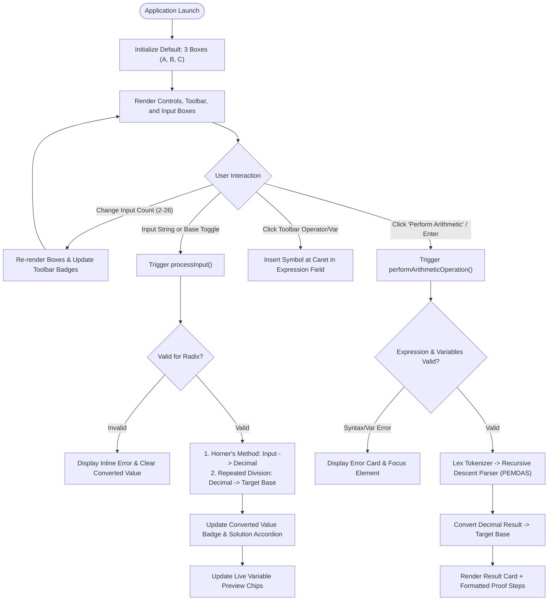
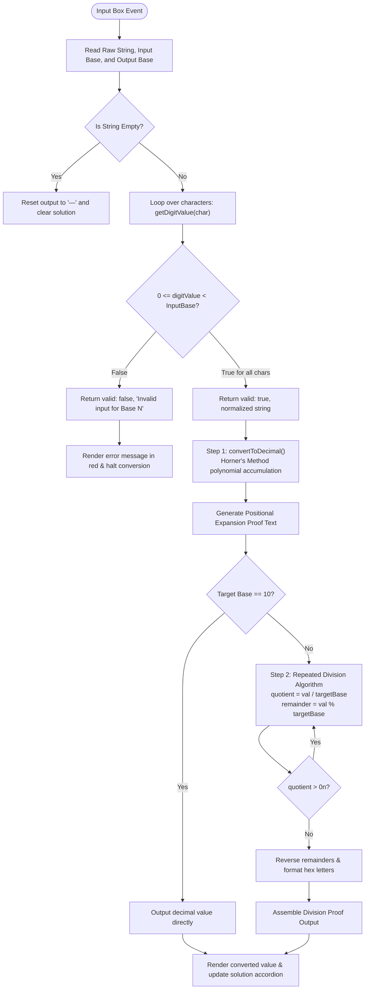
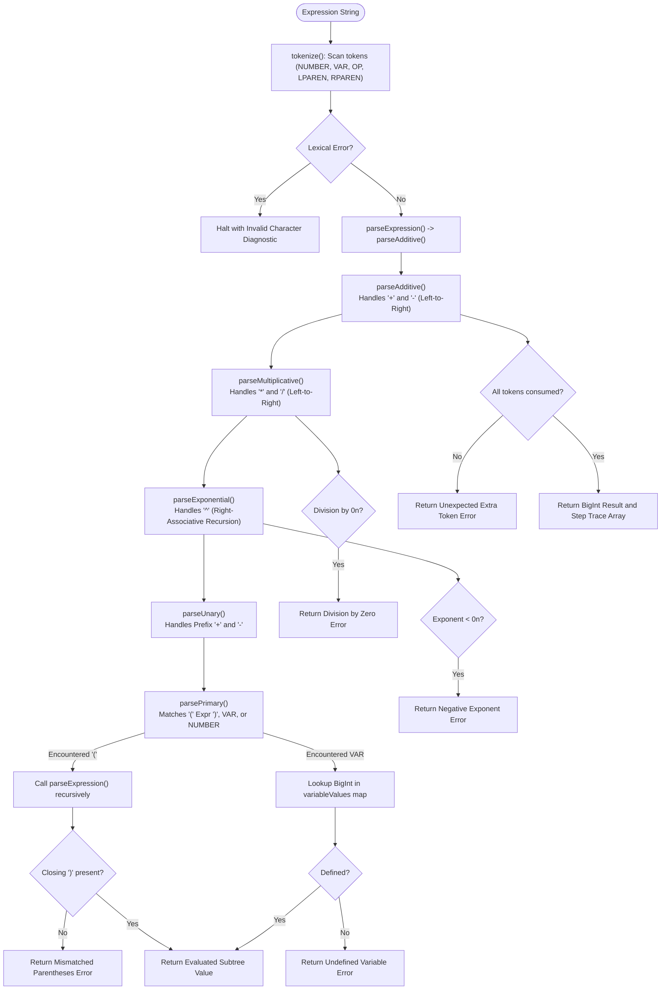

# System Requirements Specification & Technical Implementation Document

**Project:** Number System Converter & Arithmetic Expression Evaluator  
**Course Context:** Computer Architecture (Activity 1 - Number System)  
**System Type:** Client-Side Single Page Application (SPA)  
**Document Version:** 1.0.0  

---

## Table of Contents
1. [System Requirements](#1-system-requirements)
   - [1.1 Project Overview & Purpose](#11-project-overview--purpose)
   - [1.2 Functional Requirements (FR)](#12-functional-requirements-fr)
   - [1.3 Non-Functional Requirements (NFR)](#13-non-functional-requirements-nfr)
   - [1.4 System & Hardware Constraints](#14-system--hardware-constraints)
2. [Algorithms & Pseudocode](#2-algorithms--pseudocode)
   - [2.1 Digit Value Mapping (getDigitValue)](#21-digit-value-mapping-getdigitvalue)
   - [2.2 Radix String Validation (validateInput)](#22-radix-string-validation-validateinput)
   - [2.3 Radix to Decimal Conversion (convertToDecimal)](#23-radix-to-decimal-conversion-converttodecimal)
   - [2.4 Decimal to Target Radix Repeated Division (createDivisionSolution)](#24-decimal-to-target-radix-repeated-division-createdivisionsolution)
   - [2.5 Lexical Analysis / Tokenizer (tokenize)](#25-lexical-analysis--tokenizer-tokenize)
   - [2.6 Recursive Descent PEMDAS Expression Evaluator (evaluateExpression)](#26-recursive-descent-pemdas-expression-evaluator-evaluateexpression)
3. [Flowcharts (System & Logic Diagrams)](#3-flowcharts-system--logic-diagrams)
   - [3.1 High-Level Application Lifecycle](#31-high-level-application-lifecycle)
   - [3.2 Input Validation & Conversion Pipeline](#32-input-validation--conversion-pipeline)
   - [3.3 Recursive Descent Parsing & PEMDAS Execution](#33-recursive-descent-parsing--pemdas-execution)
4. [Program Implementation Details](#4-program-implementation-details)
   - [4.1 Architecture & File Organization](#41-architecture--file-organization)
   - [4.2 Module Roles and Key Code Walkthrough](#42-module-roles-and-key-code-walkthrough)
5. [Implementation Document: Test Cases & Sample Output](#5-implementation-document-test-cases--sample-output)
   - [5.1 Comprehensive Test Suite (Test Matrix)](#51-comprehensive-test-suite-test-matrix)
   - [5.2 Sample Runs & Verified Outputs](#52-sample-runs--verified-outputs)

---

## 1. System Requirements

### 1.1 Project Overview & Purpose
The **Number System Converter & Arithmetic Expression Evaluator** is an interactive educational and computational system developed for Computer Architecture studies. It allows users to:
1. Dynamically configure between 2 and 26 independent input registers (labeled alphabetically from **A** to **Z**).
2. Perform bidirectional conversions across four standard computing number systems:
   - **Decimal (Base 10)**
   - **Binary (Base 2)**
   - **Octal (Base 8)**
   - **Hexadecimal (Base 16)**
3. Inspect step-by-step mathematical proofs:
   - **Positional Polynomial Expansion (Horner's Method)** for converting any base into Decimal (Base 10).
   - **Repeated Integer Division with Remainder** for converting Decimal into any target base (Binary, Octal, Hexadecimal).
4. Evaluate multi-variable algebraic expressions (e.g., `(A + B - C) * D ^ 2`) adhering strictly to standard **PEMDAS** operator precedence with arbitrary-precision arithmetic (`BigInt`).
5. Format and display arithmetic calculation results in any selected target base along with full step-by-step substitution and operational reductions.

---

### 1.2 Functional Requirements (FR)

| ID | Requirement Name | Description |
| :--- | :--- | :--- |
| **FR-01** | **Dynamic Input Box Generation** | The user can specify the number of input boxes (from 2 up to 26; default: 3). The system dynamically instantiates input containers labeled alphabetically ($A, B, C, \dots, Z$). |
| **FR-02** | **Independent Base Selectors** | Each input container must provide independent segmented button controls for selecting the **Input Number System** ($10, 2, 8, 16$) and the **Output Number System** ($10, 2, 8, 16$). |
| **FR-03** | **Real-Time Input Validation** | Every keystroke must be validated against the chosen base. Characters outside the allowed alphabet (e.g., `'9'` in Octal, `'G'` in Hex, `'2'` in Binary) trigger immediate inline error messages and disable conversion outputs. |
| **FR-04** | **Arbitrary Precision Arithmetic** | All numeric conversions and expression evaluations must utilize JavaScript `BigInt` to eliminate IEEE-754 floating-point precision loss on large integers. |
| **FR-05** | **Step-by-Step Conversion Proofs** | Each input box provides a collapsible solution detailing: <br>1. **Input to Decimal**: Positional expansion ($d_n \times b^n + \dots + d_0 \times b^0$). <br>2. **Decimal to Target**: Repeated division table showing quotients, remainders, hexadecimal mappings, and reading remainders bottom-to-top. |
| **FR-06** | **Interactive Arithmetic Toolbar** | The UI must display dynamic variable buttons ($A, B, C, \dots$) featuring live badges that preview each variable's current value, along with operator buttons (`+`, `−`, `×`, `÷`, `^`, `(`, `)`). |
| **FR-07** | **Expression Parser & PEMDAS Engine** | The arithmetic engine must parse and evaluate expressions containing variables, integer literals, parentheses, unary operators (`+`, `-`), and binary operators (`+`, `-`, `*`, `/`, `^`), enforcing PEMDAS precedence and right-associativity for exponentiation (`^`). |
| **FR-08** | **Arithmetic Solution Breakdown** | Evaluating an expression produces an itemized solution: <br>1. Variable-to-decimal mapping summary. <br>2. Substituted decimal expression. <br>3. Ordered list of reduction operations. <br>4. Base conversion of the final result to the chosen output base. |
| **FR-09** | **Comprehensive Error Trapping** | The system must catch and display user-friendly diagnostics for syntax errors, unclosed parentheses, undefined variables, division by zero, and negative exponents. |

---

### 1.3 Non-Functional Requirements (NFR)

* **NFR-01: Performance & Responsiveness:** All DOM updates, validations, and conversions execute synchronously in $< 16\text{ ms}$ (60 fps response).
* **NFR-02: Zero External Dependencies:** Implemented in pure Vanilla HTML5, CSS3, and ES6+ JavaScript modules without frameworks or bundlers.
* **NFR-03: Ergonomics & Usability:** Sticky expression toolbar while scrolling, keyboard navigation (`Enter` key triggers calculation), and auto-formatting of inserted operators.
* **NFR-04: Robustness:** Comprehensive error trapping with no uncaught JavaScript runtime exceptions.
* **NFR-05: Modularity:** ES Module structure cleanly separating UI orchestration, validation, numeric conversion, and recursive descent expression parsing.

---

### 1.4 System & Hardware Constraints

* **Platform:** Client-side web browser (desktop, tablet, or mobile).
* **Browser Compatibility:** Google Chrome 80+, Mozilla Firefox 75+, Microsoft Edge 80+, Apple Safari 14+ (requires native `BigInt` and ES Module support).
* **Host Server:** Standard static web server (e.g., VS Code Live Server, Python `http.server`, Nginx, or GitHub Pages).

---

## 2. Algorithms & Pseudocode

### 2.1 Digit Value Mapping (`getDigitValue`)
Decodes an alphanumeric character into an integer value from $0$ to $15$.

```text
Algorithm: getDigitValue(character)
Input: A single character 'character'
Output: Integer in range [0, 15], or -1 if invalid

1.  Set upperChar = ToUpperCase(character)
2.  If upperChar >= '0' AND upperChar <= '9':
3.      Return ASCII(upperChar) - 48
4.  If upperChar >= 'A' AND upperChar <= 'F':
5.      Return ASCII(upperChar) - 55
6.  Return -1
```

---

### 2.2 Radix String Validation (`validateInput`)
Verifies that all digits in an input string belong to the radix alphabet.

```text
Algorithm: validateInput(value, base)
Input: String value, Integer base (2, 8, 10, or 16)
Output: Object { valid: Boolean, message: String, normalizedValue: String }

1.  Set trimmed = Trim(value)
2.  Set normalized = ToUpperCase(trimmed)
3.  If normalized is empty:
4.      Return { valid: false, message: "Input cannot be empty." }
5.  For each character 'c' in normalized:
6.      Set digitValue = getDigitValue(c)
7.      If digitValue < 0 OR digitValue >= base:
8.          Return { valid: false, message: "Invalid input for Base " + base }
9.  Return { valid: true, message: "Valid input.", normalizedValue: normalized }
```

---

### 2.3 Radix to Decimal Conversion (`convertToDecimal`)
Evaluates the positional polynomial via Horner's Method:

$$V = \sum_{i=0}^{n-1} d_i \cdot b^{n-1-i} = ((\dots(d_0 \cdot b + d_1) \cdot b + \dots) + d_{n-1})$$

```text
Algorithm: convertToDecimal(valueString, base)
Input: Validated string 'valueString', Integer 'base'
Output: BigInt decimalValue

1.  Set decimalValue = 0n
2.  Set bigBase = BigInt(base)
3.  For each character 'c' in valueString:
4.      Set digitValue = BigInt(getDigitValue(c))
5.      Set decimalValue = (decimalValue * bigBase) + digitValue
6.  Return decimalValue
```

---

### 2.4 Decimal to Target Radix Repeated Division (`createDivisionSolution`)
Implements repeated division by the target base, logging each step and reading remainders from bottom to top.

```text
Algorithm: createDivisionSolution(decimalValue, targetBase, targetName)
Input: BigInt decimalValue, Integer targetBase, String targetName
Output: Formatted step-by-step division string

1.  Set currentValue = decimalValue
2.  Set divisionSteps = []
3.  Do:
4.      Set quotient = currentValue / BigInt(targetBase)
5.      Set remainder = currentValue % BigInt(targetBase)
6.      Record formatted division line:
7.          currentValue + " ÷ " + targetBase + " = " + quotient + " remainder " + formatRemainder(remainder)
8.      Set currentValue = quotient
9.  While currentValue > 0n
10. Set finalValue = ToBaseString(decimalValue, targetBase) in UPPERCASE
11. Return formatted report with divisionSteps and "Read from bottom to top: " + finalValue
```

---

### 2.5 Lexical Analysis / Tokenizer (`tokenize`)
Transforms an arithmetic expression into a list of typed tokens (`NUMBER`, `VAR`, `OP`, `LPAREN`, `RPAREN`).

```text
Algorithm: tokenize(expressionString)
Input: String expressionString
Output: Array of Tokens or Error Object

1.  Set tokens = []
2.  Set i = 0, str = Trim(expressionString)
3.  While i < Length(str):
4.      Set ch = str[i]
5.      If IsWhitespace(ch): i = i + 1; continue
6.      If ch in ['+', '-', '−']: tokens.push({ type: "OP", value: ch == '−' ? '-' : ch, pos: i }); i++
7.      Else if ch in ['*', '×']: tokens.push({ type: "OP", value: '*', pos: i }); i++
8.      Else if ch in ['/', '÷']: tokens.push({ type: "OP", value: '/', pos: i }); i++
9.      Else if ch == '^':        tokens.push({ type: "OP", value: '^', pos: i }); i++
10.     Else if ch == '(':        tokens.push({ type: "LPAREN", value: '(', pos: i }); i++
11.     Else if ch == ')':        tokens.push({ type: "RPAREN", value: ')', pos: i }); i++
12.     Else if IsAlpha(ch):      tokens.push({ type: "VAR", value: ToUpper(ch), pos: i }); i++
13.     Else if IsDigit(ch):
14.         Set numStr = ""
15.         While i < Length(str) AND IsDigit(str[i]):
16.             numStr += str[i]; i++
17.         tokens.push({ type: "NUMBER", value: BigInt(numStr), pos: startPos })
18.     Else:
19.         Return { error: "Invalid character '" + ch + "' at position " + (i + 1) }
20. If tokens is empty: Return { error: "Expression is empty." }
21. Return { tokens: tokens }
```

---

### 2.6 Recursive Descent PEMDAS Expression Evaluator (`evaluateExpression`)
Parses expressions according to mathematical grammar and logs reductions.

```text
Algorithm: evaluateExpression(expressionStr, variableValues)
Grammar:
  Expression     := Additive
  Additive       := Multiplicative ( ('+' | '-') Multiplicative )*
  Multiplicative := Exponential ( ('*' | '/') Exponential )*
  Exponential    := Unary ( '^' Exponential )?   // Right-associative
  Unary          := ('+' | '-') Unary | Primary
  Primary        := '(' Expression ')' | VAR | NUMBER

Function parseAdditive():
  left = parseMultiplicative()
  While currentToken is OP ('+' or '-'):
    op = consume()
    right = parseMultiplicative()
    If op == '+': left = left + right; logStep("Addition: left + right")
    Else:         left = left - right; logStep("Subtraction: left − right")
  Return left

Function parseMultiplicative():
  left = parseExponential()
  While currentToken is OP ('*' or '/'):
    op = consume()
    right = parseExponential()
    If op == '*': left = left * right; logStep("Multiplication: left × right")
    Else:
      If right == 0n: Return Error("Division by zero")
      left = left / right; logStep("Division: left ÷ right")
  Return left

Function parseExponential():
  left = parseUnary()
  If currentToken is OP ('^'):
    consume('^')
    right = parseExponential()  // Right-associative recursion
    If right < 0n: Return Error("Negative exponent unsupported")
    If right > 1000n: Return Error("Exponent too large")
    left = left ** right; logStep("Exponentiation: left ^ right")
  Return left

Function parseUnary():
  If currentToken is OP ('-'):
    consume('-')
    res = -(parseUnary())
    logStep("Unary negation: -(val)")
    Return res
  If currentToken is OP ('+'):
    consume('+')
    Return parseUnary()
  Return parsePrimary()

Function parsePrimary():
  If currentToken is LPAREN:
    consume('(')
    val = parseExpression()
    consume(')')
    Return val
  If currentToken is VAR:
    varName = consume().value
    If varName not in variableValues: Return Error("Undefined variable: " + varName)
    Return variableValues[varName]
  If currentToken is NUMBER:
    Return consume().value
  Return Error("Unexpected token")
```

---

## 3. Flowcharts (System & Logic Diagrams)

### 3.1 High-Level Application Lifecycle


---

### 3.2 Input Validation & Conversion Pipeline


---

### 3.3 Recursive Descent Parsing & PEMDAS Execution


---

## 4. Program Implementation Details

### 4.1 Architecture & File Organization

The application is structured as modular ES6 components:

| File Path | Component Name | Primary Responsibilities | Key Dependencies |
| :--- | :--- | :--- | :--- |
| `index.html` | Presentation Layer | Application DOM structure, accessibility tags, sticky headers | `style.css`, `script.js` |
| `style.css` | Styling & Layout | Modern UI, responsive CSS grid/flexbox, sticky toolbar, segmented buttons | None |
| `script.js` | UI Controller | DOM event orchestration, dynamic box creation, toolbar syncing, error banners | All conversion modules |
| `conversions/validation.js` | Validator | ASCII-based digit value decoding and radix character set validation | None |
| `conversions/to-decimal.js` | Decimal Converter | Horner's Method computation and positional expansion proof generation | `validation.js` |
| `conversions/division-solution.js` | Division Engine | Repeated division algorithm with remainder formatting | None |
| `conversions/to-binary.js` | Binary Wrapper | Radix 2 string formatting and division solution binding | `division-solution.js` |
| `conversions/to-octal.js` | Octal Wrapper | Radix 8 string formatting and division solution binding | `division-solution.js` |
| `conversions/to-hexadecimal.js` | Hexadecimal Wrapper | Radix 16 string formatting (uppercase A-F) and division solution binding | `division-solution.js` |
| `conversions/arithmetic.js` | Arithmetic Engine | Lexer tokenizer, recursive descent PEMDAS parser, and solution generator | Conversion modules |

---

### 4.2 Module Roles and Key Code Walkthrough

#### 1. Input Validation (`conversions/validation.js`)
Validates each character by ASCII code without regular expressions:
```javascript
export function getDigitValue(character) {
    const upperCharacter = character.toUpperCase();
    if (upperCharacter >= "0" && upperCharacter <= "9") {
        return upperCharacter.charCodeAt(0) - 48;
    }
    if (upperCharacter >= "A" && upperCharacter <= "F") {
        return upperCharacter.charCodeAt(0) - 55;
    }
    return -1;
}

export function validateInput(value, base) {
    const inputValue = value.trim().toUpperCase();
    if (inputValue === "") {
        return { valid: false, message: "Input cannot be empty." };
    }
    for (const character of inputValue) {
        const digitValue = getDigitValue(character);
        if (digitValue < 0 || digitValue >= base) {
            return { valid: false, message: `Invalid input for Base ${base}.` };
        }
    }
    return { valid: true, message: "Valid input.", normalizedValue: inputValue };
}
```

---

#### 2. Positional Polynomial Expansion (`conversions/to-decimal.js`)
Evaluates numbers into `BigInt` and generates the mathematical expansion proof:
```javascript
export function convertToDecimal(value, base) {
    let decimalValue = 0n;
    for (const character of value) {
        const digitValue = getDigitValue(character);
        decimalValue = decimalValue * BigInt(base) + BigInt(digitValue);
    }
    return decimalValue;
}

export function createDecimalInputSolution(value, base) {
    const expansion = [];
    const evaluatedTerms = [];
    const simplifiedTerms = [];

    value.split("").forEach(function (character, index) {
        const digitValue = getDigitValue(character);
        const exponent = value.length - index - 1;
        const placeValue = BigInt(base) ** BigInt(exponent);
        const product = BigInt(digitValue) * placeValue;

        expansion.push(`${character} × ${base}^${exponent}`);
        evaluatedTerms.push(`${digitValue} × ${placeValue}`);
        simplifiedTerms.push(product.toString(10));
    });

    const decimalValue = convertToDecimal(value, base);
    return [
        "Convert the input value to decimal:",
        expansion.join(" + "),
        `= ${evaluatedTerms.join(" + ")}`,
        `= ${simplifiedTerms.join(" + ")}`,
        `= ${decimalValue}`
    ].join("\n");
}
```

---

#### 3. Repeated Division Algorithm (`conversions/division-solution.js`)
Divides by the target base, formats remainders $\ge 10$ into uppercase hex, and constructs the proof:
```javascript
function formatRemainder(remainder) {
    const decimalRemainder = remainder.toString(10);
    if (remainder >= 10n) {
        return `${decimalRemainder} (${remainder.toString(16).toUpperCase()})`;
    }
    return decimalRemainder;
}

export function createDivisionSolution(decimalValue, targetBase, targetName) {
    let currentValue = decimalValue;
    const divisionSteps = [];

    do {
        const quotient = currentValue / BigInt(targetBase);
        const remainder = currentValue % BigInt(targetBase);

        divisionSteps.push(
            `${currentValue} ÷ ${targetBase} = ${quotient} remainder ${formatRemainder(remainder)}`
        );
        currentValue = quotient;
    } while (currentValue > 0n);

    const finalValue = decimalValue.toString(targetBase).toUpperCase();
    return [
        `Convert decimal ${decimalValue} to ${targetName}:`,
        ...divisionSteps,
        `Read the remainders from bottom to top: ${finalValue}`,
        `Final result: ${finalValue}`
    ].join("\n");
}
```

---

#### 4. PEMDAS Exponentiation Parsing (`conversions/arithmetic.js`)
Implements right-associative exponentiation ($a^{b^c} = a^{(b^c)}$):
```javascript
function parseExponential() {
    let leftResult = parseUnary();
    if (leftResult.error) return leftResult;

    if (index < tokens.length && tokens[index].type === "OP" && tokens[index].value === "^") {
        index++;
        const rightResult = parseExponential(); // Right-recursive call enforces right-associativity
        if (rightResult.error) return rightResult;

        const baseVal = leftResult.value;
        const expVal = rightResult.value;

        if (expVal < 0n) return { error: `Negative exponent '${expVal}' is not supported in integer arithmetic.` };
        if (expVal > 1000n) return { error: `Exponent '${expVal}' is too large (maximum allowed is 1000).` };

        const res = baseVal ** expVal;
        steps.push(`Evaluate exponentiation: ${baseVal} ^ ${expVal} = ${res}`);
        leftResult = { value: res };
    }
    return leftResult;
}
```

---

## 5. Implementation Document: Test Cases & Sample Output

### 5.1 Comprehensive Test Suite (Test Matrix)

| Test ID | Module Tested | Input Configuration & Expression | Expected Output / Behavior | Status |
| :--- | :--- | :--- | :--- | :--- |
| **TC-01** | Binary $\to$ Decimal | Box A: Base 2, Input: `11010` | Converted value: `26`. Positional expansion: $1\cdot 2^4 + 1\cdot 2^3 + 0\cdot 2^2 + 1\cdot 2^1 + 0\cdot 2^0 = 26$ | PASS |
| **TC-02** | Decimal $\to$ Hex | Box B: Base 10, Input: `254`, Target: Base 16 | Converted value: `FE`. Division: $254 \div 16 = 15 \text{ r } 14\text{ (E)}$, $15 \div 16 = 0 \text{ r } 15\text{ (F)}$ | PASS |
| **TC-03** | Hex $\to$ Binary | Box C: Base 16, Input: `1A`, Target: Base 2 | Converted value: `11010`. Intermediate Dec = $26$. Division by 2 produces `11010` | PASS |
| **TC-04** | Octal $\to$ Hex | Box A: Base 8, Input: `77`, Target: Base 16 | Converted value: `3F`. Intermediate Dec = $63$. $63 \div 16 = 3 \text{ r } 15\text{ (F)}$ | PASS |
| **TC-05** | Large Integer Precision | Box A: Base 10, Input: `9007199254740993` | Value $> 2^{53}-1$ evaluated with exact precision via `BigInt` (no rounding) | PASS |
| **TC-06** | Zero Handling | Any base, Input: `0` | Returns `0` across all bases without infinite division loops | PASS |
| **TC-07** | Binary Radix Boundary | Box A: Base 2, Input: `1012` | Validation error: `"Invalid input for Base 2."` Output set to `—` | PASS |
| **TC-08** | Octal Radix Boundary | Box A: Base 8, Input: `780` | Validation error: `"Invalid input for Base 8."` Output set to `—` | PASS |
| **TC-09** | Hex Radix Boundary | Box A: Base 16, Input: `12Z` | Validation error: `"Invalid input for Base 16."` Output set to `—` | PASS |
| **TC-10** | Empty Input Reset | Clear text from any input box | Clears validation banner, sets output to `—`, clears solution accordion | PASS |
| **TC-11** | Basic PEMDAS Order | `A + B * C`<br>($A=2, B=3, C=4$) | Evaluates multiplication first: $3 \times 4 = 12$, then $2 + 12 = 14$ | PASS |
| **TC-12** | Parentheses Override | `(A + B) * C`<br>($A=2, B=3, C=4$) | Evaluates parentheses first: $2 + 3 = 5$, then $5 \times 4 = 20$ | PASS |
| **TC-13** | Exponent Precedence | `A + B ^ C`<br>($A=10, B=2, C=3$) | Evaluates power first: $2^3 = 8$, then $10 + 8 = 18$ | PASS |
| **TC-14** | Exponent Right-Associativity | `2 ^ 3 ^ 2` | Evaluates as $2^{(3^2)} = 2^9 = 512$ (not $(2^3)^2 = 64$) | PASS |
| **TC-15** | Unary Negation | `-A + B`<br>($A=15, B=5$) | Correctly negates $A$: $-15 + 5 = -10$ | PASS |
| **TC-16** | Cross-Base Multi-Variable | `(A + B) * C`<br>($A=\text{"1010"}_2, B=\text{"12"}_8, C=\text{"A"}_{16}$) | $A=10, B=10, C=10 \implies (10+10)\times 10 = 200_{10}$. Converted to Hex = `C8` | PASS |
| **TC-17** | Negative Result Formatting | Expression yields $-42$, Target: Base 16 | Converts magnitude ($42_{10} = 2\text{A}_{16}$) and prefixes negative sign: `-2A` | PASS |
| **TC-18** | Division by Zero | `A / 0` or `A / (B - B)` | Trapped gracefully. Banner: `"Division by zero encountered: N ÷ 0 is undefined."` | PASS |
| **TC-19** | Mismatched Parentheses | `(A + B * C` | Diagnostic: `"Mismatched parentheses: missing closing ')' for '(' opened at position 1."` | PASS |
| **TC-20** | Undefined Variable | Expression uses `Z`, but boxes are only `A, B, C` | Diagnostic: `"Undefined variable 'Z' in expression. Available inputs: A, B, C."` | PASS |

---

### 5.2 Sample Runs & Verified Outputs

#### Sample Run 1: Number Base Conversion (Hexadecimal `2F` $\to$ Binary)
* **Configuration:** Input Base = Hexadecimal (16), String = `2F`, Target Base = Binary (2).
* **Converted Value Display:** `101111`
* **Collapsible Solution Proof:**
```text
Input: 2F (Base 16)

Convert the input value to decimal:
2 × 16^1 + F × 16^0
= 2 × 16 + 15 × 1
= 32 + 15
= 47

Convert decimal 47 to Binary:
47 ÷ 2 = 23 remainder 1
23 ÷ 2 = 11 remainder 1
11 ÷ 2 = 5 remainder 1
5 ÷ 2 = 2 remainder 1
2 ÷ 2 = 1 remainder 0
1 ÷ 2 = 0 remainder 1
Read the remainders from bottom to top: 101111
Final result: 101111
```

---

#### Sample Run 2: Multi-Base Arithmetic Expression
* **Inputs Configured:**
  - **Box A:** Base 2, String = `1010` (Decimal value = $10$)
  - **Box B:** Base 8, String = `12` (Decimal value = $10$)
  - **Box C:** Base 16, String = `A` (Decimal value = $10$)
* **Expression:** `(A + B) * C`
* **Target Result System:** Hexadecimal (Base 16)
* **Answer Value Display:** `C8`
* **Generated PEMDAS Breakdown Solution:**
```text
=== ARITHMETIC SOLUTION (PEMDAS & PARENTHESES) ===

Expression: (A + B) * C

Step 1: Convert input variables to Decimal (Base 10):
  Variable A (Box A): Input "1010" (Base 2 - Binary) -> Output "1010" (Base 2) = 10 (Decimal)
  Variable B (Box B): Input "12" (Base 8 - Octal) -> Output "1010" (Base 2) = 10 (Decimal)
  Variable C (Box C): Input "A" (Base 16 - Hexadecimal) -> Output "1010" (Base 2) = 10 (Decimal)

Step 2: Substituted Decimal Expression:
  (10 + 10) * 10

Step 3: Step-by-step evaluation following parentheses and PEMDAS precedence:
  • Begin evaluation inside parentheses '('
  • Evaluate addition: 10 + 10 = 20
  • Completed evaluation inside parentheses ')' -> value: 20
  • Evaluate multiplication: 20 × 10 = 200
  • Final Decimal Result = 200

Step 4: Convert decimal result (200) to Hexadecimal (Base 16):
  Convert decimal 200 to Hexadecimal:
  200 ÷ 16 = 12 remainder 8
  12 ÷ 16 = 0 remainder 12 (C)
  Read the remainders from bottom to top: C8
  Final result: C8
  Final Answer: C8 (Base 16)
```

---

#### Sample Run 3: Syntax & Runtime Error Handlers
* **Scenario A: Division by Zero**
  - **Expression:** `A / (B - B)`
  - **Rendered Diagnostic Banner:**
    ```
    Arithmetic / Syntax Error: Division by zero encountered: 10 ÷ 0 is undefined.
    ```
* **Scenario B: Unclosed Parenthesis**
  - **Expression:** `(A + B * C`
  - **Rendered Diagnostic Banner:**
    ```
    Arithmetic / Syntax Error: Mismatched parentheses: missing closing ')' for '(' opened at position 1.
    ```
* **Scenario C: Undefined Variable**
  - **Expression:** `A + D` (with only Boxes A, B, C created)
  - **Rendered Diagnostic Banner:**
    ```
    Undefined variable 'D' in expression. Available inputs: A, B, C.
    ```
